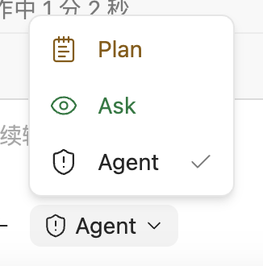
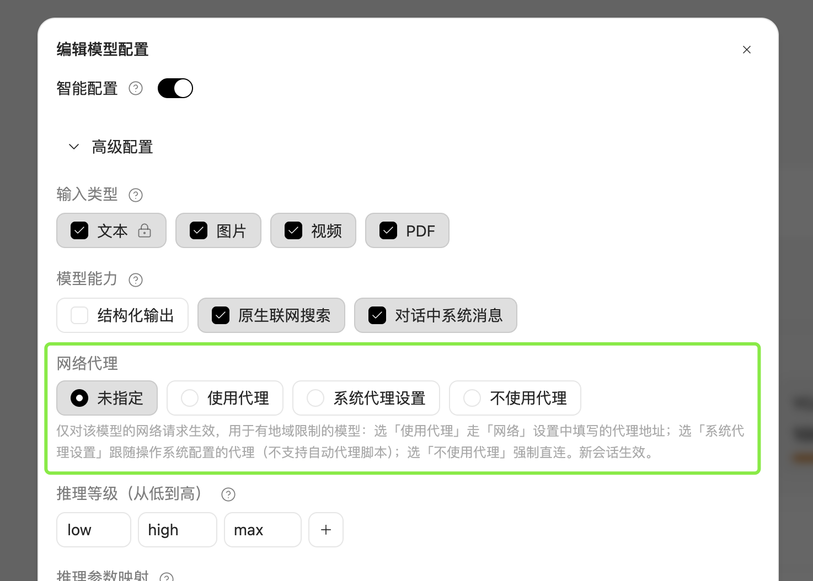
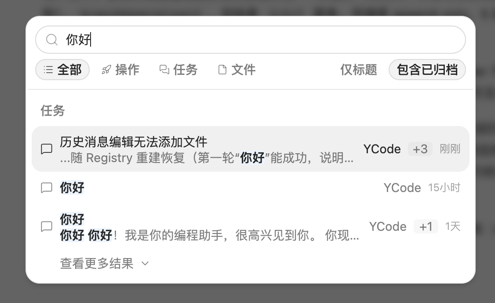
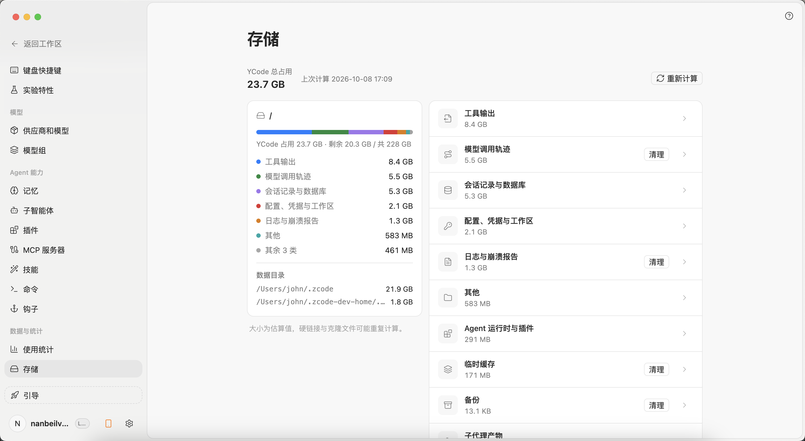

## v4.0 —— 2026-10-08

自上游 fork 后的第一个正式版本。以下只收录与官方版不同的新功能与改进，与官方一致的能力不再列出。

### 版本一览

#### 模型分组

同一供应商的模型可组成一个组，发送时自动选用组内可用模型。输入框按组选择，分组在设置页管理。

#### 输入区模型与模式

输入框显示当前模型与语言，模式在计划、只读、完全访问三档之间切换，颜色标识当前档位。

#### 按模型配置网络出口

每个模型单独选择网络代理：使用代理、跟随系统代理或强制直连，新会话生效。有地域限制的模型可单独安排出口。

#### 套餐用量与上下文用量

OpenCode Go 套餐用量按 5 小时、每周、每月三档显示剩余额度与重置时间。上下文用量支持查询，剩余比例直接给出。

#### 会话记录查询

历史会话支持按时间范围列出，可隐藏子代理会话，直接显示会话数量。

#### 计划目录

会话内的计划在侧栏列成目录，按时间排序，点开查看正文。

#### 命令中心搜索归档

命令中心搜索支持包含已归档会话，任务、操作、文件分类展示。

#### 存储分类

设置页存储分区按工具输出、模型调用轨迹、会话记录等分类展示占用，支持重新计算与清理。

#### 局域网远控

桌面生成固定链接与二维码，同一局域网内的手机或电脑浏览器扫码直连同一会话，端口与 Token 重启后保持。

### 品牌 / 开源 / 启动 / 分发

| 序号 | 功能 | 说明 |
|---|---|---|
| 1  | 代码开源 | 仓库代码与构建流程全部公开，可自行构建、审计与修改 |
| 2  | YCode 品牌 | 界面名称与图标统一为 YCode |
| 3  | 跳过登录与引导 | 首次启动不再强制登录与新手引导 |
| 4  | 新应用图标 | 更换桌面、网页与安装包图标 |
| 5  | 启动屏动画 | 启动过程改为两阶段品牌动画 |
| 6  | 新建页空态 | 移除新建页问候语与装饰水印，保留空态输入槽位 |
| 7  | 官网与文档站 | 新增官网与文档站，按功能介绍产品用法 |
| 8  | 关于窗口 | 显示应用图标、产品版本号与上游 ZCode 版本行 |

### 供应商 / 模型 / 额度

| 序号 | 功能 | 说明 |
|---|---|---|
| 9  | OpenCode 独立分组 | 设置页与添加供应商选择器中单独分组 |
| 10  | OpenCode 套餐用量 | 设置页与输入框旁显示套餐用量与重置时间，支持切换 Workspace |
| 11  | DeepSeek 余额 | 显示官方账户余额，带货币符号 |
| 12  | OpenRouter/MiniMax 余额 | 显示两家账户余额用量 |
| 13  | 智谱 Provider 可关闭 | 不用时可关闭，并隔离其套餐查询 |
| 14  | Primary 供应商 | 支持指定常用供应商，选择器按标记置顶展开，模板带配额标签与排序 |
| 15  | 模型分组 | 同一供应商的模型可分组，输入框按组选择 |
| 16  | 默认思考档位 | 切模型默认取最高思考档（优先 high） |
| 17  | 按模型配网络出口 | 每个模型单独选择走代理还是直连，详见 [网络与代理](/docs/network) |
| 18  | 模型设置独立分类 | 模型相关设置独立成类，输入框显示格式化模型名 |
| 19  | Responses 模型思考过程 | 请求 reasoning.summary，部分模型新增思考内容显示 |

### 权限轴 / 模式

| 序号 | 功能 | 说明 |
|---|---|---|
| 20  | 三档工作模式 | 计划、只读、完全访问三档单一权限轴 |
| 21  | Agent 会话模式轴 | 新增 Agent 档会话模式，与三档权限轴配套 |
| 22  | 模式颜色标识 | 输入框按三档模式显示不同身份色 |
| 23  | 问答模式支持压缩 | Ask 模式可调用压缩工具 |

### 计划模式（Plan）

| 序号 | 功能 | 说明 |
|---|---|---|
| 24  | 计划自动落盘 | 每次提交自动存为工作区文件，一会话多份，压缩后可找回，详见 [计划模式](/docs/plan) |
| 25  | 计划卡标题折叠 | 卡片显示标题与概述，文件名由标题推导 |
| 26  | 计划查看与执行分开 | 双入口：查看正文与执行计划；支持静默拒绝与自动拒绝 |
| 27  | 计划卡收纳 | 卡片收窄为气泡内最后一次请求产出，原位保留调用记录 |
| 28  | 会话计划目录 | 侧栏列出会话内全部计划，支持快速回看 |
| 29  | 命令绑定模型 | 自定义命令可绑定模式与模型，插入自动切换；内置 compact 可指定压缩专用模型 |

### 消息历史编辑（Edit）

| 序号 | 功能 | 说明 |
|---|---|---|
| 30  | 消息回滚与恢复 | 支持回滚弹窗、覆盖恢复，半写草稿自动停靠 |
| 31  | 运行中编辑重发 | 任务执行中可编辑重发，内部抢占；历史消息支持补加附件 |

### 会话时间线（Timeline）

| 序号 | 功能 | 说明 |
|---|---|---|
| 32  | 按轮加载 | 会话按整轮下发可见窗口，长会话打开更快 |
| 33  | 上翻自动续载 | 上滚自动补页，切换窗口不中断请求，带加载指示 |
| 34  | 轮次目录跳转 | 按用户轮列出目录，点击跳转到对应位置 |
| 35  | 过程行折叠 | 工具执行过程默认折叠为一行，可手动收起并保持 |
| 36  | 耗时标注 | 思考与工具标注耗时，超 60 秒显示分秒，行距收紧 |

### 工具卡与工具执行

| 序号 | 功能 | 说明 |
|---|---|---|
| 37  | 工具增量执行 | 工具调用流式执行，有输出即显示；文本与工具行保序 |
| 38  | 工具耗时徽标 | 卡片标注调用耗时，任务输出卡显示任务描述 |
| 39  | 终端命令中文说明 | Bash 卡片必填中文说明并完整展示 |
| 40  | 拒绝行内可见 | 权限拒绝直接显示在工具行 |
| 41  | 后台命令侧栏 | 后台 bash 输出集中到侧栏展示，等待预算 5 分钟/15 秒并倒计时 |

### 任务 / 会话 / 子代理

| 序号 | 功能 | 说明 |
|---|---|---|
| 42  | 草稿隔离执行 | Agent 草稿会话在独立 git worktree 中执行 |
| 43  | 任务标题 | 自动生成任务标题，支持重新生成，头部与菜单统一 |
| 44  | 任务分组 | 支持分组 emoji、行标签与拖动移动 |
| 45  | 归档 | 支持归档与取消归档；自动归档跳过有分组会话；命令中心可搜已归档 |
| 46  | 历史会话工具 | history-list/history-read/history-search 只读查询，History 工具卡自定义渲染 |
| 47  | 子代理身份与续跑 | 子代理持久化身份，跨进程可恢复；用量实时回传；普通子代理禁止后台运行 |
| 48  | 状态行用量 | 状态行显示工作段工具次数与思考耗时 |

### 连接 / 远程 / 多端

| 序号 | 功能 | 说明 |
|---|---|---|
| 49  | 局域网远控 | 手机或另一台电脑的浏览器直连桌面同一 Host 与会话，详见 [Web 与手机远控](/docs/remote) |
| 50  | 远控登录保持 | Web 远控认证 Cookie 持久化 |
| 51  | 网页端文件上传 | 网页版支持全类型附件上传 |
| 52  | 会话链接 | 页面 URL 路由，会话支持深链直达 |
| 53  | 断线重连 | 连接分层显示状态；重连保持连续，区分未发送与结果未知 |

### UI 布局 / 导航 / 设置

| 序号 | 功能 | 说明 |
|---|---|---|
| 54  | 窄屏单列布局 | 窄视口单列加覆盖式抽屉，200ms 横向滑动；设置页改抽屉导航；窗口最小尺寸与主从布局 |
| 55  | 移除付费引导 | Coding Plan 付费引导与购买入口全部移除 |
| 56  | 存储面板 | 从资源管理器迁入设置侧边栏，工具输出与临时缓存分开展示 |

### 上下文 / 压缩

| 序号 | 功能 | 说明 |
|---|---|---|
| 57  | 用量查询工具 | CompactNow 与 GetContextUsage 内置工具，专用容量卡展示 |
| 58  | 容量明细 | 中英文加权 token 占比，K/M 单位，按实际占用折算 |
| 59  | 总结跟随语言 | 压缩总结使用对话语言；子代理继承父会话语言 |

### Goal

| 序号 | 功能 | 说明 |
|---|---|---|
| 60  | 命令不用顶格写 | /goal 支持句中下达，原版要求写在消息开头，详见 [目标模式](/docs/goal) |
| 61  | 命令作用域高亮 | 被当作命令发出去的内容以命令蓝标出，发送前即确认范围 |
| 62  | 迭代间免打扰 | goal 迭代间不发任务完成通知与音效 |
| 63  | 单目标面板 | 单个目标独立面板，显示命令作用域 |

### 错误 / 重试 / 队列

| 序号 | 功能 | 说明 |
|---|---|---|
| 64  | 错误原地续跑 | 错误横幅继续按钮在同 turn 原地续跑 |
| 65  | 失败分型重试 | 模型失败按类型分型，全失败自动重试兜底；网络断连自动重试 |

### 性能优化

| 序号 | 功能 | 说明 |
|---|---|---|
| 66  | 冷恢复加速 | 批量重放跳过逐事件 usage 物化，收口统一重算 |
| 67  | 补页与渲染 | 换窗不作废补页请求；思考分片复用同一行；切换模型保留目录一次到位 |
