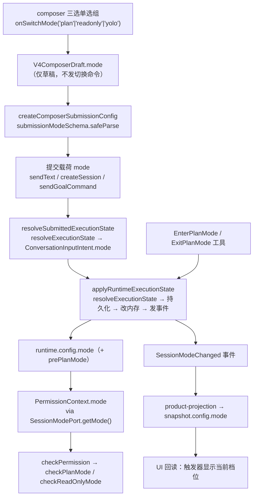

# Spec: Agent 模式轴（内部值 plan / readonly / yolo；显示名 Plan / Ask / Agent）

## 目标

把会话的权限约束收敛成一根三值轴：`plan`（计划模式）、`readonly`（只读模式）、`yolo`（完全访问），默认 `yolo`。同一个值同时决定两件事：权限层怎么判，以及模型收到哪个档位的标签。composer 上只留一个三选单选组，不再有复选项、说明行与标记药丸。

`build`（变更前确认）与 `edit`（自动编辑）连同 `auto` 一起从权限轴删除。**引擎不再有「逐项审批」档**——「改之前问我一次」这件事完全交给用户自己的本地 hook（`ask-allowlist.js` / `perm-readonly.js`），这是明确的产品决策，不是遗漏。

## 产品规则

- **一根轴一个真值。** 真值类型是 `executionPermissionModeSchema = z.enum(["plan", "readonly", "yolo"])`，状态只有 `{ mode }`。历史上并排的 `planEnabled` / `readOnlyEnabled` 两个布尔位从存储层删除，降级为**从 mode 派生的查询函数**（`isPlanEnabled()` = `mode === "plan"`，`isReadOnlyEnabled()` = `mode === "readonly"`）。调用点签名不变，但状态只有一个。
- **默认档是完全访问。** 三档里唯一能直接干活的档，同时与 headless 的 `DEFAULT_HEADLESS_PROMPT_MODE = "yolo"` 对齐。
- **三档语义。** 计划模式 = 只读 + 计划工作流（研究、设计、澄清）+ 回合只能以 `AskUserQuestion` 或 `ExitPlanMode` 结束；只读模式 = 只读，没有 in-band 退出工具；完全访问 = 权限层不弹窗。
- **显示名与内部值解耦。** 三档的模型可见标签名与 UI 显示名固定为 `Plan` / `Ask` / `Agent`（内部值 `plan` / `readonly` / `yolo` 不变）：`plan→Plan`、`readonly→Ask`（只读问答，回答与检索不受限，改动类操作被拒绝）、`yolo→Agent`。任何代码不得把内部值直译成文案，映射只有一份。
- **受限档的放行口径只有一份。** 计划模式与只读模式放行的正是同一批工具，所以 `checkReadOnlyScope` 保持单份实现、按 `scope` 参数化，只有规则号前缀与说明文案不同。放行三类：`readOnly && !destructive`；非破坏性 MCP；`allowedInPlanMode && sideEffectScope === "session" && !destructive && !needsApproval`。其余一律 `deny`（不是 `ask`）。
- **受限判定必须排在放行规则之前。** 分支顺序是 `userInteraction` → `alwaysAsk` → `yolo` → `disallowedTools` → 项目 deny / ask → `plan` / `readonly` → 项目 allow → webfetch 预批 → workflow 草稿 → `allowedTools`。顺序不可调：一条项目 `allow` 或 `allowedTools` 不能绕过受限档。`const exhaustiveMode: never = context.mode` 保留在末尾守住穷尽性。
- **`alwaysAsk` / `requiresUserInteraction` 保持工具声明的硬性确认语义**，排在模式判定之前，不受模式影响。
- **Bash 沿用既有的按命令动态只读判定**，不另立规则。
- **受限档与 Goal 互斥。** Goal `active` 时进入计划模式或只读模式抛错，不落盘、不改内存——两者都会让 Goal 的自主循环无法落盘而卡死。提交侧（`sendGoalCommand`）同样在入口拦。
- **完全访问授权不解除计划模式**，与只读一致：计划模式下写工具是 `deny` 而非 `ask`，本就不会弹授权框。
- **每条模型请求都注入模式标签。** 每个 model step 在请求尾部强制注入一行 `<mode>` 标签（`<mode>Plan</mode>` / `<mode>Ask</mode>` / `<mode>Agent</mode>`），无节流、无完整版/精简版交替：标签极短，成本可忽略，换来模型在每次生成前都拿到当前档位（含回合中途 `EnterPlanMode` / `ExitPlanMode` 切档）。三档行为指令由系统 Prompt 的静态 Collaboration modes 段交代，不随档位变化，避免切档打爆 system prompt 前缀缓存。
- **任务轴只跑完全访问。** off-peak / automation 的任务表单不再提供权限选择器，创建与更新固定写 `yolo`；协议上的 `permissionMode` 收敛为 `z.literal("yolo")`。
- **默认档与 `plan` 的返回档。** 进入计划模式时把当时的档位记进 `prePlanMode`，`ExitPlanMode` 时还原（缺省 `yolo`）。`exitPlanMode` 必须在 `apply` 之前读 `prePlanMode`，因为 `apply` 会把它清掉。显式切进计划模式的会话没有记录，回落到完全访问。

## 状态所有者与事件顺序

真值唯一所有者是 runtime 的 `AgentRuntimeConfig.mode`。schema、默认值与归一函数在 `packages/shared/src/execution-state.ts`；`resolveExecutionState` 是接纳边界的唯一入口，`normalizeLegacyExecutionMode` 是升级前数据的唯一迁移入口。

事件顺序（沿用 `applyRuntimeExecutionState` 既有事务顺序，不新增写入路径）：

1. 解析 `next = resolveExecutionState(input, previous)`；同值直接返回，**不发事件**（幂等）。
2. 若进入受限档且有 active Goal → 抛错，不落盘、不改内存。
3. 持久化 `SESSION_ENTRY_EXECUTION_STATE` entry（`id = <sessionId>:runtime-execution-state`）。
4. 改内存 `config.mode`，并同步 `config.prePlanMode`。
5. 发 `SessionModeChanged`，payload 带 `mode` / `previousMode`，以及由 mode 派生的 `planEnabled` / `readOnlyEnabled`（见「兼容面」）。

## 接口

- **shared**：`executionPermissionModeSchema`、`DEFAULT_EXECUTION_MODE`、`executionStateSchema`（只剩 `mode`）、`resolveExecutionState`、`normalizeLegacyExecutionMode`、`submissionModeSchema`、`commandPayloadRequestsPlanMode`、`ZCODE_AGENT_MODE_OPTIONS`（plan / readonly / yolo，顺序即 Ctrl+Shift+M 轮换序）。
- **contracts**：`CollaborationMode`（三值）、`SessionModePort.getMode()` / `getPrePlanMode()` / `enterPlanMode` / `exitPlanMode` / `isPlanEnabled()` / `isReadOnlyEnabled()`、`PermissionContext.mode` + `prePlanMode`、`switchCollaborationMode` 的值域三值。
- **runtime**：`setExecutionState`（命令路径）与 `applyRuntimeExecutionState`（工具路径）是仅有的两个写入点；`buildRuntimeModeReminderBody(mode)` 是唯一的标签构造入口（无参数依赖、无条件返回标签），`ContextBuilder` 的 Collaboration modes 段是唯一的三档行为文案来源。
- **CLI / TUI**：`SWITCHABLE_MODES`、`SWITCHABLE_COMMAND_CENTER_MODES`、`TUI_SWITCHABLE_MODES`、`CliPermissionMode` 全部三项。
- **UI**：`V4ComposerDraft.mode`、`ComposerSubmissionConfig.mode`、`V4ComposerModeSwitch` 三选单选组。
- **权限判定**：`checkPlanMode` 与 `checkReadOnlyMode` 委托同一个参数化实现，规则体只有一份。

## 不变量

- 状态只有一个 `mode`；`planEnabled` / `readOnlyEnabled` 只能由它派生，任何地方不得独立设置。
- 放行规则只有一份实现；禁止为只读复制一份 `checkPlanMode` 的分支。
- 受限档不放行任何 `destructive` 能力。
- 状态变更必须先持久化、再改内存、再发事件，不允许出现「内存已改但事件未发」的中间态。
- 不把 `build` / `edit` / `auto` 重新加入任何权限轴词表。
- 模式标签只有 `<mode>Plan</mode>` / `<mode>Ask</mode>` / `<mode>Agent</mode>` 三种取值；不得出现内部值直译（`readonly` / `yolo` / `Full access` / `Read-only`）的模式文案。
- 三档行为文案只有系统 Prompt 一处（静态）；per-message 注入只允许承载标签本身，不得回退成散文提醒。
- 子代理不继承受限档（`AgentPermissionMode = "auto" | "plan"` 保留，`auto` 映射为完全访问）。
- `autoApproveHighRisk` / `allowMediumRiskInAuto` 两个配置项仍留在 plumbing 里，但已不影响判定。

## 兼容面

- **历史数据只有一处迁移函数**：`normalizeLegacyExecutionMode(raw)`。`planEnabled === true || mode === "plan"` → `plan`；`readOnlyEnabled === true || mode === "readonly"` → `readonly`；其余（含 `build` / `edit` / `auto` / 未知）→ 默认档。调用点：`resume.ts`（会话恢复）、`composerDraftStore.readDraft`（localStorage 草稿）、任务轴读取归一。
- **旧计划会话必须还原成计划模式**，落到完全访问等于提权；旧 `readOnlyEnabled` 同理。
- **协议层保留两个 optional 派生布尔字段**（`SessionProjection`、`SessionModeChangedPayload`、session-config 快照、`ConversationInputIntent`）。旧事件日志与旧快照里带着它们，删掉会让读取整份失败。它们由 `mode` 单向派生，任何发送端不得独立设置。
- **`permissionFullAccessReceiptSchema`** 的 `mode` 是 `z.literal("yolo")`（全访问授权记录的永远是授权后的完全访问状态），`previousMode` 保持宽值域以容纳旧的 `build` / `edit` / `auto`。
- **命令行值域是破坏性收紧**：旧客户端发 `mode: "build"` 不再被接受；服务端 `setMode` 路径上用 `normalizeLegacyExecutionMode` 归一，避免把只读档悄悄放大成完全访问。
- **退出计划模式的提示由标签翻档承载**：`plan_mode_exit` 提醒不再发送，`needsPlanModeExitReminder` 簿记删除；`plan_mode_exit` source 枚举保留，旧会话轨迹仍可读取。
- **任务轴 `ZCodeTaskMode` / `zcodeSessionModeSchema` 保留旧值**（承载已落盘数据），只新增 `readonly`，读取路径归一。

## 验收场景

1. 新建会话默认档显示为 `Agent`，写文件不弹窗。
2. 模式下拉只有三项，没有复选项、说明行与标记药丸；Ctrl+Shift+M 按 plan → readonly → yolo 循环。
3. 计划模式下 Write/Edit 被 `deny`，`ruleId` 为 `mode.plan.nonReadOnly`；Read / Grep / `git status` 正常执行；每个 model step 的请求尾部带 `<mode>Plan</mode>`；系统 Prompt 的 Collaboration modes 段含计划工作流与「只能以 AskUserQuestion 或 ExitPlanMode 结束回合」规则。
4. 只读模式下 Write/Edit 被 `deny`，`ruleId` 为 `mode.readonly.nonReadOnly`，拒绝文案标签为 `Ask mode`；每个 model step 注入 `<mode>Ask</mode>`。
5. 完全访问下写操作直接放行，`ruleId` 为 `mode.yolo`，每个 model step 注入 `<mode>Agent</mode>`。
   5a. 回合中途 `EnterPlanMode` → 下一个 model step 标签变为 `<mode>Plan</mode>`；`ExitPlanMode` 还原档位后下一步标签翻回（无独立退出提醒）。
   5b. composer 三选与 CLI `/mode` 显示名为 `Plan` / `Ask` / `Agent`，界面不再出现「只读模式 / 完全访问」作为档位显示名。
6. 模型调用 `ExitPlanMode` → 退回进入计划模式前的档位（无记录时为完全访问）。**注意**：这条描述的是工具被放行时的档位还原。产品 UI 路径上批准弹窗已移除（见 `plan-card-execute.md`），`ExitPlanMode` 的计划批准在客户端一律被静默拒绝，因此该工具在 UI 路径上恒不执行、上面的还原不会触发；UI 上的「实施」改由计划卡片的「执行计划」显式切到完全访问（`yolo`），不还原 `prePlanMode`。
7. Goal `active` 时进入计划模式或只读模式 → 抛错，且不落盘、不改内存。
8. 受限档下，一条项目 `allow` 规则或 `allowedTools` 不能放行写工具。
9. CLI `/mode` 接受三项，`/mode build` 被拒。
10. 升级前数据：`{mode:"build", planEnabled:true}` → 计划模式；`{mode:"build"}` → 完全访问；`{mode:"edit", readOnlyEnabled:true}` → 只读；旧 localStorage 草稿同样归一；旧 `permission_full_access` receipt（`previousMode` 为 `build`）仍能解析并完成授权重试。
11. off-peak / automation 表单没有权限选择器，创建与更新的 `permissionMode` 恒为 `yolo`。
12. `pnpm typecheck` / `pnpm lint` / `pnpm architecture:check --changed` 通过。
