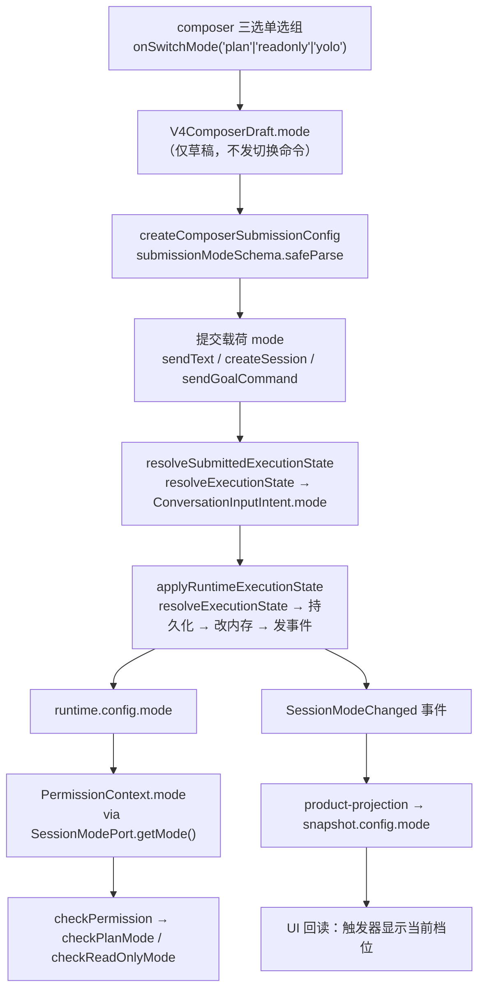

# Spec: Agent 模式轴（内部值 plan / readonly / yolo；显示名 Plan / Ask / Agent）

## 目标

把会话的权限约束收敛成一根三值轴：`plan`（计划模式）、`readonly`（只读模式）、`yolo`（完全访问），默认 `yolo`。同一个值同时决定两件事：权限层怎么判，以及模型收到哪个档位的标签。composer 上只留一个三选单选组，不再有复选项、说明行与标记药丸。

`build`（变更前确认）与 `edit`（自动编辑）连同 `auto` 一起从权限轴删除。**引擎不再有「逐项审批」档**——「改之前问我一次」这件事完全交给用户自己的本地 hook（`ask-allowlist.js` / `perm-readonly.js`），这是明确的产品决策，不是遗漏。

## 产品规则

- **一根轴一个真值。** 真值类型是 `executionPermissionModeSchema = z.enum(["plan", "readonly", "yolo"])`，状态只有 `{ mode }`。历史上并排的 `planEnabled` / `readOnlyEnabled` 两个布尔位从存储层删除，降级为**从 mode 派生的查询函数**（`isPlanEnabled()` = `mode === "plan"`，`isReadOnlyEnabled()` = `mode === "readonly"`）。调用点签名不变，但状态只有一个。
- **默认档是完全访问。** 三档里唯一能直接干活的档，同时与 headless 的 `DEFAULT_HEADLESS_PROMPT_MODE = "yolo"` 对齐。
- **三档语义。** 计划模式 = 只读 + 计划工作流（研究、设计、澄清）+ 回合只能以 `AskUserQuestion` 或 `CreatePlan` 结束（仅 Plan 档 `CreatePlan` 成功即经 `plan_created` 停轮，不切档；`CreatePlan` 仅 Plan 档可调，Ask / Agent 档调返回可读错误指引先调 `EnterPlanMode` 重试）。只读模式 = 只读，没有 in-band 退出工具，但可调 `EnterPlanMode` 切进计划模式；完全访问 = 权限层不弹窗，可调 `EnterPlanMode` 切进计划模式（先出方案再动手）。
- **显示名与内部值解耦。** 三档的模型可见标签名与 UI 显示名固定为 `Plan` / `Ask` / `Agent`（内部值 `plan` / `readonly` / `yolo` 不变）：`plan→Plan`、`readonly→Ask`（只读问答，回答与检索不受限，改动类操作被拒绝）、`yolo→Agent`。任何代码不得把内部值直译成文案，映射只有一份。
- **三档靠专属色区分，不借语义色。** 模式下拉与触发按钮给每档一个身份色：Plan `--color-mode-plan`（黄）、Ask `--color-mode-ask`（绿）、Agent `--color-mode-agent`（等同 `--color-foreground`，即「没染色」）。这三个 token 由 `resolveModeOptionToneClass` 一处映射到完整字面量类名，禁止用模板拼接（Tailwind 扫不到）。档位色只表达「当前是哪一档」，不表达风险高低：`yolo` 原本挂在触发按钮上的 `text-warning` 风险提示由 `ShieldAlert` 图标承担，档位色不得回流给等待徽章、权限拒绝或运行态，反向借用同样禁止。理由见 DESIGN.md「Session mode colors」：Zai Dark 下 `--color-warning` 是橙色，借用会让 Plan 在不同主题里变成两种颜色。
- **受限档的放行口径只有一份。** 计划模式与只读模式放行的正是同一批工具，所以 `checkReadOnlyScope` 保持单份实现、按 `scope` 参数化，只有规则号前缀与说明文案不同。放行三类：`readOnly && !destructive`；非破坏性 MCP；`allowedInPlanMode && sideEffectScope === "session" && !destructive && !needsApproval`。其余一律 `deny`（不是 `ask`）。
- **兜底拒绝的理由是「不在放行集内」，不是「工具有破坏性」。** 上面三条放行规则合起来就是白名单：兜底 `deny` 表达的是本次调用没被这批规则接住，所以原因文案只描述「不在本档放行集内」，不得断言工具有无破坏性。运行时这句断言也站不住——`resolveRuntimePermissionCapability` 先铺 `entry.metadata`，而 Bash / Write / Edit 的 metadata 都是 `destructive: false`（全仓库只有 `cron` 声明 true），落到兜底分支的工具几乎全部 `destructive` 为 false。文案里出现 "non-destructive" 只会把「没进白名单」误读成「这工具危险」，`pnpm lint`、`curl` 这类无副作用命令首当其冲。文案也不点工具名：Bash 是部分命中的，同一工具名既可能放行也可能拒绝，点名会重新引入错误断言。
- **受限判定必须排在放行规则之前。** 分支顺序是 `userInteraction` → `alwaysAsk` → `yolo` → `disallowedTools` → 项目 deny / ask → `plan` / `readonly` → 项目 allow → webfetch 预批 → workflow 草稿 → `allowedTools`。顺序不可调：一条项目 `allow` 或 `allowedTools` 不能绕过受限档。`const exhaustiveMode: never = context.mode` 保留在末尾守住穷尽性。
- **`alwaysAsk` / `requiresUserInteraction` 保持工具声明的硬性确认语义**，排在模式判定之前，不受模式影响。
- **Bash 沿用既有的按命令动态只读判定**，不另立规则。判定实现唯一所有者是 `@zcode/shared/node/bash-readonly`（纯函数 `isReadOnlyBashCommand`，Node-only 子路径，不进浏览器 bundle）；CLI 侧 `bash-semantics.ts` 的 `isRuntimeReadOnlyBashCommand` 只是它的别名。白名单规则内容变更时同步递增 `BASH_READONLY_POLICY_VERSION`，供 harness 侧缓存失效。
- **Bash 判定必须拿到运行时目录上下文。** `context.workingDirectory` / `context.workspaceRoot` 不只是可选提示：凡是判定需要真实文件系统状态的规则（git 运行时上下文安全、`-C` 目标目录校验）都靠它。缺上下文时这类规则按拒绝处理，不得因为「拿不到就不判」而放行。
- **受限档的拒绝必须可观察。** 只读/Ask 模式下被权限门拒绝的工具行必须显示“已拒绝”和结构化原因，不能退化成普通停止或“没有输出”。用户主动 Stop、回合取消和工具 abort 仍显示“已停止”；判定依据必须是结构化拒绝事实，不得解析错误文案、空 output 或缺少 started 事件。具体协议与恢复规则见 `permission-denied-tool-observability.md`。

## Git 全局参数的安全语义

`git` 的全局参数位于子命令之前（`git <全局参数> <子命令> <子命令参数>`）。规则分三层，缺一层就误伤或误放：

1. **归一化时只剥离已分类的全局参数。** `normalizeGitArgv` 从 `argv[1]` 起逐词消费：`GIT_GLOBAL_NO_VALUE_FLAGS`（无值）直接跳过；带值全局参数连同它的值一起跳过（`--flag value` 与 `--flag=value` 两种拼写都要认）；粘连短参数（`-C<path>`）按 Git 的实际语义解析。遇到未登记的 `-` 开头词一律判定失败——不猜测、不放行。
2. **剥离前缀不等于放行后续参数。** 安全由子命令自己的 `safeFlags` 白名单保证：`git -C <dir> status` 放行的依据是 `status` 的策略，而不是 `-C` 本身无害。任何仍留在归一化结果里的参数都必须命中对应子命令的 `safeFlags` / `allowAnyArgs`，否则整条命令拒绝。
3. **带值全局参数逐个走安全校验，而不是一律禁。** 值本身可能改变 git 的行为（换仓库、换工作树、注入配置、换 PATH），所以每一类都必须有独立依据才可归入安全集；没有依据的留在危险集。危险集成员仍按「整词命中 / `=` 粘连命中 / 短参数粘连命中」三种形态识别。

### 全局参数分类表

| 分类         | 成员                                                        | 依据                                                                                                                                              |
| ------------ | ----------------------------------------------------------- | ------------------------------------------------------------------------------------------------------------------------------------------------- |
| 无值安全     | `--no-pager`、`--paginate`                                  | 只影响分页器是否启动，不改仓库内容与子命令语义。分页器可能执行 `core.pager` 配置的命令，因此只放行不改变分页器程序本身的写法。                    |
| 带值安全     | `-C <path>`、`-C<path>`                                     | 只切换后续相对路径与仓库发现的起点目录，不注入配置、不换 gitdir、不换工作树。**必须额外校验目标目录**（见下）。                                   |
| 危险（禁止） | `-c`、`--config-env`                                        | 直接注入 git 配置。`-c alias.x='rm -rf /'` 可把只读子命令重写成任意命令；`--config-env=<name>=<envvar>` 同理，且值来自环境。                      |
| 危险（禁止） | `--git-dir`、`--work-tree`                                  | 换仓库与换工作树，等价于把只读查询指向任意目录。                                                                                                  |
| 危险（禁止） | `--bare`、`--namespace`、`--super-prefix`、`--shallow-file` | 改写仓库形态或对象命名空间，与只读查询无关且影响输出正确性。                                                                                      |
| 危险（禁止） | `--exec-path`、`--attr-source`                              | `--exec-path` 可让 git 执行外部子命令（`git --exec-path=<dir> log` 会用该目录下的 `git-*`）；`--attr-source` 把 attributes 来源目录指向工作区外。 |

未登记的全局参数（含未来 git 新增的选项）默认拒绝。新增成员必须先在本表写出依据。

### `-C` 目标目录校验

`-C` 会让 git 在目标目录加载 `.git`、配置与 hooks，所以它和 `cd` 归为同一类「改变 git 加载上下文」的操作：

- 目标目录按 `context.workingDirectory` 解析（每个 `-C` 的相对路径都以工作目录为基准，不以前一个 `-C` 的目标为基准），解析失败 → 拒绝。
- 目标目录必须通过既有的 `isGitRuntimeContextUnsafe` 信任校验（即 `bash-git-runtime-safety.ts` 里那套 `.git` / symlink / 裸仓库探测），校验时以目标目录自身作为 `workingDirectory`，`workspaceRoot` 沿用调用方原值。
- 目标目录逃出 `context.workspaceRoot` → 拒绝。指向工作区内的仓库子目录（含本仓库根）放行。
- 相对路径、符号链接路径按 `realpath` 归一后再判边界，避免 `../` 或 symlink 绕过。边界比较保留大小写，只在 Windows / macOS 这类大小写不敏感的文件系统上折叠大小写——无条件小写化会让 Linux 上的 `/tmp/WS` 通过 `/tmp/ws` 的边界检查。
- 多个 `-C` 每个都要独立过校验。这里按「每个相对路径都以工作目录为基准」判定，比 git 真实的逐个叠加更保守：真实 git 会把第二个相对路径接在第一个目标之后，本判定只认工作目录。因此只可能误拒合法命令（如 `git -C a -C .. status`），不会误放。
- 缺 `context.workspaceRoot` 时无法判边界 → 拒绝。

## harness 接入（Ask 行为对齐）

harness 层的 Ask（管助手工具箱）此前对 Bash 整 Tool 拒绝，与产品 Ask（`readonly`，逐命令白名单放行 `git status/log`）行为不一致。对齐方式：harness 在 Ask 下收到 Bash 调用时先调 `isReadOnlyBashCommand(commandText, context)`，返回 `true` 则放行、`false` 则维持现有拒绝。`context` 必须同时带 `workingDirectory` 与 `workspaceRoot`：前者用于解析 `-C` 相对路径与 git 运行时上下文探测，后者用于 `-C` 目标目录的工作区边界判定；缺 `workspaceRoot` 会让所有 `git -C` 判为拒绝。harness 本体的开关改造不在本仓库，本节只定义接口语义。

- **受限档与 Goal 互斥，提交侧同样在入口拦。** Goal `active` 时用户再切到计划模式或只读模式抛错，不落盘、不改内存——两者都会让自主循环无法落盘而卡死。反方向也一样：Composer 停在 Ask / Plan 时发送入口对 Goal 家族命令（设目标、恢复、空命令、暂不支持的控制词）弹既有提示并 `blocked`，草稿与档位都不动，要发 Goal 得自己先切到 Agent。CLI 不得把载荷或 runtime 偷偷改成 Agent：`sendGoalCommand` 在入口按提交档位拒绝，队列消费（`applyGoalCommand`）在写目标之前再按当时档位过一次同样的门，避免入队时是 Agent、轮到执行时已切到 Plan 仍被升档。模式轴仍是一根真值，Goal 没有豁免它。
- **档位有两份，消费时机决定谁说了算。** Composer 草稿档（`V4ComposerDraft.mode`，纯 UI 草稿态）与会话档（runtime `config.mode`，持久化真值）是两份状态：工具条与快捷键只改草稿，不发切换命令，也不写会话。会话档只在命令消费时随载荷或显式切换命令落地。于是「本次提交以哪份为准」必须按消费时机分开定，不能一条规则覆盖两端：
  - **立即发送以本次提交档位为准，且先落地再判定。** 用户在草稿档切到 Agent 后按下发送，载荷带 `mode: "yolo"`，这份显式选择就是本次发送的事实。会话若还停在旧档（Ask / Plan），`sendGoalCommand` 必须在写目标之前把这份档位经 `runtime.setExecutionState` 写进会话，再走受限判定；否则会出现「载荷已放行、受限判定却读会话旧档」的自我拒绝，用户看到目标发不出去。顺序固定为 **落档 → setTarget → continueGoalAfterChange**。同值不写：会话档已经等于提交档位时直接跳过，不产空转 delta。
  - **队列消费以执行当时的会话档位为准，不落档。** 队列项里冻结的是入队那一刻的档位，轮到消费时用户可能已经显式切到 Plan / Ask。`applyGoalCommand` 走队列路径时只判定、不写档：那时既不能落盘目标，也不允许由 Goal 命令把 runtime 升回 Agent 顶掉这次显式切档。
- **立即发送的落档不属于「Goal 偷偷改档」。** 上一条「CLI 不得把载荷或 runtime 偷偷改成 Agent」约束的是**改写用户没选的档位**：载荷或队列项声明受限档时一律拒绝，任何来源都不得把 runtime 悄悄升到 Agent。立即发送落的是**用户这一次显式选择的档位**（载荷 `mode`，来自提交时的草稿档），写入路径与普通切档完全相同（同一个 `setExecutionState` 写入点、同一套持久化与事件顺序），不新增档位写入路径。受限档载荷仍然在提交侧直接拒绝，不落盘。
- **档已落但目标未写时不回滚。** 落档成功后 `setTarget` 失败属于「档位已改、目标未写」，不回退档位：档位是用户显式选择，回滚等于用一次失败抹掉一次正确操作；目标没写成就没写，用户重发即可。
- **Goal 拒绝必须用户可见。** 即时发送被 CLI 拒绝（`guard.planGoalMutuallyExclusive` / `guard.readOnlyGoalMutuallyExclusive` 等）时，`dispatchSlashCommand` 必须返回 `blocked` 而不是「已消费」，Composer 保留草稿并弹出既有 `chat.goal.planModeBlocked` / `chat.goal.readOnlyModeBlocked` 提示；其余 reasonCode 落到 pane-local 错误横幅。返回 `true` 会让 Composer 走成功路径清空输入框，用户看到的是「像发出去了、实际没发出去」。
- **完全访问授权不解除计划模式**，与只读一致：计划模式下写工具是 `deny` 而非 `ask`，本就不会弹授权框。
- **每条模型请求都注入模式标签。** 每个 model step 在请求尾部强制注入一行 `<mode>` 标签（`<mode>Plan</mode>` / `<mode>Ask</mode>` / `<mode>Agent</mode>`），无节流、无完整版/精简版交替：标签极短，成本可忽略，换来模型在每次生成前都拿到当前档位。三档行为指令由系统 Prompt 的静态 Collaboration modes 段交代，不随档位变化，避免切档打爆 system prompt 前缀缓存。模型可调的切档工具只有一个 `EnterPlanMode`（见下），`CreatePlan` 不切档。
- **模型可调的切档工具只有一个：`EnterPlanMode`。** 全档工具面可见，仅 Ask / Agent 档可成功调用（切进 Plan）；Plan 档内调用返回可读错误（已在 Plan，直接调 `CreatePlan`），不抛权限拒绝。从 Ask / Agent 切到 Plan 是收紧（不构成提权），无需额外确认。`CreatePlan` 不切档。
- **任务轴只跑完全访问。** off-peak / automation 的任务表单不再提供权限选择器，创建与更新固定写 `yolo`；协议上的 `permissionMode` 收敛为 `z.literal("yolo")`。
- **默认档与计划工具。** `CreatePlan` 仅 Plan 档可成功调用（Plan 专属），不切档、不询问、不还原任何档位；Ask / Agent 档调用返回可读错误，指引模型先调 `EnterPlanMode` 再重试，不走权限拒绝。`EnterPlanMode` 全档工具面可见，仅 Ask / Agent 档成功切进 Plan，Plan 档内调用返回可读错误（已在 Plan）。`prePlanMode` 的退出还原逻辑已删除（历史 `EnterPlanMode` / `ExitPlanMode` 行仍按旧规则水合，见「兼容面」）。

## 状态所有者与事件顺序

真值唯一所有者是 runtime 的 `AgentRuntimeConfig.mode`。schema、默认值与归一函数在 `packages/shared/src/execution-state.ts`；`resolveExecutionState` 是接纳边界的唯一入口，`normalizeLegacyExecutionMode` 是升级前数据的唯一迁移入口。

```mermaid
flowchart TD
  A["composer 三选单选组<br/>onSwitchMode('plan'|'readonly'|'yolo')"] --> B["V4ComposerDraft.mode<br/>（仅草稿，不发切换命令）"]
  B --> C["createComposerSubmissionConfig<br/>submissionModeSchema.safeParse"]
  C --> D["提交载荷 mode<br/>sendText / createSession / sendGoalCommand"]
  D --> E["resolveSubmittedExecutionState<br/>resolveExecutionState → ConversationInputIntent.mode"]
  E --> F["applyRuntimeExecutionState<br/>resolveExecutionState → 持久化 → 改内存 → 发事件"]
  F --> G["runtime.config.mode"]
  G --> H["PermissionContext.mode<br/>via SessionModePort.getMode()"]
  H --> I["checkPermission → checkPlanMode / checkReadOnlyMode"]
  F --> J["SessionModeChanged 事件"]
  J --> K["product-projection → snapshot.config.mode"]
  K --> L["UI 回读：触发器显示当前档位"]
```

计划工具切档语义：`CreatePlan` 在任何档位调用都不改 `mode`；`EnterPlanMode` 在 Ask / Agent 档调用时经 `SessionModePort.enterPlanMode` 切进 Plan（走既有写入点，不新增路径），上图仅此一条模型工具写入路径；计划卡「执行计划」走普通 `sendText`（submission mode `yolo`）切档，不经 `switchCollaborationMode`。

事件顺序（沿用 `applyRuntimeExecutionState` 既有事务顺序，不新增写入路径）：

1. 解析 `next = resolveExecutionState(input, previous)`；同值直接返回，**不发事件**（幂等）。
2. 若进入受限档且有 active Goal → 抛错，不落盘、不改内存。
3. 持久化 `SESSION_ENTRY_EXECUTION_STATE` entry（`id = <sessionId>:runtime-execution-state`）。
4. 改内存 `config.mode`。
5. 发 `SessionModeChanged`，payload 带 `mode` / `previousMode`，以及由 mode 派生的 `planEnabled` / `readOnlyEnabled`（见「兼容面」）。`prePlanMode` 已删除，无第 4 步的同步写入。

## 接口

- **shared**：`executionPermissionModeSchema`、`DEFAULT_EXECUTION_MODE`、`executionStateSchema`（只剩 `mode`）、`resolveExecutionState`、`normalizeLegacyExecutionMode`、`submissionModeSchema`、`commandPayloadRequestsPlanMode`、`ZCODE_AGENT_MODE_OPTIONS`（plan / readonly / yolo，顺序即 Ctrl+Shift+M 轮换序）。
- **contracts**：`CollaborationMode`（三值）、`SessionModePort.getMode()` / `isPlanEnabled()` / `isReadOnlyEnabled()` / `enterPlanMode()`、`PermissionContext.mode`、`switchCollaborationMode` 的值域三值。计划工具经 `SessionModePort.enterPlanMode` 切档（`source: "tool"`，走既有 `applyRuntimeExecutionState` 写入点）；`exitPlanMode` / `getPrePlanMode` 已删除，不加回。
- **runtime**：`setExecutionState`（命令路径）与 `applyRuntimeExecutionState`（`switchCollaborationMode` 路径）是仅有的两个档位写入点；`buildRuntimeModeReminderBody(mode)` 是唯一的标签构造入口（无参数依赖、无条件返回标签），`ContextBuilder` 的 Collaboration modes 段是唯一的三档行为文案来源。
- **CLI / TUI**：`SWITCHABLE_MODES`、`SWITCHABLE_COMMAND_CENTER_MODES`、`TUI_SWITCHABLE_MODES`、`CliPermissionMode` 全部三项。
- **UI**：`V4ComposerDraft.mode`、`ComposerSubmissionConfig.mode`、`V4ComposerModeSwitch` 三选单选组。
- **权限判定**：`checkPlanMode` 与 `checkReadOnlyMode` 委托同一个参数化实现，规则体只有一份。

## 不变量

- 状态只有一个 `mode`；`planEnabled` / `readOnlyEnabled` 只能由它派生，任何地方不得独立设置。
- 放行规则只有一份实现；禁止为只读复制一份 `checkPlanMode` 的分支。
- 受限档不放行任何 `destructive` 能力。
- 状态变更必须先持久化、再改内存、再发事件，不允许出现「内存已改但事件未发」的中间态。
- 不把 `build` / `edit` / `auto` 重新加入任何权限轴词表。
- 模式标签只有 `<mode>Plan</mode>` / `<mode>Ask</mode>` / `<mode>Agent</mode>` 三种取值；不得出现内部值直译（`readonly` / `yolo` / `Full access` / `Read-only`）的模式文案。
- 三档行为文案只有系统 Prompt 一处（静态）；per-message 注入只允许承载标签本身，不得回退成散文提醒。
- 子代理不继承受限档（`AgentPermissionMode = "auto" | "plan"` 保留，`auto` 映射为完全访问）。
- `autoApproveHighRisk` / `allowMediumRiskInAuto` 两个配置项仍留在 plumbing 里，但已不影响判定。

## 兼容面

- **历史数据只有一处迁移函数**：`normalizeLegacyExecutionMode(raw)`。`planEnabled === true || mode === "plan"` → `plan`；`readOnlyEnabled === true || mode === "readonly"` → `readonly`；其余（含 `build` / `edit` / `auto` / 未知）→ 默认档。调用点：`resume.ts`（会话恢复）、`composerDraftStore.readDraft`（localStorage 草稿）、任务轴读取归一。
- **v4 行投影的 `admissionMode` 只透传白名单值**。`TurnStarted` 与 queue 消费的 intent 里冻结的 `mode` 来自历史日志重放，可能带权限轴移除前的旧值（`build` / `edit` / `auto`）。`admissionMode` 是行协议的可选字段，值域由 `submissionModeSchema` 严格校验——旧值映射不回三档，撒谎不如不写：非白名单值**丢弃该字段**（行照常下发），不得原样透传。曾因透传旧值导致整个 `conversationRowsRangeV4` 响应在 host 侧校验失败，长会话向上翻页整页拉不动（P0，2026-09-28）。
- **旧计划会话必须还原成计划模式**，落到完全访问等于提权；旧 `readOnlyEnabled` 同理。
- **协议层保留两个 optional 派生布尔字段**（`SessionProjection`、`SessionModeChangedPayload`、session-config 快照、`ConversationInputIntent`）。旧事件日志与旧快照里带着它们，删掉会让读取整份失败。它们由 `mode` 单向派生，任何发送端不得独立设置。
- **`permissionFullAccessReceiptSchema`** 的 `mode` 是 `z.literal("yolo")`（全访问授权记录的永远是授权后的完全访问状态），`previousMode` 保持宽值域以容纳旧的 `build` / `edit` / `auto`。
- **命令行值域是破坏性收紧**：旧客户端发 `mode: "build"` 不再被接受；服务端 `setMode` 路径上用 `normalizeLegacyExecutionMode` 归一，避免把只读档悄悄放大成完全访问。
- **退出计划模式的提示由标签翻档承载**：`plan_mode_exit` 提醒不再发送，`needsPlanModeExitReminder` 簿记删除；`plan_mode_exit` source 枚举保留，旧会话轨迹仍可读取。
- **任务轴 `ZCodeTaskMode` / `zcodeSessionModeSchema` 保留旧值**（承载已落盘数据），只新增 `readonly`，读取路径归一。

## 验收场景

1. 新建会话默认档显示为 `Agent`，写文件不弹窗。
2. 模式下拉只有三项，没有复选项、说明行与标记药丸；Ctrl+Shift+M 按 plan → readonly → yolo 循环。
   2a. 三行各自带本档身份色（Plan 黄 / Ask 绿 / Agent 中性灰黑），图标与文字同色；收起态触发按钮显示当前档位与同色。展开下拉与划过菜单行都不回退颜色——触发按钮在 `aria-expanded` 态保持档位色，菜单行高亮只换底色。Agent 档颜色与周围正文一致，不显得被染色。
3. 计划模式下 Write/Edit 被 `deny`，`ruleId` 为 `mode.plan.nonReadOnly`；Read / Grep / `git status` 正常执行；每个 model step 的请求尾部带 `<mode>Plan</mode>`；系统 Prompt 的 Collaboration modes 段含计划工作流与「只能以 AskUserQuestion 或 CreatePlan 结束回合」规则。
4. 只读模式下 Write/Edit 被 `deny`，`ruleId` 为 `mode.readonly.nonReadOnly`，拒绝文案标签为 `Ask mode`；每个 model step 注入 `<mode>Ask</mode>`。
5. 完全访问下写操作直接放行，`ruleId` 为 `mode.yolo`，每个 model step 注入 `<mode>Agent</mode>`。
   5a. 回合中途无模型切档工具；composer 三选与 CLI `/mode` 显示名为 `Plan` / `Ask` / `Agent`，界面不再出现「只读模式 / 完全访问」作为档位显示名。
6. Ask / Agent 档模型调用 `EnterPlanMode` → 成功切进 Plan，档位变为 Plan；Plan 档内再调 `EnterPlanMode` → 可读错误（已在 Plan），无权限拒绝态。Plan 档模型调用 `CreatePlan` → 当回合以 `plan_created` 停止，档位不变；Ask / Agent 档直接调 `CreatePlan` → 不落盘，返回可读错误指引先调 `EnterPlanMode` 再重试，无 failed 徽标、无 `Permission denied`。产品 UI 路径上计划批准弹窗已移除（见 `plan-card-execute.md`），批准与执行统一由计划卡的「执行计划」按钮完成：随同一次 `sendText` 切到完全访问（`yolo`），不还原任何历史档位。
7. Goal `active` 时进入计划模式或只读模式 → 抛错，且不落盘、不改内存。
   7a. Ask 或 Plan 下发送 `/goal`：Composer 不切档，出现「Goal 无法在 Ask / Plan 模式下使用」的既有提示，发送被拦下、草稿保留。发送按钮保持可点（点击与 Enter 同路，由发送时门禁拦截并弹提示；按钮置灰方案因禁用态无悬停/触摸反馈已回退），`/` 面板不提供 goal/target 候选（见 `goal-command-scope-and-decoration.md`「受限档门禁」）。协议直连 CLI 发 `mode: "plan" | "readonly"` 的 `sendGoalCommand` 同样被拒（`guard.planGoalMutuallyExclusive` / `guard.readOnlyGoalMutuallyExclusive`），且不落盘目标、不改档位。
   7b. 会话停在 Ask、Composer 草稿档切到 Agent 后立即发送 `/goal`（载荷 `mode: "yolo"`）→ 先把 Agent 写进会话档（`setExecutionState`），再写目标并起续跑；顺序为落档 → `setTarget` → 续跑，不被会话旧档拒掉。
   7c. 队列里的 `sendGoalCommand` 消费时会话已切到 Plan / Ask → 按执行当时档位拒绝，不写目标、不把 runtime 升回 Agent（与 7b 的立即发送路径相反）。
   7d. 即时发送 `/goal` 被 CLI 拒绝 → Composer 保留草稿、弹出既有 Goal 档位提示（`chat.goal.planModeBlocked` / `chat.goal.readOnlyModeBlocked`），不出现「像发出去了实际没发出去」。
   7e. 编辑历史消息成 `/goal`（编辑卡提交）与 7a/7b 同规（specs/message-history-edit.md 规则 42）：提交档位按载荷优先、缺省回落会话档 fail-closed；Agent 档下真实落目标并续跑，受限档下拒绝前置 rewind、编辑卡保持打开并行内展示原因；旧行 admission 冻结的档位不参与判定（`applyGoalCommand` 以 `delivery: "immediate"` 落本次解析档）。
8. 受限档下，一条项目 `allow` 规则或 `allowedTools` 不能放行写工具。
9. CLI `/mode` 接受三项，`/mode build` 被拒。
10. 升级前数据：`{mode:"build", planEnabled:true}` → 计划模式；`{mode:"build"}` → 完全访问；`{mode:"edit", readOnlyEnabled:true}` → 只读；旧 localStorage 草稿同样归一；旧 `permission_full_access` receipt（`previousMode` 为 `build`）仍能解析并完成授权重试。
11. off-peak / automation 表单没有权限选择器，创建与更新的 `permissionMode` 恒为 `yolo`。
12. 受限档下 git 全局参数按分类表判定：
    - 放行：`git status`、`git --no-pager status`、`git --paginate log --oneline`、`git -C <工作区内目录> status --short --branch`、`git -C<工作区内目录> log`、`git -C a -C b status`（两个目标都在工作区内）。
    - 拒绝：`git -C <工作区外目录> status`、`git -C .. status`、`git -C <不存在的路径> status`、缺 `workspaceRoot` 时的 `git -C . status`、`git -c core.hooksPath=/tmp status`、`git --git-dir=/tmp/x status`、`git --exec-path=/tmp log`、`git --attr-source=/tmp diff`、未登记的全局参数 `git --some-new-global status`。
    - 剥离前缀不放行子命令参数：`git -C <工作区内目录> reset --hard` 仍拒。
13. `pnpm typecheck` / `pnpm lint` / `pnpm architecture:check --changed` 通过。
