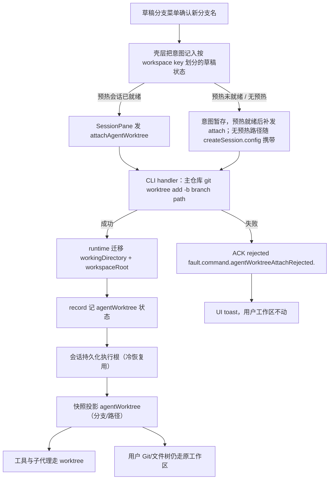

# Spec: Agent 在独立 git worktree 中隔离执行

## 目标

草稿会话可以获得「从当前 HEAD 拉新分支并挂到独立 linked worktree」的执行环境：用户当前检出与未提交改动分毫不动，Agent 的 Read/Write/Bash 与子代理全部落在新 worktree。会话身份（列表、文件树、用户侧 Git 工具）仍绑定原工作区。

首版不做：把 worktree 当用户工作区打开、自动把改动合回原分支、把未提交改动拷进 worktree、workflow 的 `isolation: "worktree"`（建树助手预留复用口）。

## 现状与关键链路（已确认）

- 执行根与身份已有拆分先例：`createRecord`（`apps/zcode-cli/packages/bootstrap/src/zcode-protocol/server-operations.ts`）把 `runtimeConfig.workingDirectory` 指向 `workspace.workspacePath`，而身份走 `workspace` ref（`workspaceKey` / `workspacePath` / `workspaceIdentity`）。
- runtime 侧 `workingDirectory` 可变（`setWorkingDirectory`，Bash `cd` 持久化用），`workspaceRoot` 在构造时钉死为 `workingDirectory`（`apps/zcode-cli/packages/core/src/runtime/agent-runtime.ts` 构造器；`getProjectId` 用 `workspaceRoot`）。隔离必须同时迁移两者，否则 Bash `cd` 边界与 project identity 仍是用户主树。
- 草稿语义：`record.persistence === "deferred"`（不进 sqlite）；首条输入经 `startPromptTurn` 时置 `immediate`（`apps/zcode-cli/packages/bootstrap/src/zcode-protocol-v4/commands/prompt-turn.ts`）。这一步即「提升」，之后执行根冻结。
- `deleteSession` → `host.closeSession`（`v4-bridge.ts`）：退订事件 → `app.close` → gateway dispose → 注册表摘除。草稿丢弃即走这条路径（UI 预热控制器 `useDraftSessionPrewarm` 的 `dispose()`）。
- 预热：草稿 pane 在用户输入前就 `createSession`（无 `firstInput`），载荷 config 由 `resolveInitialConfig` 组装（`packages/ui/src/v4/composer/useDraftSessionPrewarm.ts`）。因此隔离意图必须同时支持「创建时带上」与「对已有草稿补挂」。
- 草稿分支菜单：`GitBranchSwitcher`（`packages/ui/src/GitBranchSwitcher.tsx`）footer 两项 = `git.branchSwitcher.createAction`（创建并检出新分支）与 `gitGraph.menuAction`（Git 图谱）；草稿态实例渲染于 `WorkspaceShellLayout.tsx` 的 `draftComposerHeader`。
- 命令拒绝的稳定码模式：枚举 schema + `fault.command.<name>Rejected.` 前缀常量（先例 `savedWorkflowStartRejected`，bootstrap 铸码、UI 反查 i18n）。
- 快照冻结面规则：`conversationSnapshotSchema` 新增字段必须 additive 且带 `default`，否则旧快照/旧发送端解析破裂。

## 产品规则

1. **起点 = 当前 HEAD**：`git worktree add -b <branch> <path>` 在用户主仓库执行。用户工作区的脏文件不进 worktree，HEAD 不被切走。
2. **入口只在草稿**：分支菜单 footer 在「创建并检出新分支」和「Git 图谱」之间新增「在新的 worktree 中工作…」。已开聊（已提升）的会话不提供入口；协议侧对已提升会话拒绝 attach。
3. **对话框独立**：复用「输入新分支名」形态，但文案说明「不会切换你当前分支」；不复用「创建并检出」的提交语义。确认后用户工作区 Git 状态不变。
4. **身份与执行根拆开**：列表身份、文件树、用户 Git 工具继续绑定原 `workspacePath` / `workspaceIdentity`；只有该会话 runtime 的执行根（`workingDirectory` + `workspaceRoot`）指向 worktree。身份键仍是 `workspaceIdentity?.trim() || workspacePath`。
5. **绑定窗口**：attach 只允许 `persistence === "deferred"` 的草稿会话。提升后执行根冻结：不能再挂、不能拆。
6. **清理语义**：草稿被丢弃（预热回收、切走未发送、订阅失败）→ `deleteSession` 拆 worktree 并删除该会话创建的分支；已提升的会话关闭 → 只关会话，worktree 与分支保留在磁盘上（供之后合并）。
7. **路径归属**：worktree 建在跨平台用户数据目录 `~/.zcode/worktrees/<仓库指纹>/<sessionId>`（本地 CLI 所在机器；远程工作区 = 远端 Host 机器），不建在用户仓库内部，不让用户选目录。
8. **远程工作区**：worktree 建在 Host 侧；UI tab 仍是原 identity。远程链路复用当前 Agent 进程，不另起 Host/Agent。
9. **失败可见**：建树/挂载失败以稳定拒绝码回 ACK，UI toast 对应文案；用户工作区不动。

## 状态所有者与事件顺序

真值唯一所有者是 **CLI 会话 runtime**：`record.persistence`（是否草稿）+ runtime 执行根 + 会话级 agent worktree 状态。UI 只记意图、发命令，不自己跑 `git worktree add`，不另起 Host/Agent。

幂等与竞态边界：

- attach 重复到达（同分支）→ `noop`；不同分支 → `rejected session_bound`；会话已提升 → `rejected session_promoted`；会话不存在 → 既有 `proto.sessionNotFound` guard。
- createSession.config 携带隔离意图而建树失败 → handler 关闭刚建的 deferred record（草稿无痕）并回 `rejected`，绝不留下「已创建但未隔离」的半成品会话。
- 建树本身用 `git worktree add` 的原子性：路径冲突、分支已存在都由 git 判定，handler 只翻译成稳定码，不解析英文 stderr。
- 拆树（`git worktree remove --force` + `git branch -D`）只发生在「会话仍是 deferred 的 closeSession」；与提升（`persistence` 翻转）的竞态由「先读 persistence 再拆」+「提升路径不碰 worktree」保证：提升只改 `record.persistence`，不触发 close。

## 接口

### 1. 协议（packages/shared/src/zcode-protocol-v4/）

- `command.ts`
  - `createSessionRequestedConfigSchema` 新增可选 `agentWorktree: { branch: z.string().trim().min(1) }`（请求意图）。
  - 新命令 `attachAgentWorktree: z.object({ branch: z.string().trim().min(1) })`，进 `commandPayloadSchemas`；不进 `COMMANDS_REQUIRING_BASE_REVISION`（草稿期无投影 revision 竞争，幂等由 CLI 状态裁决）。
  - 拒绝词表 `agentWorktreeAttachRejectedReasonSchema`：`invalid_branch_name | branch_already_exists | not_a_git_repository | worktree_path_conflict | session_promoted | session_bound`；导出 `AGENT_WORKTREE_ATTACH_REJECTED_FAULT_PREFIX = "fault.command.agentWorktreeAttachRejected."`。
- `snapshot.ts`：`conversationSnapshotSchema` 新增 additive 只读投影
  `agentWorktree: z.object({ branch, path }).nullable().default(null)`。

### 2. CLI（apps/zcode-cli）

- **建树助手**（`packages/adapters` 新文件，供 bootstrap handler 调用，未来 workflow `isolation: "worktree"` 复用）：
  - `createAgentWorktree({ repoRoot, branch, worktreePath })`：`git worktree add -b <branch> <path>`（cwd=repoRoot，超时有界）。
  - `removeAgentWorktree({ repoRoot, worktreePath, branch })`：`git worktree remove --force` + `git branch -D <branch>`；不存在时幂等成功。
  - 错误类型携带稳定 reason（映射上表词表），不透出 git stderr 给 UI。
- **runtime 迁移**（`packages/core`）：新增 runtime method `relocateExecutionRoot(cwd)`——同时写 `workingDirectory` 与 `workspaceRoot`，并把执行根写入会话持久化 entry（冷恢复后仍在同一执行根）。`setWorkingDirectory` 语义不变（仅 Bash cwd）。
- **attach handler**（`bootstrap/zcode-protocol-v4/commands/handlers/` 新组）：
  - 校验 `record.persistence === "deferred"`，否则 `session_promoted`。
  - 校验分支名（`git check-ref-format` 规则的本地实现），否则 `invalid_branch_name`。
  - 已挂隔离：同分支 `noop`，不同分支 `session_bound`。
  - 调建树助手（repoRoot = record.workspace.workspacePath；失败映射稳定码）。
  - 成功：`record.app.runtime.relocateExecutionRoot(worktreePath)`，record 记 agentWorktree 状态，广播投影更新。
  - `createSession` handler：config 携带 `agentWorktree` 时，在 config 应用阶段走同一 attach 流程；失败 → 关闭刚建 record + rejected（见事件顺序）。
- **生命周期**（`v4-bridge.ts` 的 `closeSession` 钩子内，或 handler 收口处）：
  - `record.persistence === "deferred"` 且 record 携带 agentWorktree → 拆树删分支。
  - 已提升 → 不动磁盘。
- **子代理**：子代理执行根继承 runtime `workingDirectory` 的现有读取路径，迁移后自动生效；不新增旁路。
- **快照投影**（`product-projection.ts` / gateway 投影组装处）：从 record/runtime 读 agentWorktree 状态投影。

### 3. UI（packages/ui）

- `GitBranchSwitcher.tsx`：新增草稿专用 props（`agentWorktreeDraft?: { pendingBranch: string | null; onConfirmWorktree: (branch: string) => void; }` 一类），footer 渲染第三项；确认走独立对话框（复用 `GitBranchCreateDialog` 形态、独立实例与提交回调）。已挂隔离时在触发器旁显示「Agent 将在 \<branch\> 工作」；用户自己的当前分支与脏文件数展示不变。
- 意图存放：壳层（`WorkspaceShellLayout`）按 workspace key（`workspaceIdentity?.trim() || workspacePath`）划分的草稿状态持有 `pendingAgentWorktreeBranch`；不进 Zustand 全局 store（无跨 pane 广播需求，回环风险为零）。
- `SessionPane`：新增草稿 props 传入意图；预热 binding 就绪且意图存在 → 发 `attachAgentWorktree`；无预热、首发直接 `createSession` 的路径把意图放进 `config.agentWorktree`。
- 已提升会话的状态面板（`ConversationStatusPanel`）按快照 `agentWorktree` 投影展示隔离分支。
- i18n：`packages/ui/src/i18n/locales/en-US.ts` / `zh-CN.ts` 新增 `git.branchSwitcher.worktreeAction`、`git.worktreeDialog.*`、`git.worktreeNotice.*` 与拒绝码文案键；不改现有 `createAction` / `createDialog.*`。

## 不变量

- 用户工作区的 HEAD、脏文件、当前分支永不因 attach/拆树改变。
- 执行根迁移是原子的单一写点（`relocateExecutionRoot`），不存在只改 `workingDirectory` 不改 `workspaceRoot` 的路径。
- 身份 ref（`workspace`）在 attach 全程不变；会话不出现在别的 workspace 列表。
- 拆树只由「deferred 会话的 closeSession」触发；提升后的会话任何关闭路径都不拆树。
- attach 决策只读 CLI 侧 record/runtime 状态，不信任 UI 声明的「是否草稿」。

## 负面边界（明确不改）

- `IGitService` 的 `switchBranch` / `createBranchAndSwitch` 只服务用户工作区，不感知 agent worktree。
- 不新增 Desktop Host，不改进程池键；远程工作区复用 attachment 链路。
- 用户 Git 图谱、提交、切分支仍对原路径生效。
- 不把 worktree 加入用户工作区列表、文件树或最近列表。
- 不做自动合并回原分支、不拷贝脏文件、不做 workflow `isolation: "worktree"`。

## 验收场景

1. 当前分支有未提交改动时挂隔离：用户工作区脏文件数不变、HEAD 不变；Agent Read/Write/Bash 落在新 worktree 的新分支上。
2. 「创建并检出新分支」行为与现在完全一致（不改其回调与文案键）。
3. 挂上后丢掉未发送草稿：worktree 目录被拆、空分支从用户仓库消失。
4. 已发送会话：Agent 文件卡片路径相对 worktree 根（相对路径看起来仍像原项目）；冷恢复后仍在同一执行根。
5. 目标分支已存在 / 非 Git 仓库 / 会话已提升 / 重复 attach 不同分支：命令 rejected 稳定码 + toast，用户工作区不动。
6. 远程工作区：worktree 建在远端 Host 机器；UI tab 仍是原 identity。

## 验证

- CLI：建树助手单测（真实临时 git 仓库）、attach handler 准入/幂等/拒绝码、closeSession 草稿拆树与已提升保留、`relocateExecutionRoot` 后 `getProjectId` 与 Bash cwd 边界。
- 协议：create/attach 载荷校验与快照投影兼容（旧快照无字段仍可解析）。
- UI：意图在预热就绪后发出、非草稿不渲染入口、i18n 键完整。
- 全局：`pnpm typecheck`、`pnpm lint`、`pnpm architecture:check --changed`、相关包测试；交互用 `pnpm dev:desktop` 手工走一遍草稿会话（当前无可用的浏览器跑 Desktop，此条人工执行）。
