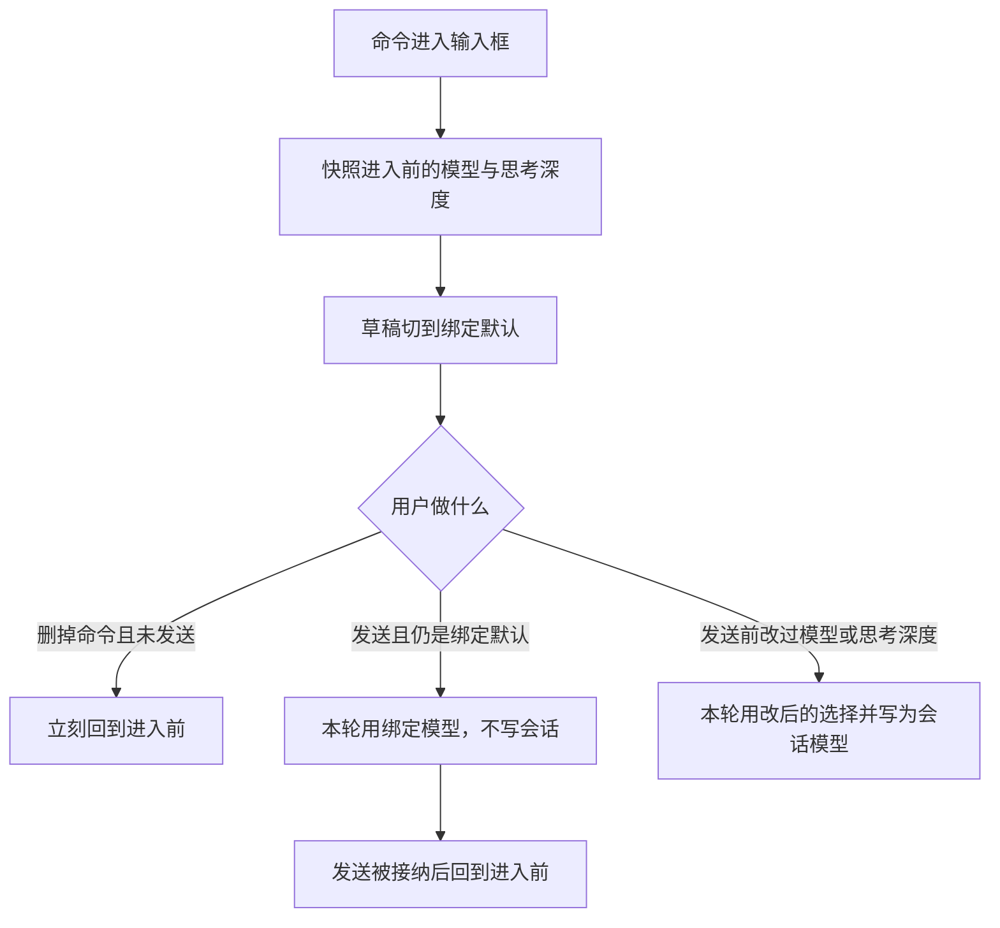

# Spec: 设置页内置命令展示与命令绑定模型

## 目标

两件独立的事：

1. **展示**：设置 → 插件 → Commands 增加分组「内置命令」，列出 App 可见的四条内置命令（`/goal`、`/compact`、`/init`、`/plan`），对齐内置子智能体的既有做法，消掉「输入框 `/` 面板有、设置页没有」的落差。分组行只读展示、可点进入子集详情页。
2. **绑定**：让压缩与用户自定义命令支持「绑定模型」—— 命令进入输入框那一刻，草稿的模型选择器切到绑定默认；用户看得见、可以改；发送时再决定这一轮是否写回会话模型。

目标、计划、初始化、插件自带命令**只展示不绑定模型**（初始化曾可绑，现改为强制跟随默认；存量配置残留不迁移，只是不再生效）。用户自定义命令另支持「绑定模式」（`mode` 文件头，可选 `plan` / `readonly` / `yolo`）：命令进入输入框那一刻，草稿的模式选择器切到绑定默认；用户看得见、可以改；发送时沿用现有模式提交链路，发送被接纳后按是否改过决定复原。

## 产品规则

### 展示与入口

- 设置页「内置命令」分组四行，无开关、无删除；行可点进入子集详情页（面包屑返回列表）。
- 详情页展示只读基本信息（名称 / 描述 / 用法）+ 模型区：只有压缩挂即改即存的模型控件；目标、计划、初始化只显示「跟随默认，不可修改」。
- 用户自定义命令行可点进入编辑表单；表单内新增模型区段（延迟态：点保存才落盘，取消丢弃）。
- 列表行不再放可切换的模型控件，只读展示当前绑定（绑定模型名或「跟随默认」）；插件行保持不可点。
- User / Workspace 两个作用域都显示同一组（覆盖写在用户配置，没有工作区副本）。切换作用域不隐藏内置分组。
- 行内 description 与 usage 沿用 CLI 目录里的英文摘要，不做翻译——与 `/` 面板保持一致，这是接受的取舍，不是回归。

### 绑定范围

| 命令类别        | 模型绑定                       | 模式绑定 | 存储                                 | 入口           |
| --------------- | ------------------------------ | -------- | ------------------------------------ | -------------- |
| 压缩 `/compact` | 是                             | 否       | 用户配置 `builtinCommands` 段        | 系统命令详情页 |
| 用户自定义命令  | 是                             | 是       | 命令 md 文件头 `model` / `mode` 字段 | 命令编辑表单   |
| 初始化 `/init`  | 否（强制跟随默认）             | 否       | —                                    | 详情页只读说明 |
| 目标 `/goal`    | 否（自主续跑生命周期未定义）   | 否       | —                                    | 详情页只读说明 |
| 计划 `/plan`    | 否（发送前 UI 已剥掉命令身份） | 否       | —                                    | 详情页只读说明 |
| 插件命令        | 否（不能改插件缓存文件）       | 否       | —                                    | 无入口         |

绑定只在一个地方改（详情页或表单），列表行只读——同一份事实不在两处可改，避免表单保存重写文件头盖掉行内改的结果。

### 模式绑定（用户自定义命令）

- 文件头 `mode` 可选 `plan` / `readonly` / `yolo`（大小写不敏感，前后空白忽略）；坏值按无绑定处理，不抛错、不阻断目录装配。
- 只有 `source === "zcode"` 的用户命令投影 `modeOverride`：插件文件属安装目录会被升级覆写、agents 为外部导入，两者设置页都没有模式控件——投影了就会出现「模式被切但无处解除」。
- 输入框行为与模型绑定同一条规则：命令进入输入框那一刻快照进入前的模式并切到绑定默认；删芯片或换成无绑定的命令时复原；重挂载后正文芯片仍在时不重复快照；复原只在「草稿仍等于进入时的绑定默认」时执行，用户改过模式则保留显式选择。
- 模型与模式各自独立快照、各自独立复原：一条命令可以只绑模型、只绑模式、两者都绑；复原时模型回到模型快照、模式回到模式快照，互不覆盖。
- 发送语义不变：模式沿用现有提交链路（草稿 `mode` → `createComposerSubmissionConfig` → `sendText` / `createSession` 载荷 `mode` → CLI 准入冻结），模式绑定不声明「仅本轮」作用域；发送被接纳后按是否改过模式决定复原，复原不清 `initializeFromNewTask`。
- 时效与模型绑定一致：绑定在「命令进入输入框」这一刻读取；设置里改完，框里已有的那条不跟着跳；删掉再敲或发完再敲才用新的。

### 输入框行为

- 绑定在「命令进入输入框」这一刻读取，不在会话创建时锁定。设置里改完，框里已有的那条不跟着跳；删掉再敲或发完再敲才用新的。
- 草稿和已有会话同一套。
- 插入时模型与思考深度必须一起写进草稿；**不得**经由会清掉思考深度的模型切换路径。
- 绑定的模型在当前目录不可用：提示一声，不切换，继续用输入框现有的选择。
- 芯片增删由 `SlashCommandPlugin` 的 update listener 采样命令名（`findCommandMentionNameInEditorState`），经 `onCommandMentionChange` 通知 `SessionPane`；通知发出在 `editorState.read` 事务之外，接收方要写 React 草稿与 localStorage。
- 着色状态随草稿持久化为 `commandBinding`（`name` / `binding` / `snapshot`）：重挂载后正文芯片仍在时按名字识别、不重复快照；删芯片仍能回到进入前的选择，而不是停在绑定默认上。坏绑定读取时丢弃，不连带丢正文选择。
- 复原只在「草稿仍等于进入时的绑定默认」时执行；用户改过模型或思考深度则保留显式选择，交给正常的 accepted 写回链路。着色不是显式选择：不清 `initializeFromNewTask`，不参与 accepted 写回竞争。
- 上下文面板的 `/compact` 入口不经过输入框、没有可见的草稿切换，不触发绑定——这是可见性原则的边界，不是遗漏。

## 为什么不是后台注入

命令身份的事实来源是「发送文本或命令种类」，**不是**「自定义命令展开是否成功」。四条内置命令的路径完全不同：

- 压缩是独立协议命令，载荷按发送语义携带模型选择（B 期前为空对象）；后台 `submitPrompt("/compact")` 不带意图。
- 目标走独立命令与续跑。
- 初始化是普通发送（`resolveZCodeBuiltinPromptCommand` 恰好能展开它，但这不是接线依据）。
- 计划在发送前就被 UI 剥掉命令身份。

且每次普通发送都会把会话/草稿模型冻进 intent（准入语义）。若在发送后台解析绑定并遵循「调用方已指定则不覆盖」，绑定永远排不到前面。把绑定变成输入框里可见的草稿默认选择，一次解掉路径分叉与优先级倒置两个问题。

## 数据与所有权

- **App 可见内置命令清单的唯一权威**是 `packages/shared`（从 `apps/zcode-cli/.../slash-command-surface.ts` 上移）。CLI 组装目录、设置页合成列表都从它读。TUI 另外十五条 help 条目不动。
- **斜杠目录（`/` 面板）仍以 CLI catalog 为权威**。绑定默认作为可选字段投影进 catalog，输入框插入时用同一份数据；远程 workspace 走远端 Host 的文件和配置。
- **设置页列表**由 `commandsService.list` 在返回前合成内置四行（`source: "builtin"`、只读、伪路径），另给 `builtinCommands` 数组，不污染现有 user/plugin 过滤。
- **用户配置**：`~/.zcode/cli/config.json` 新增顶层段 `builtinCommands`，按命令名键。不塞进按文件路径做键的 `command[<filePath>].enable` 那张表。**执行时读取，不进启动缓存**——与自定义命令「调用时读文件」的时效一致，避免同一个设置页两套生效时机。
- **自定义命令**：写 markdown 文件头（`model` + 思考深度，`mode` 模式）。CLI 解析器与 services 解析器必须认同一组字段，只改设置页控件会导致存了读不回来。文件头标量字符串与 `ModelSelection`（含 `options.reasoningLevel`）的互转规则只有一份；`mode` 的解析规则只有一份（大小写不敏感、坏值收敛为无绑定）。
- 写入走 `commandsService` 的串行队列，形态对齐内置子智能体覆盖；选「跟随默认」即删键。

## 发送语义（关键）

- **仍等于绑定默认**：带上本次模型选择，并声明仅本轮执行（`modelExecution.selectionScope: "execution"`），**不写会话模型**。发送被接纳（含压缩入队）后，输入框回到进入前的快照。
- **用户改过模型或思考深度**：只带改后的选择，**不**声明仅本轮，会话模型变成用户改的那个，发完不复原。
- **压缩与普通发送同一条规则，由 UI 显式声明**：「是否仅本轮」的唯一判定方是发送端（UI）——按插入锁定的着色快照比较当次选择，把结论随载荷（`modelSelection` + 可选 `modelExecution`）下发。CLI 只执行声明，不在压缩真正开跑时现读配置推导（两个真相源会在设置变更后把插入时模型写成会话模型，与输入框分叉）。队列提升走 `startManualCompact` 时经 intent 原样继承该声明，不能只在入队瞬间写过就丢；UI 侧无命令着色时（如上下文栏压缩入口）载荷为空，走「用会话模型并写回」的旧路径。
- 初始化与用户自定义命令走现有 `sendText`，按上面两条决定是否带执行作用域。不能让「准入冻结的会话模型」盖掉绑定默认。初始化现为强制跟随默认，实际不再产生绑定着色。
- **忙时的带声明输入走队列，不拒单**：`sendText` 带 `modelExecution` 在 busy 落到 Core admission 时，不能 steer 进正在跑的 turn（那条路径续写旧 turn 的模型步，切过去的模型与声明的轮次边界分叉），也不走 guide（guide 在当前模型步里消费，模型已在跑，换不成绑定模型），更不能直接拒单——那会把「静默不生效」变成「发不出去」。因此整条入队，声明随 intent 冻结；提升时把 intent 里的声明回填成 `startPromptTurn` 的顶层 `modelExecution`（模型闸门与 Core admission 读的是顶层参数，只留在 intent 里等于没带），形状与 compact 提升分支一致。`QueueItem` 投影必须写出 `modelExecution`，漏字段会让提升后的 turn 按会话模型跑并写回会话。
- 新会话首条输入（`createSession.firstInput`）schema 支持 `modelExecution`（additive）；副屏首条输入（`createSelectionSideSession.firstInput`）**UI 不使用**——副屏入口无命令芯片语境，不存在「未改 vs 改过」的判定依据，保持用会话模型。
- 不改 TUI 选择器；TUI 压缩/初始化若载荷没有模型，仍用会话模型。

## 失效语义

- 绑定模型在当前 provider 目录不可用：输入框 toast，不切换选择，命令照常可用会话模型。UI 不做档位对齐（可用性只在插入时校验一次），后续依赖 runtime 降级兜底。
- 配置 `builtinCommands` 段里的坏条目按**单条**静默丢弃，不阻断其余绑定——一条手编坏值不能拖垮全部命令的绑定（比对齐子智能体覆盖的读取语义更细一档）。配置读取整体失败时退化为「无绑定」，不阻断目录装配。
- App 内设置页写入绑定后刷新输入框目录（`refreshWorkspaceSlashCommandsAfterBindingChange`）；外部途径（TUI、手编配置或 md 文件头）改绑定**不**触发 App 内刷新，已水合会话的目录保持旧值，重开会话才生效。

## 明确不做

- 不给内置命令开关和排序。
- 不改 `command[<filePath>].enable` 的既有语义。
- 不接目标绑定（自主续跑生命周期未定义）。
- 不改计划的发送前剥离，计划行不挂控件。
- 不把绑定写进插件缓存文件。
- 不修子智能体里重复的覆盖归一化。
