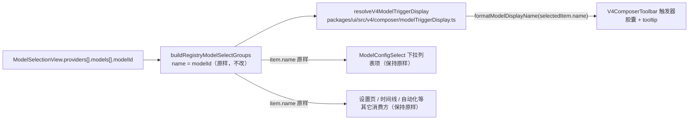

# Spec: 输入区模型胶囊的展示名格式

## 目标

输入区工具条上的模型胶囊一直显示模型目录里的原始 id（`deepseek-v4.1-flash`、`glm-5.3-flash`），像机器标识而不是产品名。本次在**展示层**加一层格式化：胶囊（及其 tooltip）显示 `Deepseek V4.1 Flash`、`GLM 5.3 Flash`。

格式化是纯派生的显示行为：模型 id 仍是唯一事实，目录、配置、协议与请求参数一律不改。

## 产品规则

模型 id → 展示名的唯一实现是 `formatModelDisplayName(modelId)`（`packages/ui/src/lib/modelDisplayName.ts`）。规则：

- **空白与空值**：折叠连续空白并 trim；结果为空串时返回空串（调用方自行兜底）。
- **vendor 前缀原样保留**：id 含 `/` 时按 `/` 切段，除最后一段外原样保留（它们是 `anthropic`、`z-ai` 这类 slug），只格式化最后一段，用 `/` 连接 → `anthropic/claude-opus-4.5` → `anthropic/Claude Opus 4.5`。
- **分词**：段内按 `-`、`_` 与空白分词。
- **缩写整词大写**：`glm` / `gpt` / `ai` / `api` / `mcp` / `vl` / `llm`（不区分大小写）→ 全大写。
- **数字原样**：纯数字与点分版本号（`\d+(\.\d+)*`）不改编排 → `5.3`、`250414`。
- **只改写拉丁小写词**：词里含大写字母（任意字符集），或含拉丁字母以外的字母（西里尔、希腊、汉字…）时整词原样保留 → `MiniMax`、`M2.1`、`FlashX`、`4.1V`、`GLM`、`МОДЕЛЬ`、`我的模型`。这条同时保护用户自定义 provider 里大小写敏感或非拉丁的模型名。判定只看字母与大小写，不看符号与变音符号，所以拉丁字母（含变音）与符号仍走首字母大写：`café-model` → `Café Model`、`custom_model@2024` → `Custom Model@2024`。
- **视觉标记大写**：版本号后面的单个 `v` 视为视觉标记（`4.6v` → `4.6V`），与官方 `GLM-4.6V` 写法对齐；其它数字字母混排的词保持原样（`hy3`、`k3`、`256k`）。
- **其余首字母大写**：首字母大写、其余小写 → `deepseek` → `Deepseek`、`v4.1` → `V4.1`、`highspeed` → `Highspeed`。
- **相邻单个数字并成版本号**：相邻两个单个数字（`\d`）用 `.` 连接 → `claude-sonnet-4-5` → `Claude Sonnet 4.5`；多位数字不参与合并，避免把日期戳或型号后缀并进版本号 → `claude-haiku-4-5-20251001` → `Claude Haiku 4.5 20251001`、`glm-4-flash-250414` → `GLM 4 Flash 250414`、`model-24-7` → `Model 24 7`。
- **统一空格连接**：GLM 系列同样用空格分词（`glm-5.3-flash` → `GLM 5.3 Flash`），不保留连字符写法。
- **只作用于输入区胶囊**：格式化只在输入区工具条触发器上启用；provider 前缀仍沿用既有规则（内置家族不拼前缀，其余拼 `<providerName>/`）。

样例：

| 模型 id                     | 展示名                      |
| --------------------------- | --------------------------- |
| `deepseek-v4.1-flash`       | `Deepseek V4.1 Flash`       |
| `glm-5.3-flash`             | `GLM 5.3 Flash`             |
| `GLM-4.1V-Thinking-FlashX`  | `GLM 4.1V Thinking FlashX`  |
| `MiniMax-M2.1-highspeed`    | `MiniMax M2.1 Highspeed`    |
| `claude-sonnet-4-5`         | `Claude Sonnet 4.5`         |
| `anthropic/claude-opus-4.5` | `anthropic/Claude Opus 4.5` |

## 状态所有者与数据流

格式化不引入任何状态：输入是目录里命中项的 `name`（即 modelId），输出是触发器的 `fullLabel` / `modelLabel`。

## 接口

- `formatModelDisplayName(modelId: string): string`（`packages/ui/src/lib/modelDisplayName.ts`）。
- 唯一消费点：`resolveV4ModelTriggerDisplay()`（`packages/ui/src/v4/composer/modelTriggerDisplay.ts`），只格式化「命中目录项」的标签；未命中目录时的 `fallbackLabel`（占位、「选择模型」i18n 文案、`<synthetic>`）不进格式化函数。

## 不变量

- 展示名只在展示层派生：不得把格式化结果写回配置、目录、协议或请求参数，`modelId` 始终是传给 runtime 的值。
- 同一份格式化规则只有一处实现；UI 其它位置需要时 import 这一份，不各自复制规则。
- 目录外模型、`<synthetic>`、i18n 占位文案不经格式化，保持既有兜底行为。
- provider 前缀规则不变：内置家族（Z.ai / BigModel）只显示模型段，其余拼 `<providerName>/`。

## 负面边界

- **下拉列表项不改**：`ModelConfigSelect` 的列表项仍显示原始 id，本次刻意只改胶囊，接受「合上格式化、展开原始」的不对称。
- **其它展示位置不改**：模型切换分割线（`ConversationRowView` / `SessionPane` 的 `formatModelChangeLabel`）、workflow 时间线（`subagent-model-label`）、设置页子代理与自动化（`automationAgentConfigOptions`、`SubagentsSection`）仍显示原始 id。
- **套餐/配额卡片不改**：`formatQuotaModelDisplayName` 虽规则相近，但带自己的 `GLM-*` 特殊分支且服务另一条产品语义，本次不合并、不改写。
- **不新增数据字段**：不给模型目录、共享类型或 CLI 加 `displayName`；不碰 `packages/shared`、`packages/provider`、`apps/zcode-cli`。
- **不做本地化**：展示名是 id 的排版结果，不引入 i18n 文案（中文 UI 下同样显示 `Deepseek V4.1 Flash`）。

## 验收场景

1. 打开输入区：当前模型为 `deepseek-v4.1-flash` 时，胶囊显示 `Deepseek V4.1 Flash`，悬停 tooltip 同文案。
2. 点开模型下拉列表：列表项仍是 `deepseek-v4.1-flash`（原始 id），与改动前一致。
3. 切到 `glm-5.3-flash` / `GLM-4.1V-Thinking-FlashX`：分别显示 `GLM 5.3 Flash` / `GLM 4.1V Thinking FlashX`。
4. 非内置 provider：胶囊显示 `<providerName>/Claude Opus 4.5`，前缀行为与改动前一致。
5. 模型不在目录、`<synthetic>` 等兜底：显示「选择模型」占位，不做格式化。
6. 发送消息、切换模型与思考档位、额度显示均正常；模型切换分割线文案与改动前一致。
7. 单测与静态检查通过：`node --import tsx --test packages/ui/test/modelDisplayName.test.ts`、`TSX_TSCONFIG_PATH=packages/ui/tsconfig.json node --import tsx --test packages/ui/test/modelTriggerDisplay.test.ts`、`pnpm typecheck`、`pnpm lint`、`pnpm architecture:check --changed`。
