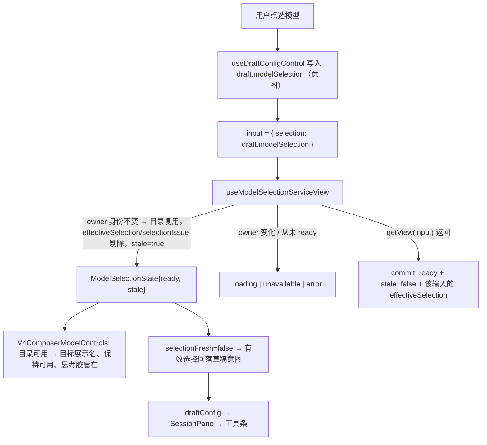

# Spec: 切换模型时输入区胶囊的显示连续性

## 目标

用户点选模型后，输入区工具条要在**同一帧**显示目标模型，不能先退回占位文案/禁用态、再跳回目标。切换模型的这一次输入变化，只让「由选择派生的结果」失效，不让「与选择无关的模型目录」失效。

本次不改模型目录的读写、不改选择语义、不改协议；只改「选择变化时的失效粒度」与「失效期间显示什么」。

## 现状与根因

`useModelSelectionServiceView`（`packages/ui/src/hooks/useModelSelectionView.ts`）把「调用方这次传的 selection 变了」等同于「没有视图」：`inputKey = JSON.stringify(input)`，`ownerMatches` 与 effect 里的 `retainedReady` 都要求 `previous.inputKey === inputKey`，不相等就整份退回 `{ status: "loading" }`。

但视图里只有两个字段与 input 有关。`ModelSelectionView extends Partial<EffectiveModelSelectionResult>`（`packages/provider/src/facades.ts`），`getView` 中 `providers` / `revision` / `preferredSelection` 完全不看 `input`，只有 `effectiveSelection` / `selectionIssue` 来自 `input.selection`。所以失效时被丢掉的部分，恰好是不该失效的那部分。

切换模型那一帧的连锁反应（全部可对到代码）：

| 现象                 | 直接原因                                                                                                                                               |
| -------------------- | ------------------------------------------------------------------------------------------------------------------------------------------------------ |
| 胶囊显示「管理模型」 | `modelSelectionView = null` → `modelSelectGroups = []` → `resolveModelSelectTriggerDisplay` 命中空组占位分支（`chat-input-toolbar/modelSelection.ts`） |
| 胶囊变淡、点不开     | `disabled={... \|\| modelSelectionState.status !== "ready"}`（`v4/composer/V4ComposerToolbar.tsx`）                                                    |
| 思考档位胶囊消失     | `resolveDraftModelThoughtOption` 在无视图时返回 null（`v4/composer/draftWorkspaceDefaults.ts`）                                                        |
| 文字被裁切地滚一下   | 标签换两次（旧名 → 占位 → 目标名），`RollingToolbarLabel` 的 AnimatePresence 在 200ms 内叠放两个标签                                                   |
| 发送按钮短暂不可用   | `createComposerSubmissionConfig(draftConfig, null)` 返回 null（`v4/composer/composerSubmissionConfig.ts`）                                             |

## 产品规则

1. **失效粒度**：调用方的 `input.selection` 变化时，只让 `effectiveSelection` / `selectionIssue` 失效；`revision` / `providers` / `preferredSelection` 继续可展示。
2. **状态表达**：保留的目录仍以 `status: "ready"` 对外，并带 `stale: true`。消费方读到的 `view` 只含目录字段（`effectiveSelection` / `selectionIssue` 按构造剔除），因此不存在"读到上一份选择结果"的路径。
3. **新鲜度**：`ModelSelectionRead.selectionFresh` 表示「当前状态已经对应调用方这一次的 selection」。`stale` 或非 `ready` 时为 false。
4. **显示回落**：Composer 的有效选择在 `selectionFresh` 为 true 时取 `view.effectiveSelection`；为 false 时取草稿意图 `draft.modelSelection`。目标模型来自刚读到的目录，所以胶囊当帧就能显示排过版的展示名（见 `composer-model-display-name.md`）。
5. **占位只属于"从未读到目录"**：`loading`（`status !== "ready"`）时的占位/禁用行为不变——冷启动首读未完成、远端未连接、目标缺失仍按原语义显示。
6. **不跨 owner 复用**：`service` / `enabled` / `unavailableReason` 任一变化都视为新 owner，退回 `loading` / `unavailable`，绝不展示上一个 Host、上一个 workspace 或上一个项目的目录。
7. **读取失败语义**：已有目录时，重读失败保留目录且不显示错误条（沿用「成功后的刷新失败保留原 View」）；从未读到目录时仍是可见错误 + 有界重读。当前输入尚未解析时的瞬时失败仍走那两次有界重读。
8. **提交**：`stale` 期间提交用「草稿意图 + 保留目录校验」，Host 侧仍做最终裁决（`ensureReadyForSend` 发送前重读 registry）。

## 状态所有者与数据流

所有者：目录的读取与失效判定在 `useModelSelectionServiceView` 一处；Composer 只派发展示，不自己缓存目录。

## 接口

- `packages/ui/src/hooks/modelSelectionViewState.ts`（纯函数，无运行时依赖）：
  - `ModelSelectionState` / `ModelSelectionRead`（`ready` 变体新增 `stale?: boolean`；`ModelSelectionRead` 新增 `selectionFresh: boolean`）；
  - `initialModelSelectionState(service, enabled, unavailableReason)`；
  - `ownsModelSelection(owned, target)`；
  - `projectModelSelectionCatalog(view)`：只挑 `revision` / `providers` / `preferredSelection`，同源视图返回稳定引用；
  - `nextOwnedModelSelectionState({ owned, target, inputKey })`：一次输入变化后应持有的状态（含目录复用与 `stale`）；
  - `resolveVisibleModelSelectionState({ owned, target, inputKey })` → `{ state, selectionFresh }`；
  - `isModelSelectionStateFresh(state)`。
- `packages/ui/src/v4/composer/draftEffectiveSelection.ts`：`resolveDraftEffectiveSelection({ selectionFresh, view, intent })`。
- `useModelSelectionView.ts` 继续 re-export `ModelSelectionState` / `ModelSelectionRead`，既有引用不变。

## 不变量

- `effectiveSelection` / `selectionIssue` 只能来自「与当前输入匹配」的视图；`stale` 状态下消费方读到的是「字段不存在」，而不是旧值。
- 目录只在同一 owner 内复用；owner 身份（service / enabled / unavailableReason）变化必须回到 `loading` / `unavailable`。
- 只有一处实现判定保留与新鲜度；Composer 侧只调用 `resolveDraftEffectiveSelection`，不再各写三元。
- 格式化规则不变：展示名仍只在触发器上派生（`composer-model-display-name.md`）。

## 负面边界

- **不做目录缓存或持久化**：目录只活在 hook 的 state 中，进程退出即消失；不新增 store、协议字段或目录快照。
- **不跨 owner 保留**：切 workspace / 切远端 target / 远控未连接都不复用旧目录。
- **不改变"从未读到目录"的体验**：冷启动占位、禁用、错误条与重试次数都不变。
- **不改格式化与下拉内容**：下拉项仍是原始 id，provider 前缀规则不变。
- **不清理旁支死代码**：`ModelConfigSelect` 的 `pending` / `pendingLabel` 分支与旧 `startModelSwitch` / `chat.toolbar.modelSwitch.stage.*` 文案确认无调用方，但不是本症状的路径，本次不删。
- **不改 Automations 的语义**：stale 期间 `selectionIssue` 缺失带来的"不弹失效提示"、`effectiveSelection` 缺失带来的空值，都与改动前 `view === null` 时一致。
- **不新增 UI 测试基建**：本次只把判定逻辑做成纯函数来测，不引入 jsdom / renderHook，也不新建 E2E 框架。

## 验收场景

1. 输入区切换模型：胶囊从旧模型名一次滚到目标展示名（`deepseek-v4.1-flash` → `Deepseek V4.1 Flash`），全程不出现「管理模型」/「选择模型」占位，不出现变灰禁用的中间帧，思考档位胶囊不消失，发送按钮不禁用。
2. 切到思考档位集不同的模型：思考胶囊一次跳到该模型默认档，不出现先清空再回填。
3. 冷启动首次进入（目录未读到）：胶囊仍是占位且禁用；读到目录后正常显示。
4. 远端未连接 / 无 workspace target：仍显示 remoteWaiting / targetMissing 文案，不显示旧目录。
5. 设置页 Automations 切换项目：候选随项目切换，不出现上一个项目的模型。
6. 单测与静态检查：`TSX_TSCONFIG_PATH=packages/ui/tsconfig.json node --import tsx --test packages/ui/test/modelSelectionViewRetention.test.ts packages/ui/test/draftEffectiveSelection.test.ts`（测试引用了带 `@/` 别名的模块，需要 `TSX_TSCONFIG_PATH`）、`pnpm typecheck`、`pnpm lint`、`pnpm architecture:check --changed`。
7. 交互层验收：`pnpm dev:desktop` 手工切换模型观察胶囊（仓库无 E2E 框架，此条人工执行）。
