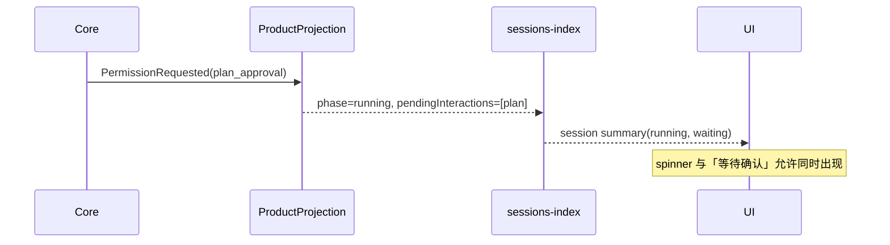
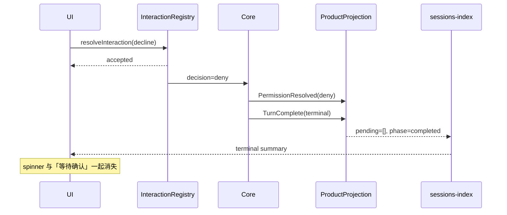

# Spec: 交互、回合与会话列表状态生命周期

## 目标

冻结「交互等待 → 权威决策 → 回合终态 → 会话列表摘要」之间的状态所有权和投递语义，避免 Plan 已拒绝后仍显示转圈与「等待确认」，也避免 UI 用超时或本地状态猜测业务终态。

## 状态所有者

| 状态                                    | 唯一所有者                                                        | 其他层职责                                      |
| --------------------------------------- | ----------------------------------------------------------------- | ----------------------------------------------- |
| interaction 是否仍待答、应答是否命中    | `V4InteractionRegistry` 与 CommandInbox admission 链              | UI 只发送命令；sessions-index 不得反推 registry |
| 工具行、pending interaction、turn phase | `ProductProjection` 消费 core 权威事件后的 `ConversationSnapshot` | sessions-index 只派生摘要；UI 只展示            |
| 会话列表实时摘要                        | `SessionsIndexPublisher` / `SessionsIndexProjection`              | 持久 membership/status 由 tasks-index 单独拥有  |
| Plan 卡片执行入口                       | transcript 中 `ExitPlanMode` 工具行 + 当前 UI submission mode     | 列表摘要不执行计划、不改变模式                  |

禁止新增第二份 pending interaction map、列表本地 pending Set、超时完成状态或由 persisted status 单独推导 spinner 的路径。

## 正常时序

### 真实等待确认



### 正常拒绝



`accepted` 只证明命令被接收，不证明投影已收口。UI 不得在收到 ACK 时直接删除业务 pending；后续渲染由权威 snapshot 替换。

### 晚到或重复应答

- 同一 `commandId` 重试由 CommandInbox 返回 `duplicate`，不产生第二次 core 决策。
- 新 commandId 指向已结算 interaction 时返回 `noop`（当前稳定 reasonCode 为 `proto.alreadyResolved`），不产生第二次 core 决策。
- Plan 静默拒绝 effect 对 `accepted`、`duplicate` 和 `noop` 都不再重发；`failed` ACK 或传输失败允许下一次权威 snapshot 触发重试。

## sessions-index 两阶段投递

每个 subscription 的 `sentSeq` 与 `inFlight` 由对应 publisher 独占。帧先 reserve，再完成物理编码/发送，最后 commit：

```text
reserve → encode/notify 成功 → commit(sentSeq=toSeq, inFlight=null)
                     失败
                       ↓
              rollback(inFlight=null, sentSeq 不变)
```

不变量：

1. `commit` 只在物理发送成功后调用；成功推进 `sentSeq` 并清除当前 reservation。
2. `rollback` 只在 reservation 仍属于当前 subscription generation 时清除 `inFlight`，绝不推进 `sentSeq`。
3. 已 commit 或已 rollback 的旧 reservation 不得再次改变水位。
4. rollback 后的下一次 flush 必须重新构造并发送包含最新 `currentSeq` 的帧；不能重发旧 `inFlight`。
5. snapshot/delta/recovery 继续使用现有 `logEpoch + fromSeq/toSeq` 契约，不增加轮询、sleep 或超时兜底。
6. 初始 subscribe 的 encode/admission 失败仍回滚整个新订阅；在线 flush 失败只回滚本次 reservation，保留 subscription 供下一次权威更新重试。

## raw seq 投递与缺口容忍

`eventStore.append` 分配 `sequenceNumber` 时该序号即被消耗。**已消耗的序号必须最终通知到 live sink**：序号一旦分配而事件永不投递，投影与持久日志就永久失同步。

core `appendEvent` 的四步（append → persistDurable → recordUsage → notifyEventSinks）在同一个 try 内，catch 只记录后 rethrow。因此 `persistDurableSessionEvent` / `recordToolUsageFromEvent` 中任何未被 try 保护的失败，都会让 `notifyEventSinks` 被跳过，制造这种空洞。不变量：

1. `notifyEventSinks` 必须在 `appendEvent` 中**必定执行**。持久化与用量记账是 best-effort，失败只降级为 warn，不得阻断事件投递。
2. `persistDurableSessionEvent` 的每个分支的 payload 解析都必须在 try 内；解析失败降级为 warn 并继续，不得把异常抛回 `appendEvent`。
3. 消费端 `normalizeRuntimeEventSequence` 只按 raw seq 连续 drain。**缺口不得被当作正常**：滞留事件必须被观测到，而不是无限期静默缓冲。
4. **任何边界重置都不得丢弃已收到的事实**。`SessionResumed` 是 epoch 边界：旧 runtime 的缺口可能再也补不齐，边界必须重置，但边界前已经滞留在 `pendingByRawSeq` 的事件是本进程收到的事实（`PermissionResolved`、`TurnComplete` 之类），必须按 raw seq 升序先落地再重置边界。丢掉它们会让投影永久停在缺口之前，且完全无声——没有 warn、没有 error，连缺口现场都不会留下。这是同一个症状的第二条独立成因，且不需要任何异常就能发生。

缺口自愈与冻结暴露：

5. 连续 drain 之后若 `pendingByRawSeq` 仍有滞留，说明 raw seq 出现空洞。空洞超过容忍窗口仍未补齐时，该会话判定为**投影失同步**，并一次性记录现场：sessionId、缺口 rawSeq、滞留事件数、滞留时长。
6. 失同步的修复走**定点回填**而不是整体重建：缺失的序号在 eventStore 里本就存在（append 已成功），只是没进 live sink。用 `loadPersistedEvents` 读出缺口之后的事件，经与 live 相同的 `normalizeRuntimeEventSequence` → `ingest` 通道按 raw seq 连续补齐，queue/stream 总序不变。不用 `forceRebuild` 整体重建，是因为宿主在没有 backing record 时会返回空事件列表，整体重建会把一份完好的投影清成空投影；定点回填在没有可补事件时自然什么都不做。
7. `synthesized` 的事件日志（冷合成重新编号为 1..N）不是 runtime raw seq，不得用于回填。
8. 失同步未解除前，该会话的摘要不得继续以 `running` / `prewarming` 呈现给列表。转圈与「等待确认」都是对用户的事实断言，投影冻结时二者都是错的。唯一不撒谎的落点是 `error`：它同样不撒谎（投影确实失同步），也不会被后续真实事件覆盖掉。
9. 失同步标记必须可逆：缺口补齐或整体重建后，真实事件照常推进 phase。
10. 不引入轮询、sleep 或固定重试。容忍窗口只用于判定「缺口是否已确认」，判定本身由 raw seq 事实驱动；每个会话至多一个定时器，补齐即撤销。

## 投影 apply 失败与未投递记账

序号连续不等于事件已落地。`ingestNormalizedEvent` 在投影 apply 失败时会把异常上抛，由 core `notifyEventSinks` 逐 sink 吞掉——这同样制造「raw seq 已被 eventStore 消耗，但事件从未进入投影」的空洞，而且比 raw seq 缺口更难察觉：序号是连续的，缺口检测根本不会触发。消费端必须自己留下记账。

11. **投影 apply 失败必须留下 undelivered 记录**。`ingestNormalizedEvent` 的 rethrow 分支在抛出前，把 `event.id` 记入会话级 `undeliveredEventIds` 并累计 `undeliveredEventCount`，同时一次性发出 `fault.projection.undelivered` 诊断，带 eventId、eventType、sessionId 与累计条数。序号连续，因此不能依赖缺口检测覆盖这条路径。
12. **undelivered 非空的会话与 gap 会话同等对待**：能定点回填就回填并清空记账，补不到就 `markDesynced`。undelivered 事件的 raw seq 已经落在 `sourceEventSeq` 之前，再走 `normalizeRuntimeEventSequence` 会被当作 duplicate 丢掉，因此回填**直接补投影**并推进 `lastTransportSeq`，不重走 normalize 通道——这与 gap 回填的走法不同，两条路径不得合并。
13. 记账去重：同一 eventId 只记一次。`ProjectionPayloadTooLargeError` 是既定可降级分支（该分支内不记账），其余异常必须记账。

## 索引帧出站卡死（订阅级，不是会话级）

缺口与 undelivered 都是**消费端**的问题：投影本身可能有洞。但还有一类症状完全相反——**投影是对的，列表行是错的**。这类故障的投影侧一切正常：事件全部 ingest、`deriveSessionSummary` 从最新快照派生出的 `phase` 与 `pendingInteractionSummary` 都是收口后的值，缺口检测与 undelivered 记账都不会触发（因为确实没丢事件）。但 UI 拿到的索引帧停在了更早的那一帧上，于是同一份旧 summary 的两个字段一起僵住——转圈加「等待确认」，而实际上没有任何东西在跑。

可疑路径是 control reservation：subscribe/resync 的 initial reservation 进 request-scoped outbox，ACK 发出后由 outbox admission 调 `commit()` 摘掉自己；窗口期内 online flush 复用同一 `inFlight` 被抑制是设计意图。但 `server.ts` 的 `postResponseOutbox.delete(request.id)`（clearPostResponseMessages 与每请求开头的清理）会直接删掉条目，**既不 commit 也不 rollback**。reservation 就此永远留在 `controlReservations` 与 `subscription.inFlight` 里，此后每次 flush 都取到同一个死 reservation、每次都被 `emitReservation` 的静默 `return false` 吞掉。

14. **这条路径此前完全不可观测**：它不抛异常、不调 `onError`、不产生任何日志；断档检测也不会触发（帧根本没发，不是发了被丢），所以 renderer 侧看到的 status/seq/gap 全部正常。必须在抑制点留下诊断。
15. **抑制本身有正常与故障两种，必须按滞留时长区分**。`emitReservation` 记录 control reservation 的加入时刻；滞留超过 `STUCK_CONTROL_RESERVATION_MS`（30s，远大于正常 ACK 往返）仍然没被 commit，即判定为卡死，一次性发出 `fault.sessionsIndex.stuckReservation`，带 topic、subscriptionId、workspaceId、滞留时长，以及 `publisherSeq` 与该订阅的 `sentSeq`。判据是 `publisherSeq` 持续增长而 `sentSeq` 不动。
16. 卡死是 **workspace 级**而非会话级：同一侧边栏内所有会话行会同时停止更新。这是与单会话投影故障最快的区分方式。

## 摘要槽位的位次不变量

`pendingInteractionSummary` 统计全部待结算交互，但 `pendingInteraction` **只有一个槽位**。摘要又是 conflation 的产物（只有真变化才产帧），所以这一槽给谁，直接决定 UI 能看见什么。

17. **该槽必须优先给计划批准**，而不是数组里的首个 permission/userInput。取首个时，同一会话里排在计划批准之前的其他交互会把它挤掉：侧栏显示「等待确认」却看不出真正卡住的是计划批准，靠摘要驱动的静默拒绝（见 `plan-card-execute.md`）也永远等不到触发信号——decline 发不出去，turn 停在审批闸门，列表行就此永久停在转圈加「等待确认」。这与本规范第 14-16 条的帧级卡死症状几乎一样，但成因在归约侧而非传输侧，靠 `fault.sessionsIndex.stuckReservation` 区分（该诊断 0 命中即排除帧级卡死）。
18. `permissionCount` / `userInputCount` **不受**这条不变量影响，仍统计全部交互。只约束「哪一条被单独下发」。
19. 判定实现必须与 UI 共用同一份，放在 shared（`packages/shared/src/zcode-protocol-v4/plan-approval.ts`）。摘要形态没有 `schema`，只能用 `toolName`；完整 payload 形态要同时看 `toolName` 与 `schema` 两个信号。任一侧改用另一形态的判定都是回归。

## 展示规则

- `prewarming/running` 才显示 spinner；持久 `tasks-index status=running` 单独存在不显示 spinner。
- `pendingInteractionSummary` 存在才显示「等待确认」。
- 真实待确认时两者允许并存。
- 权威 `phase` 离开运行态且 `pendingInteraction` 为空后，两者必须同时消失。
- 失同步与真实运行失败都落在 `phase: "error"`，但语义不同：真实失败用 `bg-destructive` 圆点，`fault.projection.desynced` 用中性色圆点 + 「投影失同步」提示。分不出来就说明 `lastErrorCode` 没走到列表行。
- UI 不得根据时间、ID 消失、本地 Set 或组件卸载推断 interaction 已结算。

## turn 终态与输入账本收口

`session_input` 的每一行都必须终结。`admitted` 是「已收件、未注入对话」的中间态，它占着该 session 的 FIFO 与发布器队头——一行 `admitted` 悬空，后续所有用户输入都会静默卡死，且界面上没有任何提示。

- **turn 自身负责兜底收口。** `sendText` 的 handler 在 `startPromptTurn` 返回后立刻 ACK，并不等待 turn 完成，因此网关命令 promise 的 `finally` 兜底在 turn 抛错时早已走完（按 `accepted` 收口），接不住 turn 后的异常；`prompt-turn.ts` 的 catch 又只记日志。账本收口因此不能依赖任何外部调用点，必须由 turn 生命周期自己在 `finally` 中终结。
- **兜底的第一选择是补投升格，不是结算失败。** `finally` 先看账本：已 `promoted` → 空操作（成功路径再跑一次不得写出第二条用户消息）；仍 `admitted` → 走升格原语把正文补进转录并补内存历史（优先用本回合已解析的正文/附件/消息 id；逃逸发生在解析之前则从账本读正文，附件按「找不到就只留字」）。升格本身失败才退回结算 `failed`，避免已受理永久卡住后续发送。
- **结算只对 `admitted` 行生效。** store 的 UPDATE 带 `where status = 'admitted'`，已 promoted 的行是 no-op，因此成功路径调用它也安全，无需枚举分支。
- **收口失败不得覆盖主流程。** 收口动作自身 `try/catch` 兜住，只记 warn；它是善后，不是主流程。
- **收口 reason 用 `fault.` 前缀。** `status_reason` 无枚举约束，但 `persistent-command-facts.ts` 只对 `fault.*` / `proto.*` / `guard.*` 做客户端 reasonCode 复用，用别的前缀会丢可读原因。

## 僵尸 Goal 收口

`status = 'active'` 而 `active_input_id` 为空，是一个不可能成立的组合：`startSessionTargetRun` 的 `where status = 'active'` 谓词保证任何真正跑起来的 goal 一定会写入 `active_input_id`，写不进去就直接返回不写。

- 恢复期读到该组合时收口为 `paused`，并清空 `active_input_id` / `active_run_started_at` / `active_run_last_seen_at`。收口成 `paused` 而非新增终态：`GoalStatus` 只有 `active | paused | budget_limited | complete`，且 `paused` 语义上更准确——用户可以再恢复它。
- **不改动 `recoverInterruptedTargetRun` 自身的判据。** 它负责「跑过但没跑完」的情况，用 `last_seen_at` 而非 `Date.now()` 结算时长（避免离线时间被计入 goal 运行时长），这个判据和结算方式都必须保持。
- 该收口只处理「没有活跃 run 却被标 active」；真在跑的 goal 由 `recoverInterruptedTargetRun` 按原路径处理，不得被这条误杀。

## 受限档与活跃 Goal 的裁决

进入 `plan` / `readonly` 档时若 Goal 为 `active`，受限档会让 Goal 的自主循环无法落盘——这个判断成立，但**冲突必须被裁决，不能拒绝**。裁决方式是**把 Goal 收口为 `paused`，然后放行模式切换**。

正在跑的 turn 不需要、也不应该被中断，中途收口是安全的，三条依据缺一不可：

- **`status` 才是 Goal 续跑的开关。** turn 开头读一次 Goal 状态（`turn.ts` 的 `startedTarget?.status !== "active"` 判定），非 active 就不带 Goal 续跑。收成 `paused` 就足以让「切档后 Goal 不再自主续跑」成立。
- **收口不动 active run 租约。** `updateTargetStatus` 只写 `status` 与 `time_updated`，`active_input_id` / `active_run_started_at` 保持不变，所以当前 turn 收尾时 `finishTargetRun` 的判据仍然成立，tokens 与时长照常累加，不丢账。`finishTargetRun` 只检查租约字段、不检查 status，正是这个方案成立的前提。
- **权限实时生效，不需要中断 turn。** 工具每次执行都重新读 `config.mode`（`call-runner` 的 `deps.getMode()`），切档立刻对正在跑的 turn 收紧。

因此「Goal 已暂停」与「turn 仍在跑」**不是矛盾状态**：turn 会正常跑完并正常记账，只是之后不再有 Goal 驱动的新 turn。为它拒绝用户的模式切换是错的。

其余情况一律放行：`paused` / `complete` / `budget_limited` / 无 Goal 时切受限档都成功。收口必须发布一次 `status_updated` 的 target 变更，让 UI 不再显示「运行中」。

模式语义决策只在 `applyRuntimeExecutionState` 这一个持有 Goal 语义的层做。底层 turn 不得因为产品级冲突而抛异常——那会让账本悬挂、界面静默，把一个用户能理解并自行处理的冲突变成死锁。

## 恢复与迁移边界

- 新 runtime epoch 后新产生的 interaction 仍按正常链路展示和响应。
- 本规范不借本次修复清空所有历史 pending；runtime resume 的历史 interaction 清理需另立事件时序和验收。
- 不改变 `tasks-index` 的 membership、pin、archive、搜索和持久 status 语义。
- 不改变 Plan 文件落盘、计划卡「执行计划」入口或 submission mode。

## 验收场景

1. Plan approval 未处理时，列表同时显示 spinner 与「等待确认」。
2. 自动拒绝的 `PermissionResolved(deny)` 与 `TurnComplete` 进入投影后，列表无需刷新即同时移除 spinner 和「等待确认」。
3. 相同 commandId 重试返回 duplicate；新 commandId 晚到返回 `noop + proto.alreadyResolved`，均不产生第二次 core 决策。
4. sessions-index 物理发送抛错后，subscription 仍存在，旧 reservation 被 rollback；下一次 reserve 返回新 frame 并覆盖到最新 `currentSeq`。
5. 已 commit 的旧 frame、已 rollback 的旧 frame、已退订或被新 generation 替换的 reservation 均不能推进水位。
6. 持久 status=running 但实时 phase 缺失时不显示 spinner。
7. Plan 拒绝与 `TurnComplete` 之间丢了任意一个 raw seq 时，确认窗口内快照停在 `running` + 一条 `userInput` pending；确认窗口后：持久日志能补到该事件则一路排空到回合终态并清空 pending，补不到则 phase 落到 `error`、`canStop=false`、`lastError.code=fault.projection.desynced`。
8. 乱序（慢持久化）在确认窗口内补齐时，不得报任何空洞现场，也不得把会话标为失同步。
9. 失同步标记之后缺口补齐，真实事件仍能把 phase 推回 `completedSuccess`。
10. Plan 拒绝与 `TurnComplete` 之间丢了 raw seq、随后到达 `SessionResumed` 时，边界前的 `PermissionResolved` / `TurnComplete` 仍落地：phase 收口、pending 清零、不报空洞现场；紧随其后的新 epoch 事件继续正常 drain。没有空洞时的 `SessionResumed` 不改变任何既有事实。
11. `persistDurableSessionEvent` 或 `recordToolUsageFromEvent` 抛错时，live sink 仍收到该事件，`appendEvent` 只记 warn 不抛。
12. 让某个 event sink 在 `TurnComplete` 到达时抛错：该会话列表行不再显示「运行中」，而是显示「投影失同步」的中性可恢复提示；CLI 日志出现一次 `fault.projection.undelivered`，带 eventId 与累计条数。
13. 同场景下让 `loadPersistedEvents` 能补到该事件：投影自动回填，行回到正常终态，无需用户操作，undelivered 记账清空。
14. subscribe/resync 正常往返时，control reservation 的抑制窗口内**不得**报 `fault.sessionsIndex.stuckReservation`。
15. 让 outbox 条目在 admission 之前被删除（`commit` 与 `rollback` 都不被调用）：超过 30s 容忍窗口后 CLI 日志出现一次 `fault.sessionsIndex.stuckReservation`，带 topic、subscriptionId、workspaceId 与滞留时长，且其中 `publisherSeq` 已增长而该订阅的 `sentSeq` 停在删除那一刻；同一 workspace 下所有会话行停止更新，重启应用后恢复。
16. turn 在 `session_persistence` 等任意阶段抛异常：该条 `session_input` 补投升格为 `promoted`，转录里有该用户消息（附件按可解析项落盘，失效附件只留正文），模型下一轮能读到；同一会话随后发送的消息仍能正常执行，`session_input` 中不残留 `admitted`。仅当升格本身失败时才回退结算为 `failed` 且 `status_reason = fault.command.turnLifecycleEscaped`。
17. 构造 `status='active'` 且 `active_input_id` 为空的 Goal 后执行恢复：Goal 变为 `paused`、三列 active run 字段被清空、`time_used_seconds` 不因恢复动作而增加；同一条件下换成真在跑的 Goal，状态保持不变。
18. Goal 为 `active` 时切到 `plan` / `readonly`：无论当前有没有活跃 turn，一律先把 Goal 收口为 `paused`、发布一次 `status_updated`，然后完成模式切换，不出现拒绝或 `turn.lifecycle.unhandled_rejection`。
19. 上条在「Goal 真的正在跑」时的追加断言：正在跑的 turn 不被中断，正常跑完；其 tokens 与时长经 `finishTargetRun` 正常累加（收口未清 `active_input_id` / `active_run_started_at`）；该 turn 之后的工具调用按新档位权限判定；再发消息起的新 turn 不再携带 Goal 续跑。Goal 为 `paused` / `complete` / `budget_limited` / 不存在时切 `plan` / `readonly` 不触发任何收口，直接放行。
20. `pnpm typecheck`、`pnpm lint`、`pnpm fmt:check`、`pnpm architecture:check --changed` 与相关定向测试通过；任何基线失败单独报告。
21. 同一会话里计划批准前面还挂着另一个未结算交互（AskUserQuestion 或 permission）：摘要的 `pendingInteraction` 仍是计划批准（`toolName === "ExitPlanMode"`），`pendingInteractionSummary` 仍统计两条。
22. 摘要里只有普通权限请求（`kind === "permission"`）而没有计划批准时，`pendingInteraction` 仍取首个，不被计划批准的优先级顶掉。
