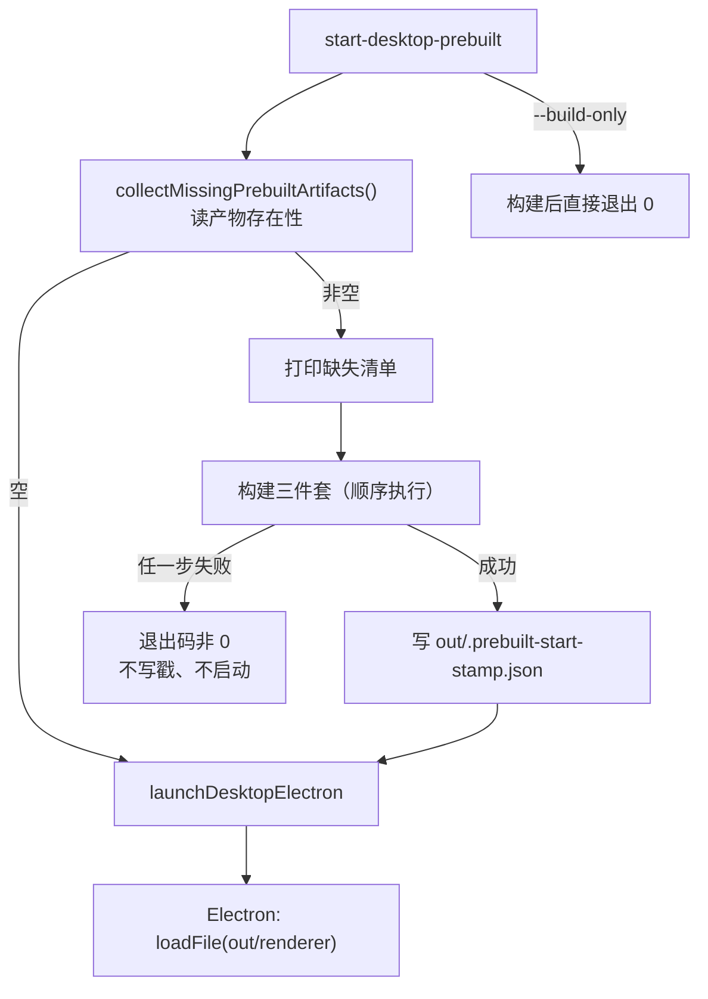

# Spec: 桌面端预编译启动（Prebuilt Desktop Start）

## 目标

提供一条开发用启动入口：用**生产构建产物**驱动**未打包（`app.isPackaged === false`）**的 Electron，得到接近发布包的性能，同时完全跳开 electron-builder 的打包与签名。

命令只做三件事：**检查产物 → 缺失时才构建一次 → 启动**。已构建过就直接启动；代码改动后由开发者手动重新构建（不引入文件监听，不做增量 tsc）。

## 背景：现有 dev 链路为什么每次全量重编译

`mise run dev` → `pnpm dev:desktop:test` → `scripts/dev-desktop-env.mjs`，依次执行：

1. `pnpm --filter @zcode/desktop pre-dev`：`ensure-local-runtime-assets` + `rm -rf packages/desktop/out`；
2. `node scripts/build-desktop-agent-cli.mjs`：按顺序构建 agent 侧 11 个包（裸 `tsc`，无 `--incremental` / `-b`）后打 CLI bundle 并暂存；
3. `pnpm --filter @zcode/desktop dev:runtime`：`tsup --watch` + `vite dev` + `node scripts/dev.mjs`。

第 1 步删除整个 `out/` 是每次冷编译的直接原因；第 2 步的 tsc 链是每次重复全量的大头。

renderer 走 dev server 还是本地产物，只由一处判定决定：

```text
packages/desktop/src/main/desktopHostProcess.ts
  !app.isPackaged && process.env.ELECTRON_RENDERER_URL  → loadURL(dev server)
  否则                                                   → loadFile(out/renderer/<page>.html)
```

因此**不设置 `ELECTRON_RENDERER_URL`** 就能让未打包的 Electron 加载构建产物，无需签名。

## 产品规则（命令语义）

- **入口**：`pnpm start:desktop:prebuilt` / `mise run start`（启动）；`pnpm build:desktop:prebuilt` / `mise run start-build`（仅构建）。mise 的 `run` 任务不接受额外参数，故重建独立成一条任务而不是 `mise run start --build`。
- **构建判定唯一依据是产物是否存在**：`collectMissingPrebuiltArtifacts()` 返回空集就跳过全部构建步骤，直接启动。已构建时**绝不自动重建**。
- **强制重建**：`--build` / `-b` / `--rebuild` 参数，或 `ZCODE_PREBUILT_FORCE_BUILD=1`。
- **`--check` 只报告不动作**：打印缺失产物清单、构建戳信息、是否有更新的源码，以及"直接启动 / 构建后启动"的判定，然后退出 0，不写任何文件、不启动 Electron。
- **不打包、不签名**：不调用 `electron-builder`（`scripts/bundle.mjs` 不参与），不生成 `dist/`，不触碰证书与 code signing。
- **构建范围**（"客户端 + Web UI + 桌面包"全覆盖，顺序固定、失败即停）：

  | 步骤 | 命令 | 覆盖内容 |
  | --- | --- | --- |
  | 1 | `packages/desktop/scripts/ensure-local-runtime-assets.mjs` | 本机 runtime sidecar（embedded search、macOS window-bounds） |
  | 2 | `scripts/build-desktop-agent-cli.mjs` | 客户端 Agent CLI + MCP plugin runtime，暂存到 `bundled-agents/<platform>/glm` |
  | 3 | `pnpm --filter @zcode/desktop build:no-runtime-assets` | 桌面 main/host/preload/scheduler（tsup）+ renderer（vite build）+ mobile web（`@zcode/web build`） |

- **运行时环境与 `mise run dev` 对齐**：`ZCODE_ENV=test`、cwd = `packages/desktop`、显式删除 `ELECTRON_RENDERER_URL`、沿用 `ZCODE_DATA_BASE_DIR` 数据目录隔离（mise task 注入 `~/.zcode-dev-home`）。
- **陈旧提示不阻断**：产物集存在即启动，只在源码比构建产物新时打印告警与重建命令。这是刻意的——判定口径保持"只看产物存在性"，陈旧信息只是减少"改了代码没生效"的误判成本。
- **不做**：不引入 `--watch`、不做增量 tsc、不修改 `dev` / `dev:desktop:*` / `bundle:desktop` / CI 的现有语义。

## 状态所有者与判定顺序

"是否需要构建"的唯一所有者是**磁盘产物集**，没有第二个真值来源（不写缓存标记、不在内存里记状态）。



构建戳 `packages/desktop/out/.prebuilt-start-stamp.json`（`{ format, commit, builtAt, builtAtMs, zcodeEnv }`）**只**用于"源码是否比产物新"的告警，不参与构建判定；戳缺失或损坏时静默跳过告警。

## 接口

- **`scripts/start-desktop-prebuilt.mjs`**（新）：编排入口。
  - 参数：`--build` / `-b` / `--rebuild`、`--build-only`、`--check`（只报告判定结果，不做任何改动）、`--help`。
  - 环境：`ZCODE_PREBUILT_FORCE_BUILD=1` 等价于 `--build`；`ZCODE_DATA_BASE_DIR` 透传。
  - mise 的 `run` 任务不接受额外参数（实测 `mise run lint --help` 报 "This task does not accept any arguments."），因此提供两条独立任务：`start`（缺产物才构建）与 `start-build`（强制重建），而不是靠 `mise run start --build` 转发参数。
  - 产物清单：`out/main/index.js`、`out/host/index.js`、`out/scheduler/index.js`、`out/preload/index.cjs`、`out/renderer/index.html`、`packages/web/dist/index.html`、`bundled-agents/<platform>/glm/zcode.cjs`。
- **`packages/desktop/scripts/launchDesktopElectron.mjs`**（新，Electron 启动的唯一实现）：
  - `resolveLocalElectronBinary()`：从项目内 `electron` 包解析二进制（跨平台）。
  - `resolveDesktopElectronCommand({ electronBinary })`：macOS 上复用 `prepareDevElectronAppBundle` 生成本地启动副本（补 `CFBundleURLTypes`，让 `zcode://` 深链投递到本地实例）。
  - `launchDesktopElectron({ desktopRoot, rendererUrl, label, env, log })`：写入/清除 `ELECTRON_RENDERER_URL`、spawn Electron、处理进程组信号与退出码。
- **`packages/desktop/scripts/dev.mjs`**（改）：`waitForReady()` 之后改为调用同一启动器，不再自带 spawn/信号逻辑。
- **复用既有产物路径解析**：`packages/desktop/scripts/stage-agent-bundle.mjs` 的 `resolveAgentBundlePaths()` 与 `target-platform.mjs` 的 `resolvePlatformKeyForPackagedApp()`，不手写 `bundled-agents` 路径。

## 不变量

- Electron 的 spawn 与信号回收只有一份实现，`dev` 与 `prebuilt` 共用；`ELECTRON_RENDERER_URL` 只在 dev-server 分支存在，未传 `rendererUrl` 时必须从子进程环境删除继承值。
- 构建步骤只复用既有脚本（`ensure-local-runtime-assets.mjs`、`build-desktop-agent-cli.mjs`、`build:no-runtime-assets`），不复制其内部逻辑。
- 不调用 `pre-dev`（它的 `rm -rf out` 只服务 dev，prebuilt 调用它等于每次启动都清空产物）。
- 构建失败必须停在失败步骤：不写构建戳、不启动 Electron、退出码非 0。
- `bundled-agents` 的判定路径与暂存路径来自同一函数，不允许出现"判定说没有、暂存写到别处"。

## 迁移边界

- 不改动 `dev` / `dev:desktop:test` / `dev:desktop:prod` / `dev:desktop:bytecode` / `bundle:desktop` / `build:desktop-agent:bytecode` 的行为与参数。
- `pnpm --filter @zcode/desktop build:no-runtime-assets` 会清理并重建 `out/main|host|preload|renderer`；`out/scheduler` 不在其清理清单内（既有行为，本次不扩围）。
- 生产档构建带来的已知差异（**均为既有生产构建行为，不在本轮修复**）：
  - main/host/preload 被压缩且不带 sourcemap（发布口径），需要可读栈时用 `mise run dev`。
  - renderer 的 `__ZCODE_LOCAL_DEVELOPMENT_RUNTIME__` 为 `false`、`import.meta.env.PROD` 为 `true`，`window.__testActions` 不注册（需要时用既有 `VITE_ZCODE_E2E_STORE_BRIDGE=1` 开关）。
- 不支持"构建后由本命令自动同步到打包产物"；打包仍然走 `pnpm bundle:desktop`。

## 验收场景

1. 干净工作树（无 `packages/desktop/out`）执行 `mise run start`：打印缺失产物清单 → 顺序执行三个构建步骤 → 启动 Electron，界面来自 `out/renderer`，全程不监听 5174 端口。
2. 已构建后再执行：无任何构建日志，秒级进入应用。
3. 改动 `packages/ui/src` 下任一组件后直接再执行：界面仍是旧版，同时打印"源码比构建产物新"的告警与重建命令；执行 `pnpm build:desktop:prebuilt` 后再执行 → 看到新界面。
4. shell 中已存在 `ELECTRON_RENDERER_URL=http://localhost:5174` 时执行：应用仍加载 `out/renderer`（不白页、不依赖 dev server）。
5. 未设置 `ZCODE_DATA_BASE_DIR` 时执行：打印数据目录未隔离告警，应用正常启动。
6. 删除 `packages/desktop/bundled-agents/<platform>/glm/zcode.cjs` 后执行：判定为缺产物并重建（不静默沿用旧 agent）。
7. `pnpm build:desktop:prebuilt`：构建成功后不启动 Electron，退出码 0。
8. 构建中途失败（例如 agent 侧 tsc 报错）：日志指出失败步骤，退出码非 0，且未写入构建戳、未启动 Electron。
9. macOS 上执行后 `zcode://` 深链仍能投递到本地 Dev 实例（复用 `prepareDevElectronAppBundle`）。
10. `mise run dev` 行为与改动前一致：仍走 `tsup --watch` + `vite dev` + dev-server 分支启动。
11. `--check`：只跑过 dev 的机器（dev 用 Vite dev server，不产出 `out/renderer`）应报告"缺少 desktop renderer → 构建后启动"；已完整构建后应报告"直接启动"，且两次都不写文件、不启动 Electron。
