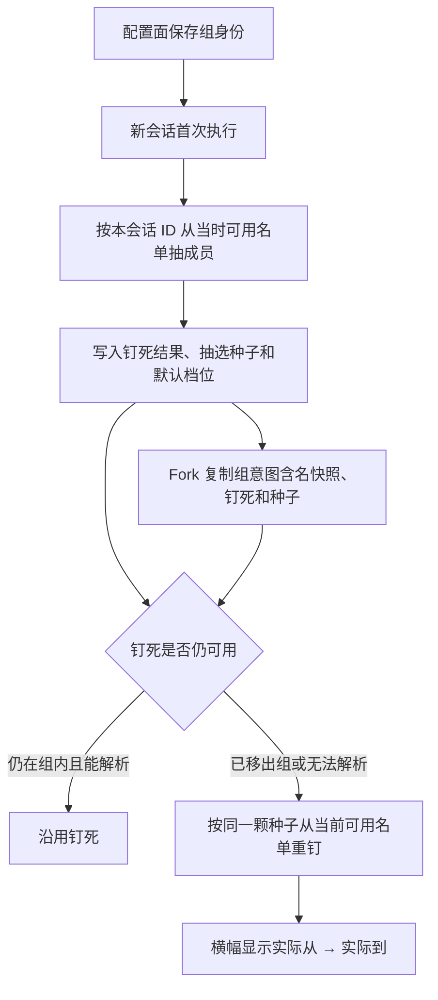

# Spec: 模型组（Model Group）

## 目标

模型组是一层可编辑的模型别名，不是新的供应商。设置「模型」分类下新增独立「模型组」页；Subagent、命令绑定等配置面把组当成一个普通模型来选。会话在钉死成员仍可用时沿用它（缓存、同一长会话、Fork 不漂移）；一旦钉死成员被移出组或已无法解析，发送前按组当前名单与同一颗抽选种子重钉，让超长会话跟着组换免费模型，而不把人锁死。

## 三层事实

- **配置意图**：设置、Subagent、命令、Composer 胶囊选中的是组。身份是组 ID + 组名快照。不带思考档位。
- **会话钉死**：会话第一次真正跑模型组时，按抽选种子 + 组 ID 从**当时仍可用**的成员名单抽一个具体模型写进该会话模型配置，并记录种子。种子写入后本会话不再更换。钉死条目同时带该成员的思考档位。
- **时间线展示**：横幅与消息记录的是当时实际在跑的具体模型 + 档位；胶囊仍显示组名。



不要每次发送都按最新名单重算。组从两个变三个、旧成员还在时继续用原来那个。重钉只发生在「旧钉死已经不能代表这个组」时。成员顺序只参与两种哈希下标：还没有钉死；钉死已不可用后的重钉。钉死仍可用时重排组内成员不换人、不落横幅。

## 产品规则

### 设置与菜单

- 侧栏「模型」分类下新增独立入口「模型组」（`modelGroups` section），与「供应商和模型」并排；导航仍只来自 `packages/ui/src/settings/settingsPageConfig.ts` 与 `packages/ui/src/lib/settingsNavigation.ts`。
- 设置页主从布局：顶部为描述 + `SettingsResourceHeaderActions` 新建按钮（与供应商页头部排法一致），左侧组列表走共享 `SettingsSortableNav`（拖拽排序 + Layers 行图标，见 `settings-master-detail-shared.md`），右侧只承担组详情编辑。详情头走共享 `SettingsDetailHeaderMenu`（标题 + 右侧启用开关 + `...` 菜单：重命名 + 红色删除，删除确认沿用现有确认框）。新建点击后弹出系统 `Dialog` 单输入小窗（组名输入 + 保存/取消，Enter 保存，空名与重名禁用保存并在窗内提示，创建失败错误留在窗内，成功后关窗并自动选中新组）；左栏与详情区不再承担创建态。添加成员走弹窗选择器（按供应商分组、可搜索，选中映射回 provider/model 二元组提交），过滤掉模型组自身（禁止组套组）。详情区段间距与供应商卡片一致（`space-y-3`，不套第二层内边距）；成员段为区头（标题左置 + 右上添加按钮）+ 列表容器 + 空态虚线行，成员行对齐 `ModelRowInput`（mono id + 徽标 + 右操作组）。
- 窄屏呈现（< `md`）：左栏只留图标 + 选中态（组名走 `sr-only` 保留给读屏，tooltip 复用 `ControlHintTooltip`），`md+` 显示图标 + 组名 + 成员数；排序走拖拽，窄屏不再设详情区备用箭头。详情区标题 / 重命名 / 删除行允许换行（`flex-wrap`），重命名输入框 `min-w-0 flex-1 basis-40`；成员行操作组窄屏折到第二行右对齐（与 `ModelRowInput` 换行做法一致）。新建小窗本身居中浮层，窄屏同样可用。不新增 Drawer，不引入自动保存。
- 用户可创建、重命名、删除、启用/停用组；组内添加、移除、排序**具体模型**（provider+model 二元组）。
- 组启用（`enabled`，缺省 `true`）：关闭后该组离开模型选择器，但详情页仍可编辑、标记保留，重开后按已保存标记恢复；旧盘缺字段视为启用。停用组的发送按「无可用成员」拒绝（`modelGroup.noMembers`，文案用当前名），胶囊保留组名，不回落、不清意图。
- 模型组整体 Primary（`modelGroupsPrimary`，缺省 `false`）：挂在个人配置顶层（与 `providerOrder` 同层），只决定「模型组」分节在一二级，不参与可执行判定，不改变成员可用性与排序；关闭保留标记。打开后「模型组」整节置顶一级展开（`directItems`），不进二级菜单；关闭后整节收进二级菜单。旧盘缺字段视为非 Primary；历史逐组 `isPrimary` 字段只做兼容读取，不再写入、不再参与投影。
- 草稿组意图（Renderer）：菜单点组只写 `modelGroupIntent` 草稿；`updateDraftConfig` 与 `persistV4ComposerDraft`、`seedImportedSessionDraft` 必须原样携带组意图，组与具体选择互斥，覆盖即丢用户意图（本次修复的依据：选组后新会话模型选项为空）。
- 组身份走独立命名空间：组 ID 由 Host 生成（`model-group:` 前缀 + slug），禁止占用保留供应商 ID（`account:`、`builtin:` 前缀），组不得注册成假供应商，不进 Registry 的 providers 名单。
- 选模型菜单里组作为一条普通模型出现（单独一截「模型组」）；条目值编码 `model-group:<groupId>`，与 `provider/model` 编码分开，不借用保留供应商 ID。
- 胶囊显示组名：组还在时读个人配置的当前名；组已删时用会话/草稿上的组名快照；快照也缺失才回退显示组 ID（实现兜底，正常路径禁止）。

### 抽选与会话

- 哈希发生在两种时候：还没有钉死；已有钉死但已不可用。输入 = 抽选种子 + 组 ID，对**当时仍可用**的成员按组配置顺序取下标（SHA-256 取模）。组内只有一个可用成员时就是纯别名。
- **种子一旦写入不再更换**。新会话第一次钉死时种子 = 该会话自己的 ID。Fork 原样拷走种子，不换成子会话 ID。同一会话改选另一个组，仍用已有种子抽新组成员。
- 同一会话从组 A 改选组 B 再改回 A、且 A 的可用名单没变：哈希输入相同，抽回原成员，实际模型没变，不落横幅。这是有意为之。
- 钉死仍可用时：组里后来新增、重排其它模型，本会话和 Fork 都不改抽。
- 钉死已不可用时：发送前重钉，用户不必改选具体模型。
- 配置面改组，对仍钉着旧成员且旧成员还可用的会话不生效；对以后新开的 Subagent、旧成员已不可用的长会话生效。

### 横幅（复用 `modelChange` 分隔线，见 model-change-divider-thought-level.md）

- 比较与展示都用**钉死的具体模型身份**，不是组名；横幅不得写成「组 A → 组 B」。
- 普通新会话选具体模型：保持静默首轮，不出现「正在使用」。
- **新会话选模型组**：首轮出现「正在使用 {实际模型} · {档位词}」。`toThought` 必填，填钉死补上的默认档位；档位表为空写空串（渲染层按现有规则只显示模型名）。Subagent 开头那条同样填实际成员和该默认档位。
- 中途切换（用户改选，或重钉）：落「模型已切换 {实际从} → {实际到} · {新实际档位}」。两次实际模型相同不落；只改档位、模型身份没变也不落。
- 横幅由 CLI 投影（`product-projection.ts` 的 TurnStarted 裁决 + `onModelSelected`）在钉死写入走 `app.setModel` + `ModelSelected` 事件时自动成立，投影层不新增组分支；本 spec 只约束事件形态：首次钉死的 `ModelSelected` 必须带 `previousModelSelection: null`（source-less「正在使用」分支）。

### 思考档位：钉死后恢复可调

组意图本身不带档位，档位跟钉死成员走。三个阶段：

1. **尚未钉死**（草稿已选组、或会话还没成功跑过第一轮）：档位控件隐藏；无可展示档位表，不能提前调档。
2. **已钉死且仍可用**：档位控件恢复可调，表来自钉死成员。改档位只写进该会话钉死条目的档位，不改组意图、不触发重钉。
3. **重钉成功**：视为对新成员的全新选择，按现有 `resolveDefaultReasoningLevel` 补默认档，不沿用旧成员档位（成员档位表可能异构）。横幅 `toThought` 是新默认档。之后控件继续可调，表换成新成员的。

用户显式改选另一个组：组意图换成新组，沿用本会话已有种子（尚未钉死则首次 admission 写入）抽新组成员并按新成员补默认档；抽中的实际模型与上一轮相同则不落横幅。改选具体模型：退出组意图，走现有主动切模型补默认档规则。组已删或没有可用成员时控件保持隐藏，直到用户另选。

### 组名快照

身份只有组 ID；个人配置删除组是真删除，不留墓碑。

- **组还在**：胶囊和设置页读个人配置当前名，改名立刻反映到仍指向该组的胶囊；成功的 admission 把当前名写进该会话的组名快照。
- **选中组时**：草稿/配置面的组意图同时记下组 ID 和当时组名；会话创建或首次 admission 把快照带进会话配置。
- **组已删**：胶囊和失败文案用会话（或未建会话时草稿）上的组名快照；不留墓碑，不编新名字。
- Fork 把组名快照一并拷走。组还在且后来改过名，子会话下次成功 admission 刷新快照；组已删则一直用拷来的那份。

### 重钉失败的可见形态

组已删或重钉时组内没有任何可用成员：失败；不回落父模型，不偷偷改成某个具体模型。

- **命令**：`sendText` / 带首条输入的 `createSession` 在 admission 内被拒。ACK `status=rejected`，`reasonCode` 为 `modelGroup.deleted` 或 `modelGroup.noMembers`。`message`：已删用「模型组「{组名}」已删除，请另选模型」；无可用成员用「模型组「{组名}」没有可用模型」。`{组名}`：组还在用个人配置当前名；已删用组名快照。
- **输入区**：走现有发送失败路径，在输入框上方展示 `message`；草稿文本保留。
- **胶囊**：组意图不变；组还在显示当前名，已删显示快照名并进入不可发送的失效态；选择器里已删的组不再出现。
- **档位控件**：保持隐藏。
- **会话配置**：不写新钉死，不清除组意图；必须显式另选才能恢复发送。
- Subagent / 命令绑定 / Automation 启动失败：同样抛配置错误（不回落父模型），文案与两条 `reasonCode` 对齐。
- 限流、网络失败不重钉，也不走这两条 `reasonCode`。

### 何时沿用，何时重钉

「仍可用」必须同时成立：还在当前组名单里，并且按现有有效选择能解析（在目录、未禁用、账号/套餐能对应上）。判定用的组名单是 **admission 当下**从个人配置读到的那份，不是会话创建时冻住的旧名单；写入走个人配置同一把文件锁。

- 组里加了第三个模型、旧钉死仍在组且能解析：沿用。
- 旧免费模型被移出组、换上新的：下一次发送前按种子从当前可用名单重钉；胶囊仍是这个组。
- 旧模型还在组里但解析失败（删除、禁用、套餐失效）：视为不可用，从其它仍能解析的成员重钉，不会再次抽中已死成员。
- 重钉换了实际模型：落「模型已切换 {旧实际} → {新实际} · {新档位}」。同一轮发送只重钉一次，不在失败后再连抽。
- 网络错误、限流、临时忙碌：不重钉。
- 用户显式改选另一个组或具体模型：按新意图处理；仍是组则用已有种子抽新组成员（种子不变）。
- 组已删，或重钉时组内没有任何可用成员：失败，见上节。

### 钉死写入的并发与幂等

- 唯一写入者：该会话自己的模型配置条目；写入时机是 **CommandInbox per-session 串行 admission**（session gate 持有到 settle）。
- 同一会话不同 `commandId` 的两次发送：后到等前一次 admission 结束；第一次若完成钉死，第二次读到已有钉死且仍可用则沿用，不并排抽两次。
- 同一 `commandId` 重试：`CommandInbox` 返回 `duplicate`，不第二次钉死。
- 桌面与手机、两个窗口对同一会话发送：owner/lease 把命令路由到同一 CLI 的同一个 `CommandInbox`；桌面 continuous 与手机 replayable 都消费这一份会话钉死，恢复链路不得自己再哈希。
- 组名单在 admission 读到之后、settle 之前被改掉：本轮按读到的那一拍判定；下一轮再读新名单。不在 admission 里重试等待。

## 状态所有者与接口

- **组名单唯一写入者**：个人层供应商配置（`provider_config.json` 同一把文件锁）。`ProviderConfigLayerSnapshot`（`packages/provider/src/config-service.ts`）增加 `modelGroups` 与顶层 `modelGroupsPrimary`；`ProviderConfigService` 提供组的创建/重命名/删除/成员增删排序事务方法与整体 Primary 补丁，组与 Provider/Model 共用一次 Repository update 边界。组不是假供应商。
- **会话钉死唯一写入者**：该会话自己的模型配置条目。会话配置（`packages/shared/src/zcode-protocol-v4/session-config.ts` 的 `sessionConfigStateSchema`）增加 `modelGroupIntent`（组 ID + 组名快照）与 `modelGroupPickSeed` 两个 optional 字段；现有 `modelSelection` / `provider` / `model` / `thought` / `thoughtLevels` 在钉死后表示钉死成员及其档位投影，尚未钉死时这些投影为空。写入只发生在 `CommandInbox` admission（bootstrap `commands/handlers/session-flow.ts` 的 sendText / createSession 路径），复用 `app.setModel` / `app.setThoughtLevel` + `ModelSelected` 事件。种子写入后本会话不再更换。会话 entry 侧用新的 `SESSION_ENTRY_MODEL_GROUP_STATE` 持久化组意图与种子（Fork 复制的载体）。
- **配置意图扩展**：配置面（草稿、`sendText` / `createSession` 携带的选择、Subagent / 命令绑定 / Automation）新增可辨识的组意图载荷 `modelGroupIntentSchema`（`packages/shared/src/model-selection.ts`）：`{ groupId, groupNameSnapshot }`，与 `modelSelection` 互斥（命令 payload superRefine 校验）。组不塞进供应商字段。
- **模型选择视图**：`ModelSelectionView`（`packages/provider/src/facades.ts`）增加 `modelGroups` 候选分节（组 ID、当前名、成员及其可用性），由个人配置 + Registry 可解析性投影；组不进 `providers`。
- **横幅**：仍由 CLI 投影在 turn 开始时按「上一轮实际模型 vs 本轮实际模型」裁决；组场景的「实际模型」即钉死结果，`toThought` 即钉死后的档位。新会话 + 组意图走已有的 source-less「正在使用」分支（钉死 `ModelSelected` 带 `previousModelSelection: null`），普通主会话静默首轮不变。
- Renderer 只读写组意图和（钉死后）档位循环；抽选与钉死只在 CLI/runtime owner 上发生。

## 事件顺序

```text
设置保存组 → ProviderConfigService 事务（personal repository 文件锁）→ Registry/Facade 刷新
Composer 选组 → 草稿写 modelGroupIntent{groupId, 名快照}（档位控件隐藏）
sendText / createSession(firstInput) → CommandInbox session gate
  → admission：读会话钉死状态 + admission 当下组名单
    → 无组意图 → 现有具体模型路径（不变）
    → 组已删 → rejected ACK modelGroup.deleted（名快照文案）
    → 无可用成员 → rejected ACK modelGroup.noMembers
    → 已钉死且钉死成员仍可用 → 沿用（payload 只改档位时仅更新档位）
    → 否则 → 同一颗种子哈希抽选 → app.setModel + 默认档 + 写种子/意图 entry
      → 首次钉死发 ModelSelected(previousModelSelection=null) → 投影下轮 sourceLess「正在使用」
      → 重钉换人 → 下轮 TurnStarted 落「模型已切换」
forkAssistant → 父会话组 entry（意图 + 名快照 + 钉死 + 种子）随 bundle 原样拷入子会话（种子不变）
```

## 设置入口与页面

`docs/specs/settings-model-category.md` 同步：模型分类下新增 `modelGroups` 入口。页面为独立 section 内容组件，主从布局左组列表右成员编辑；删除组不级联改写 Subagent 文件，失效在新会话执行时按失败 UX 暴露。

## 需要接到组身份的表面

- Composer 草稿、最近选择、Host 默认模型：存组 ID 与组名快照
- 会话配置：组 ID + 组名快照 + 钉死具体模型（含档位）+ 抽选种子
- Subagent / 命令绑定 / Automation / Workflow：配置存组 ID 与组名快照；每次新开的子会话各自钉死；Fork 继承组 ID、组名快照、钉死和种子，旧成员不可用时按同一颗种子重钉
- Agent 工具 `ListModels`（`apps/zcode-cli/packages/contracts/src/tools/list-models.ts`，经 `model-catalog-port.ts`）与 CLI `/model` 列出组；不是 V4 `commandPayloadSchemas` 协议命令

## 决策记录

- owner：组名单在个人配置；钉死在会话模型配置
- command path：设置页 → 模型组 Host 服务 → 个人配置事务；首次执行 / 钉死已不可用 / 显式改选 → `CommandInbox` admission 写入会话钉死
- derived views：设置列表、选模型菜单里的组、胶囊组名、档位控件（钉死后）、横幅实际模型名与档位
- ordering：无钉死则抽；有钉死先问是否仍可用；不可用才按同一颗种子重钉；本轮只重钉一次；改选组不换种子；Fork 复制组 ID、组名快照、钉死和种子
- concurrency：同会话命令由 `CommandInbox` session gate 串行；owner/lease 保证跨端只有一个 CLI 执行 admission；组名单以 admission 当下的个人配置为准
- delivery：抽选与钉死只在 CLI/runtime；桌面 continuous 与手机 replayable 都携带组意图，消费同一份会话钉死
- failure：`modelGroup.deleted` / `modelGroup.noMembers` 拒绝命令，意图保留，不回落

## 负面边界

- 不把组装进 Provider Registry 的 providers 名单，不产生假供应商。
- 不在每次发送时按最新名单重算成员。
- 不为已删组在个人配置留墓碑，不为文案编造新名字。
- 不因限流、网络失败重钉。
- Renderer 不做抽选、不自行哈希；恢复链路不重复哈希。
- 组意图与 `modelSelection` 在命令 payload 中互斥；不新增第二个模型选择通道。

## 验收场景

1. 能创建组、加入两个具体模型、改名、排序、删除；不能组套组；组 ID 不占用保留供应商 ID；组不注册成供应商。
2. Composer / Subagent / 命令绑定能把组当一条模型选中，配置存组身份。
3. 同一会话连续发送始终用首次钉死的成员；中途组名单改成三个模型，该会话与它的 Fork 仍用原来那个。
4. 两个新建的不同会话可以抽到组内不同成员。
5. 组内只留一个成员后，以后新开的 Subagent 都用这个成员。
6. 选模型组的新主会话，首条消息上方出现「正在使用 {实际模型} · {默认档位}」；无档位表时只有模型名。选具体模型的新主会话仍不出现。
7. Subagent 开头「正在使用」显示实际成员和该默认档位，不是组名。
8. 中途改选另一个组或具体模型，横幅为「实际从 → 实际到 · 新档位」；两次钉死相同无横幅；只改档位不落横幅。
9. Fork 后组名单增加、旧成员仍在且能解析：父子都继续用原成员和原档位。
10. 长会话钉着 A；A 被移出组换上 B：下一次发送自动改钉 B，横幅为实际 A → 实际 B 并带 B 默认档位，胶囊仍是这个组。
11. 同一长会话的 Fork 也钉着 A；A 被换下后，父子按同一颗种子接到同一个新成员。
12. 组里只多加 C、或只重排成员、A 仍可用：不重钉，不落切换横幅。
13. 限流或网络失败不重钉。组已删：发送被拒 `modelGroup.deleted`，输入框上方提示用快照组名，胶囊显示快照名且不可发送，个人配置无墓碑，会话不改成具体模型。组在但无可用成员：`modelGroup.noMembers`，提示用当前名。
14. 尚未钉死时档位控件隐藏；首轮钉死后按钉死成员档位表恢复可调；改档后后续发送沿用该档位，不重钉、不落横幅。
15. 同一会话两条并发发送只钉死一次；同一 commandId 重试不第二次钉死。
16. 同一会话从组 A 改选组 B 再改回 A，A 可用名单未变：抽回原成员，不落横幅；种子仍是第一次钉死写入的那颗。

## 验证

- 哈希抽选、沿用、重钉、重排不触发重钉：`packages/provider` 与 `apps/zcode-cli` 测试
- Fork 复制组 ID、名快照、钉死和种子；名单变长不变；换下旧成员后父子接到同一新成员：`apps/zcode-cli` 测试
- admission 串行：同会话两条发送只钉一次；duplicate 不二次钉
- 横幅：组意图首轮「正在使用」带 `toThought`、切换显示实际模型和新档位：投影测试
- 失败 ACK 文案、胶囊保留组名、不回落；钉死后档位控件可调
- `pnpm typecheck`、`pnpm lint`、`pnpm architecture:check --changed`
- 不用 CDP 操作 YCode
