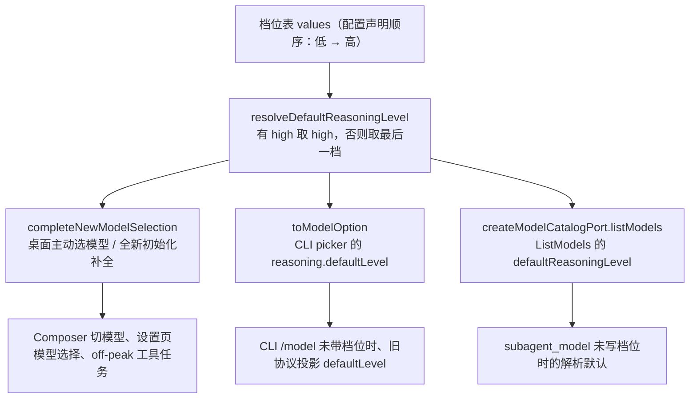

# Spec: 切换模型时的默认思考档位（有 high 选 high，否则最高档）

## 目标

用户主动切换模型（或全新草稿初始化）时，系统要给这次选择补一个默认 reasoning 档位。当前规则是「取档位表最后一档」，也就是该模型的**最高档**：模型越强、档位表越长，切过去就越贵越慢，而用户往往只想要一个均衡档。新规则改成：**档位表里有 `high` 就默认 `high`，没有 `high` 才退回最后一档（最高档）**。

这条规则只决定「用户没表态时系统替选什么」。用户显式选过的档位、以及已有会话恢复出来的档位（含空值）都不受影响。

## 产品规则

- **有 `high` 选 `high`。** 档位表里存在归一化（`trim` + 小写）后等于 `high` 的项，就选它，返回档位表里的原值（保留配置里的大小写写法）。
- **没有 `high` 退回最高档。** 找不到 `high` 时取档位表最后一档，与改动前行为一致；档位表为空则整个默认档位缺席（`undefined`），调用方保留「已选模型、待选档位」的空状态。
- **只匹配 `high` 本身。** `xhigh` / `extra-high` / `max` / `ultra` 等其它档位名不算 `high`，不做前缀或模糊匹配。
- **只在主动选模型与全新初始化时生效。** 用户显式切换档位、恢复已有会话的选择、`normalizeModelSelection` 对失效档位的清理，都不补默认值——失效或缺失就保持空，等用户自己选。
- **一张表两条脸，规则只有一条。** 桌面补全入口（`completeNewModelSelection`）、CLI picker 的 `reasoning.defaultLevel`、`ListModels` 的 `defaultReasoningLevel` 三处给出同一个默认；任何一处单独改都会造成「picker 里默认 high、不写档位时默认 low」这类只有用户会发现的偏差。

## 状态所有者与唯一实现

默认档位的唯一实现是 `@zcode/provider` 的 `resolveDefaultReasoningLevel(values)`（`packages/provider/src/model-selection-config.ts`）。三处消费点都调它，不各自实现：

`values` 是配置提供的自由字符串数组，没有规范枚举；档位名的比较沿用仓库既有归一化习惯（`trim` + 小写，见 `packages/ui/src/chat-input-toolbar/thoughtLevelOptions.ts`）。

## 接口

- `resolveDefaultReasoningLevel(values: readonly string[]): string | undefined`（`@zcode/provider` 包入口导出）。
- 消费点：`completeNewModelSelection`（`packages/provider/src/model-selection-config.ts`）、`toModelOption`（`apps/zcode-cli/packages/bootstrap/src/app/provider-registry-selection.ts`）、`createModelCatalogPort`（`apps/zcode-cli/packages/bootstrap/src/app/model-catalog-port.ts`）。

## 不变量

- 默认档位的判定只有一份实现；禁止在 UI、服务层或 CLI 各自写 `values.at(-1)`。
- 补默认档位只发生在「用户主动选模型 / 全新初始化」；恢复与重解析路径不得补档位。
- 档位名匹配不区分大小写与首尾空白，但写回的是配置里的原值，不改写档位表。
- 档位表为空时返回 `undefined`，不得凭空造一个档位值。

## 负面边界

- `completeAuxiliaryRegistryModelSelection`（连通性等辅助调用取 `values[0]` 最低档）是另一条规则，本次不碰。
- legacy 配置迁移里的 `defaultLevel` / `defaultVariant` 是用户配置事实，不是「切换默认」规则，不碰。
- `normalizeModelSelection` 只做校验与清理，不补档位，行为不变。
- `resolveDraftThoughtCurrentValue` 的「恢复空值保持空」展示规则不变。

## 验收场景

1. Composer 切到档位为 `["minimal","low","medium","high","xhigh"]` 的模型 → 工具条默认档位显示 `High`（不再是 `xhigh`）。
2. 切到档位为 `["low","medium"]` 的模型 → 默认档位为 `medium`（无 `high` 时维持「最高档」现状）。
3. 切到档位为 `["High","xhigh"]`（大写写法）的模型 → 默认档位写回 `High` 原值。
4. 切到没有档位表的模型 → 档位保持空，工具条显示未选择，等用户显式选。
5. CLI `/model` 切到含 `high` 的模型且未指定档位 → 选中 `high`；`ListModels` 里该模型的 `defaultReasoningLevel` 同为 `high`。
6. 已有会话恢复、用户手动改档位、`/effort` 显式指定档位的行为与改动前完全一致。
7. `pnpm typecheck`、`pnpm lint`、`node --import tsx --test packages/ui/test/modelSelectionDefaultLevel.test.ts` 通过。
