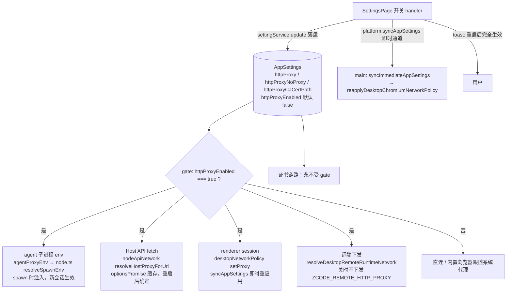

# Spec: 网络设置分区

## 目标

HTTP 出口策略原先嵌在「常规」设置页中段，与语言、终端、通知等窗口级偏好混排，既难发现也不符合信息架构：这三项影响的是模型、MCP、命令工具与应用渲染层的全局出口流量，而非当前窗口体验。

本次改动把它们迁到侧边栏独立的「网络」分区，并按「外观」分区的分类模式重组为「网络代理」与「证书」两个分类，新增「为全局启用」总开关——填写代理地址与启用代理是两个独立概念，只有开关打开时代理才实际生效。

## 产品规则

- 「网络」是设置页一级分区，位于「基础」组，排列在「模型设置」之后（出口策略与模型/MCP/命令工具同源，又与浏览器插件设置分离）。
- 分区内部分类（AppearanceSectionContent 的标题 + 描述 + 卡片模式）：
  - **网络代理**：「为全局启用」开关、HTTP 代理（`settings.httpProxy`）、不使用代理的地址（`settings.httpProxyNoProxy`）。
  - **证书**：自定义证书（`settings.httpProxyCaCertPath`）。证书与代理无关——直连场景也需要自定义 CA，因此独立成分类，不受「为全局启用」影响。
- 「为全局启用」（`httpProxyEnabled`）：
  - **默认关闭**。开关未打开时，无论是否填写了代理地址，模型、MCP、命令工具与应用渲染层流量一律直连；内置浏览器仍跟随系统代理（与「代理留空」语义一致）。
  - 存量已填写代理地址的用户升级后同样是关闭状态，代理停止生效，需手动开启（已确认的产品决策，靠开关行描述与保存 toast 引导）。
  - 关闭开关只 gate 代理与 No Proxy；自定义证书注入（`NODE_EXTRA_CA_CERTS`、渲染层证书校验）不受影响。
- 保存行为：
  - 开关、代理地址、No Proxy、证书均通过 `settingService.update` 写入 `AppSettings`；输入框 dirty 时「保存」可用，回车等同保存；清空须提交空串（RPC 会丢弃 `undefined`，由服务层删除旧字段）。
  - 时效分三层：**renderer（Electron session）切换开关后即时生效**——设置页经 `platform.syncAppSettings` 即时通道通知 main，重读全量设置并重调 `applyDesktopChromiumNetworkPolicies`；**Host API fetch** 的设置读取有单飞缓存、**agent 子进程 env** 在 spawn 时注入，两者需新会话/重启后生效。保存 toast 统一提示「网络代理设置已保存，重启应用后生效」。
- 「允许不安全证书」等内置浏览器证书策略仍归「浏览器」分区，不迁入本分区。
- 不提供 Quick Pick 直达「网络」的命令；外部需要跳转时用 `setPendingSettingsSection("network")`。

## 远期方向（本次不实现）

模型设置里将支持按模型单独选择是否走代理：全局启用时所有模型与其他 API 默认走代理，模型可单独豁免；全局关闭时一律直连。本次只落全局开关，字段与链路不做预留改造。

## 状态所有者与接口

- 持久化事实源：`AppSettings` 的 `httpProxy` / `httpProxyEnabled` / `httpProxyNoProxy` / `httpProxyCaCertPath`（`packages/shared/src/protocol.ts`，校验在 `validationAppSettings.ts` 两个 schema，patch 归一化在 `packages/services/src/setting/normalizeSettingsPatch.ts`）。
- UI 状态所有者：`SettingsPage` 持有四项的加载 state 与保存 handler（含遥测 `featureId: "settings.network"`，开关 action 为 `toggle_global_proxy`）；`NetworkSettingsSection`（`packages/ui/src/settings/NetworkSettingsSection.tsx`）只持有输入框本地 draft 与 dirty 判断，通过 props 接收值与回调，不直接调用 `settingService`。
- gate 统一语义 `proxyEnabled !== true → 直连`，落在四个派生层，下游消费方（env 变量、dispatcher、远端 env）零改动：
  - `packages/services/src/runtime-tools/agentProxyEnv.ts` `buildAgentRuntimeEnv`
  - `packages/services/src/providers/api/nodeApiNetwork.ts` `resolveHostProxyForUrl`（`HostApiNetworkOptions.proxyEnabled`）
  - `packages/desktop/src/main/desktopNetworkPolicy.ts` `applyDesktopSessionNetworkPolicy`
  - `packages/desktop/src/host/index.ts` `resolveDesktopRemoteRuntimeNetwork`（WSL 远端只在下发前裁决一次，远端侧无 AppSettings）
- CLI standalone 的代理配置源（`~/.zcode/cli/config.json`、用户 shell 的 `ZCODE_HTTP_PROXY`）不属于 AppSettings 链路，不受开关影响。
- 代理 env 注入链（`packages/desktop/src/main/desktopNetworkPolicy.ts`、`packages/services/src/runtime-tools/agentProxyEnv.ts` 等）除 gate 外不变。

## 验收场景

1. 侧边栏「基础」组出现「网络」入口；分区内容分「网络代理」「证书」两分类；「常规」页不再显示这三项设置。
2. 全新状态：填了代理地址但开关关闭 → 模型/MCP/命令工具/renderer 直连，内置浏览器跟随系统代理；打开开关并重启 → 全链路走代理，No Proxy 规则生效。
3. 切换开关 → renderer 代理立即切换（不重启），toast 提示重启后完全生效；重启后 agent 链路对齐。
4. 开关关闭时自定义证书仍生效（`NODE_EXTRA_CA_CERTS` 注入 + 渲染层证书校验），且证书行位于独立「证书」分类。
5. 已填地址的存量设置升级后 `httpProxyEnabled` 为 undefined → 代理不再生效，需手动开启。
6. 清空任一输入并保存 → 重新打开设置仍为空（服务层已删除旧字段）；No Proxy 输入 `localhost, 127.0.0.1` 保存后归一为 `localhost,127.0.0.1`。
7. 中英文分类标题与开关文案齐全；在「网络」分区退出再进入，上次分区记忆为「网络」。
