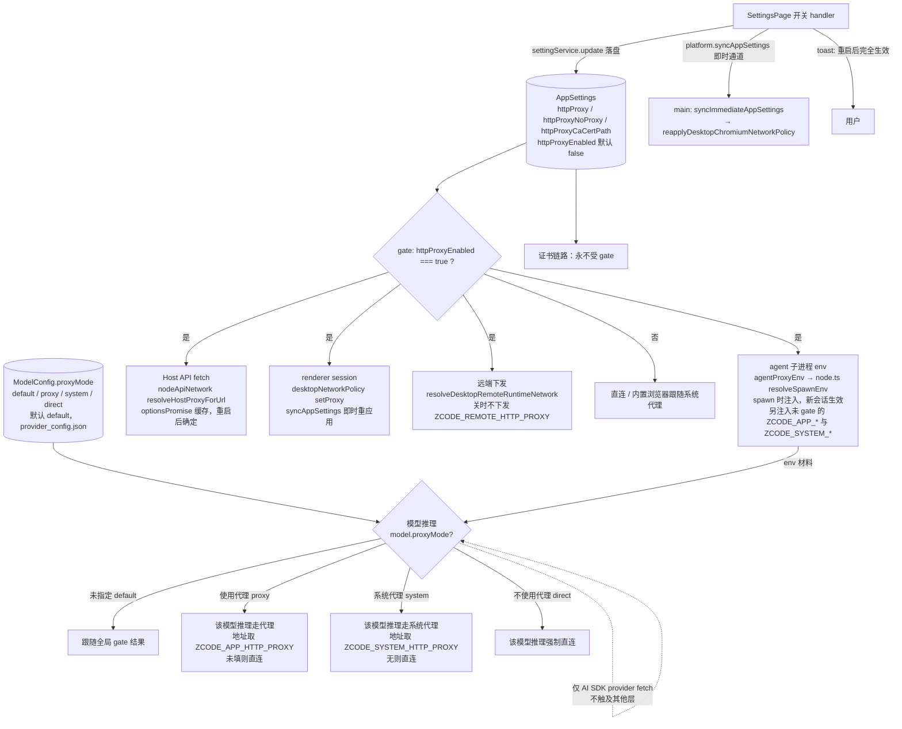

# Spec: 网络设置分区

## 目标

HTTP 出口策略原先嵌在「常规」设置页中段，与语言、终端、通知等窗口级偏好混排，既难发现也不符合信息架构：这三项影响的是模型、MCP、命令工具与应用渲染层的全局出口流量，而非当前窗口体验。

本次改动把它们迁到侧边栏独立的「网络」分区，并按「外观」分区的分类模式重组为「网络代理」与「证书」两个分类，新增「为全局启用」总开关——填写代理地址与启用代理是两个独立概念，只有开关打开时代理才实际生效。

在此之上，模型设置支持按模型单独选择推理请求的出口代理：模型编辑弹窗的高级配置里提供四选项 radio（未指定/使用代理/系统代理设置/不使用代理，默认未指定），解决模型地域限制场景——有的模型必须经代理才可达（全局关闭时单个模型强制走代理），有的模型拒绝代理出口 IP（全局开启时单个模型强制直连）。

## 产品规则

- 「网络」是设置页一级分区，位于「基础」组，排列在「模型设置」之后（出口策略与模型/MCP/命令工具同源，又与浏览器插件设置分离）。
- 分区内部分类（AppearanceSectionContent 的标题 + 描述 + 卡片模式）：
  - **网络代理**：「为全局启用」开关、HTTP 代理（`settings.httpProxy`）、不使用代理的地址（`settings.httpProxyNoProxy`）。
  - **证书**：自定义证书（`settings.httpProxyCaCertPath`）。证书与代理无关——直连场景也需要自定义 CA，因此独立成分类，不受「为全局启用」影响。
- 「为全局启用」（`httpProxyEnabled`）：
  - **默认关闭**。开关未打开时，无论是否填写了代理地址，模型、MCP、命令工具与应用渲染层流量一律直连；内置浏览器仍跟随系统代理（与「代理留空」语义一致）。
  - 存量已填写代理地址的用户升级后同样是关闭状态，代理停止生效，需手动开启（已确认的产品决策，靠开关行描述与保存 toast 引导）。
  - 关闭开关只 gate 代理与 No Proxy；自定义证书注入（`NODE_EXTRA_CA_CERTS`、渲染层证书校验）不受影响。
- 保存行为：
  - 开关、代理地址、No Proxy、证书均通过 `settingService.update` 写入 `AppSettings`；输入框 dirty 时「保存」可用，回车等同保存；清空须提交空串（RPC 会丢弃 `undefined`，由服务层删除旧字段）。
  - 时效分三层：**renderer（Electron session）切换开关后即时生效**——设置页经 `platform.syncAppSettings` 即时通道通知 main，重读全量设置并重调 `applyDesktopChromiumNetworkPolicies`；**Host API fetch** 的设置读取有单飞缓存、**agent 子进程 env** 在 spawn 时注入，两者需新会话/重启后生效。保存 toast 统一提示「网络代理设置已保存，重启应用后生效」。
- 「允许不安全证书」等内置浏览器证书策略仍归「浏览器」分区，不迁入本分区。
- 不提供 Quick Pick 直达「网络」的命令；外部需要跳转时用 `setPendingSettingsSection("network")`。
- 按模型代理模式（模型设置 → 编辑模型配置 → 高级配置 →「网络代理」radio）：
  - 每个模型四选一：**未指定**（`proxyMode` 缺省或 `"default"`，跟随全局开关）、**使用代理**（`"proxy"`，无视全局开关，强制走「网络」分区填写的代理地址；地址未填时直连）、**系统代理设置**（`"system"`，无视全局开关，走操作系统配置的代理；系统未配代理时直连）、**不使用代理**（`"direct"`，无视全局开关强制直连）。
  - **范围仅限该模型的推理请求**（agent 内 AI SDK provider fetch）。MCP、WebFetch、Bash 子进程、内置浏览器、Host API fetch、远端下发均无「当前模型」上下文，不读取该字段。
  - 「系统代理设置」的解析：agent 是 Node 进程，不读取操作系统代理设置，由 Host 在 spawn 时解析并作为材料（`ZCODE_SYSTEM_HTTP_PROXY` / `ZCODE_SYSTEM_NO_PROXY`）下发——macOS 读 `scutil --proxy`（HTTPS 优先于 HTTP，再次 SOCKS；ExceptionsList 作绕过规则）；Windows 读注册表 `HKCU\...\Internet Settings`（ProxyEnable/ProxyServer/ProxyOverride）；Linux 以代理环境变量为准。**局限：不解析 PAC 自动配置脚本**。CLI standalone（无桌面托管）没有 `ZCODE_SYSTEM_*` env，该模式直连；与内置浏览器「跟随系统代理」互相独立、互不影响。
  - 走代理的模式下各自的 No Proxy 规则仍然生效；自定义证书与代理模式无关，直连场景同样注入。
  - 持久化为模型配置 personal 稀疏 overlay 的顶层叶子（`ModelConfig.proxyMode`，写入 `provider_config.json`），不进 AppSettings；与 `enabled` 同待遇——推荐/手动模式切换不清除该用户偏好。
  - 时效：代理地址经 spawn env 快照（`ZCODE_APP_*` 只要地址非空即注入、`ZCODE_SYSTEM_*` 只要系统代理已配置即注入，均不受全局开关 gate）下发；代理模式随新创建的 Model/新会话生效，运行中的会话不变；系统代理变更同样需新会话。
  - CLI standalone（非桌面托管）没有 `ZCODE_APP_*` env，「使用代理」回落 CLI 自身 `config.network.httpProxy`（其语义本就是启用）。

## 状态所有者与接口

- 持久化事实源：`AppSettings` 的 `httpProxy` / `httpProxyEnabled` / `httpProxyNoProxy` / `httpProxyCaCertPath`（`packages/shared/src/protocol.ts`，校验在 `validationAppSettings.ts` 两个 schema，patch 归一化在 `packages/services/src/setting/normalizeSettingsPatch.ts`）。
- UI 状态所有者：`SettingsPage` 持有四项的加载 state 与保存 handler（含遥测 `featureId: "settings.network"`，开关 action 为 `toggle_global_proxy`）；`NetworkSettingsSection`（`packages/ui/src/settings/NetworkSettingsSection.tsx`）只持有输入框本地 draft 与 dirty 判断，通过 props 接收值与回调，不直接调用 `settingService`。
- gate 统一语义 `proxyEnabled !== true → 直连`，落在四个派生层，下游消费方（env 变量、dispatcher、远端 env）零改动：
  - `packages/services/src/runtime-tools/agentProxyEnv.ts` `buildAgentRuntimeEnv`
  - `packages/services/src/providers/api/nodeApiNetwork.ts` `resolveHostProxyForUrl`（`HostApiNetworkOptions.proxyEnabled`）
  - `packages/desktop/src/main/desktopNetworkPolicy.ts` `applyDesktopSessionNetworkPolicy`
  - `packages/desktop/src/host/index.ts` `resolveDesktopRemoteRuntimeNetwork`（WSL 远端只在下发前裁决一次，远端侧无 AppSettings）
- CLI standalone 的代理配置源（`~/.zcode/cli/config.json`、用户 shell 的 `ZCODE_HTTP_PROXY`）不属于 AppSettings 链路，不受开关影响。
- 代理 env 注入链（`packages/desktop/src/main/desktopNetworkPolicy.ts`、`packages/services/src/runtime-tools/agentProxyEnv.ts` 等）除 gate 外不变。
- 按模型代理的所有者与接口：
  - 事实源：`ModelConfig.proxyMode`（schema：`packages/shared/src/model-config.ts` complete+sparse；域类型与 overlay 合并：`packages/provider/src/config/model-config.ts`；序列化：`packages/provider/src/resolver.ts`；手动模式字段归属：`packages/provider/src/config/manual-model-config.ts`）。
  - UI 状态所有者：模型编辑弹窗 draft（`packages/ui/src/settings/model-provider-section/ProviderModelMetadata.ts` 的 `proxyModeValue` 与提交稀疏写入），radio 在 `ProviderModelMetadataDialog.tsx` 高级配置区。
  - agent 生效层：`buildAgentRuntimeEnv` 注入未 gate 的 `ZCODE_APP_HTTP_PROXY` / `ZCODE_APP_NO_PROXY`；`packages/services/src/runtime-tools/systemProxy.ts` 在 spawn 时解析操作系统代理（scutil/reg/env）并经 `buildAgentRuntimeEnv` 注入 `ZCODE_SYSTEM_HTTP_PROXY` / `ZCODE_SYSTEM_NO_PROXY`；CLI `env-config.adapter` 解析为 `config.network.appHttpProxy/appNoProxy` 与 `systemHttpProxy/systemNoProxy`；`apps/zcode-cli/packages/adapters/src/model/model-execution.ts` 的 `resolveModelTransportNetwork(proxyMode, network)` 按四态取 transport 代理，transport 缓存键含 proxyMode。

## 验收场景

1. 侧边栏「基础」组出现「网络」入口；分区内容分「网络代理」「证书」两分类；「常规」页不再显示这三项设置。
2. 全新状态：填了代理地址但开关关闭 → 模型/MCP/命令工具/renderer 直连，内置浏览器跟随系统代理；打开开关并重启 → 全链路走代理，No Proxy 规则生效。
3. 切换开关 → renderer 代理立即切换（不重启），toast 提示重启后完全生效；重启后 agent 链路对齐。
4. 开关关闭时自定义证书仍生效（`NODE_EXTRA_CA_CERTS` 注入 + 渲染层证书校验），且证书行位于独立「证书」分类。
5. 已填地址的存量设置升级后 `httpProxyEnabled` 为 undefined → 代理不再生效，需手动开启。
6. 清空任一输入并保存 → 重新打开设置仍为空（服务层已删除旧字段）；No Proxy 输入 `localhost, 127.0.0.1` 保存后归一为 `localhost,127.0.0.1`。
7. 中英文分类标题与开关文案齐全；在「网络」分区退出再进入，上次分区记忆为「网络」。
8. 全局开关关闭且已填地址：模型 A 在高级配置选「使用代理」→ A 的新会话推理请求走代理，其他模型与所有工具仍直连。
9. 全局开关开启：模型 B 选「不使用代理」→ B 的新会话推理请求直连，其余流量照旧走代理。
10. 默认「未指定」的模型行为与没有该字段时完全一致；「使用代理」但「网络」分区未填地址 → 直连且不报错。
11. 弹窗高级配置四选项横排展示、中英文齐全、默认选中「未指定」；保存后重开选中态保持；推荐/手动配置模式切换不丢失 proxyMode。
12. macOS 系统设置配了代理、应用内全局开关关闭：模型选「系统代理设置」→ 新会话推理请求走系统代理地址，选「未指定」的模型仍直连。
13. 系统未配置代理（或 CLI standalone）时选「系统代理设置」→ 直连，不被应用内代理劫持。
