# Spec: 计划卡接管执行（批准弹窗静默拒绝 + 查看/执行计划）

## 目标

计划模式里 AI 写完计划后，**不再弹出「实施计划」批准弹窗**。批准这是运行时的一个交互（`plan_approval`），但产品上不再把它做成一个需要用户当场回答的模态：UI 收到它后直接静默回 `decline`，把「开始实施」这个动作搬到对话里的计划卡片上——用户先看计划，再决定要不要执行。

计划卡片同时承担两个入口：

- 右上角「查看」：打开右侧计划详情 tab（等价于改造前卡片底部的「查看完整计划」）。
- 底部「执行计划」：把当前会话切到**完全访问**并向 AI 发送「执行计划」。

卡片本体不再是按钮，点击正文不再跳转计划详情。

## 产品规则

- **批准弹窗从 UI 消失。** 计划批准请求（`payload.kind === "userInput"` 且为 plan approval）到达时，UI 立即回 `{ action: "decline" }` 且不渲染任何弹窗；不出现「先闪一下再消失」。回执语义与用户点「忽略」完全一致：broker 判 `deny`，本回合以 `plan_exit_denied` 停止，会话**留在计划模式**。
- **计划卡是唯一执行入口。** 用户点卡片底部「执行计划」时，客户端做两件事，且必须在同一 tick 内先切档再发送：把 composer 草稿模式置为 `yolo`，然后发一条正文为「执行计划」的普通用户消息。完全访问随这次 `sendText` 的 submission mode 上行（`resolveSubmittedExecutionState`），**不额外发 `switchCollaborationMode` 命令**；草稿模式持久化，后续提交也保持完全访问。
- **「执行计划」文案即发送正文。** 按钮 label 与发送正文取同一个 i18n key（`planTool.panel.execute`），随界面语言走；中文即「执行计划」。
- **卡片点击不再是入口。** 卡片退化为纯展示：去掉 `role="button"` / `tabIndex` / 整卡 `onClick` / `onKeyDown`，键盘与鼠标都只能通过「查看」「执行计划」两个真实按钮进入。
- **复制能力收敛为路径复制，且路径文本不再展示。** 卡片右上角原复制按钮删除，整份计划**不提供**一键复制（正文可直接框选）；复制能力收敛为详情面板头部右上角的「…」菜单里的「复制绝对路径 / 复制相对路径」两个菜单项，以及「在 {editor} 中打开」按钮。**路径只作为操作目标存在**：折叠卡头部与详情面板头部都不再渲染任何路径文本（文件名、相对路径都不显示），`planFilePath` 字段仍随行下发，仅供复制与打开操作使用。
- **只读场景不给执行入口。** `readOnly`（分享只读、子代理观察等）会话不注入 `onExecutePlan`，卡片底部的「执行计划」按钮随之不渲染；「查看」仍可用。
- **系统通知保留但改中性文案。** 计划批准交互仍会生成一条系统通知（`planApprovalRequired` / `planApprovalBody`），但标题/正文从「等待确认 / 请确认计划后继续执行」改成中性描述（「计划已生成 / 可查看计划并开始执行」），因为批准动作已经不在通知对应的弹窗里了。
- **卡片折叠为「标题 + 概述」（参考 Cursor 的 Created Plan 卡）。** 计划提交时必带 `overview`（`ExitPlanMode` 必填字段，见 `session-plan-files.md`；缺失在入参校验门被打回模型重试），卡片正文不渲染计划全文，只显示：标题行（小标签 + 图标）→ 加粗标题（`title`，显式输入优先）→ 概述段落（`overview`，限 3 行截断）→ 底部右侧操作区（「查看」ghost +「执行计划」primary）。完整内容只能通过「查看」打开的计划详情侧栏阅读。概述还没流到时（模型先写完整篇 `plan`、`title`/`overview` 在末尾）不渲染概述段落，标题先回退正文首个 H1——**缺概述只少一行，不改变卡片形态**。
- **卡片形态由调用状态决定，不由 `overview` 有没有值决定。** 三种状态各自有明确的形态：

  | 调用状态                                        | `overview` | 卡片形态                            |
  | ----------------------------------------------- | ---------- | ----------------------------------- |
  | 流式中（`inputStreaming`，`input` 尚未解析）    | 暂时没有   | 折叠卡，概述行缺席                  |
  | 定稿，`overview` 在入参里                       | 有         | 折叠卡                              |
  | 定稿，入参里没有 `overview`（该字段之前的版本） | 没有       | 全文渐隐预览 + 底部悬浮「执行计划」 |

  `overview` 是 schema 必填，**定稿后必然存在**；它的缺席只有「还在流式」和「旧调用」两种含义。用「有没有 `overview`」当形态判据会把这两者混为一谈：模型写计划是整个输出期最长的一段（`plan` 字段先写完，`title`/`overview` 在末尾），按该判据卡片会在整段输出期显示旧样式、定稿瞬间翻牌。**历史数据回退只针对定稿且入参无 `overview` 的旧调用**，老数据不劣化，新提交不翻牌。

- **流式期间「执行计划」置为加载态且不可点。** 计划还没写完就谈不上执行，所以按钮**保留原位、保留文案**，只把右侧箭头换成 spinner（`LoaderIcon` + `animate-spin`）并加 `disabled` + `aria-busy`（仓库既有约定，见 `DeleteAllArchivedTasksButton.tsx`）。定稿后自动恢复可点。保留文案与位置是为了让状态切换不发生位移——「执行计划」的 label 同时就是发送正文（见上），不能换成「生成中」之类的新词。
- **「查看」流式期间照常可用。** 详情面板读的是投影实时值，计划还在写的时候打开也能看，且随流更新，不需要门禁。
- **卡片数据来源仍是 transcript。** 标题/概述从 `ExitPlanMode` 工具行的 input 读取（`extractPlanToolCallContent` 扩展返回 `title`/`overview`）；`planFilePath` 也随行下发——运行时在落盘后经 `plan_file_written` 事件补到这个字段（见 `session-plan-files.md`），不是 UI 算出来的——但卡片**不渲染**它，只透传给详情面板作复制与打开的操作目标。两侧都不读落盘文件，frontmatter 也不进 UI。
- **计划目录不是 `ExitPlanMode` 卡的展开态。** 状态面板、侧边栏启动器和 `ListPlans` 工具摘要打开的是会话级 `plan-directory` side-pane tab，目录数据来自 `state.sessionPlans`，详情行再按 `toolCallId` 打开现有 `PlanDetailSidePane`。`ListPlans` 的模型输出不注入目录；目录页不提供“执行计划”。
- **计划详情与目录按会话和 remote scope 隔离。** `plan-detail` 与 `plan-directory` tab 的身份包含 `workspaceKey`、`parentSessionId` 和 `remoteSessionId`；远端重连产生的新 scope 不会复用旧详情或目录 tab，详情正文仍只来自对应 `ExitPlanMode` transcript 行。

## 计划详情面板

「查看」与状态面板「会话计划」列表打开的是同一个 `PlanDetailSidePane`。它由**固定不滚的头部**与**独立滚动的正文区**两段组成，两段同套一列宽度对齐。用 flex 分栏而不是 `sticky`：根节点自己就是滚动容器，`sticky` 会和 markdown 的 margin 折叠打架。

头部自上而下两行，每行**独立降级**——字段缺席就不渲染那一行，不留空行：

1. 标题行：左侧小标签「计划」+ 图标（与折叠卡同款，复用 `planTool.panel.planTab`），右侧是操作区——「…」菜单里的「复制绝对路径 / 复制相对路径」，以及「在 {editor} 中打开」（`platform.openInEditor`，交给系统编辑器，不是应用内代码查看器）。
2. 加粗标题，与折叠卡、运行时 frontmatter 同一条优先级链：显式 `title` 优先，回退正文首个 H1/首个非空行（`getPlanDirectoryTitle`）。

**头部不渲染概述。** 概述只出现在折叠卡上（3 行截断）；详情面板是完整正文的阅读处，正文自己会讲到概述说的那件事，再顶一行只会把头部撑高。因此 `PlanDetailSidePaneTab` 与打开请求**不再携带 `overview`**——这个字段只剩卡片一个消费方。

两条配套规则：

- **正文 H1 去重。** 头部标题的来源常常就是正文首个 H1（优先级链的第 2 档），此时正文不再重复渲染该 H1；仅当正文首个非空块与标题**完全相同**时才删，其余正文逐字保留。
- **数据源仍是 transcript，路径是行级字段但不展示。** 标题取工具行 input（`extractPlanToolCallContent`）；路径取工具行的 `planFilePath`，仅供「…」复制与「在编辑器中打开」使用，不再渲染任何路径文本（运行时落盘后由 `plan_file_written` 事件补齐，优先级链最后一位：入参/输出里没有它，也不覆盖既有值）。投影窗口里找不到那条工具行时回退到打开时冻结的 tab 字段——所以 `PlanDetailSidePaneTab` 与打开请求都必须带 `title`/`planFilePath`，否则窗口滚动后头部会当场空掉。**UI 不读计划文件**：不解析 frontmatter，正文也只从工具行来。

路径复制复用 `useFileContextActions`（全应用同一份复制实现与日志，复制相对路径用行级字段按 workspace 算出的相对路径），「在外部打开」复用代码预览面板那套 `useWorkspaceOpenInEditorTarget` + `resolveWorkspaceEditorSelection`：远程工作区解不出可用编辑器时按钮禁用，不退化成用本机编辑器打开远端路径。两者都只在有 `planFilePath` 时渲染，行级相对路径在复制时按 workspace 现算，不需要新管道。

## 状态所有者与事件顺序

计划批准的**判定**只有一份实现：`packages/ui/src/lib/planApproval.ts` 的 `isPlanApprovalUserInputRequest`。消费方两处：交互弹窗层（决定静默拒绝）与通知编排（决定通知标题）。

```mermaid
flowchart TD
  A["ExitPlanMode 工具<br/>needsApproval"] --> B["interaction-broker.requestExitPlanModeApproval<br/>发 plan_approval 交互"]
  B --> C["product-projection<br/>kind: userInput + schema.interaction=plan_approval"]
  C --> D["snapshot.pendingInteractions"]
  D --> E["V4InteractionDialogs<br/>isPlanApprovalUserInputRequest 命中"]
  E --> F["resolveInteraction(id, {action:'decline'})<br/>且 return null（不渲染弹窗）"]
  F --> G["broker: decision=deny<br/>turn 以 plan_exit_denied 停止，会话留在 plan 模式"]
  D --> H["taskNotificationOrchestrator<br/>发中性文案系统通知"]
  I["计划卡「执行计划」按钮"] --> J["onExecutePlan（SessionPane 注入）"]
  J --> K["handleSwitchMode('yolo')<br/>同步写 draftConfigRef"]
  K --> L["handleSendText('执行计划')<br/>sendText.mode = yolo"]
  L --> M["resolveSubmittedExecutionState<br/>本回合意图 mode=yolo"]
```

事件顺序（静默拒绝）：snapshot 出现 plan approval → UI effect 触发一次 `resolveInteraction(decline)` → 用 ref Set 记已发送的 interactionId（同一 id 不重复发）→ ACK 语义按 `accepted / duplicate / noop` 分类：三者都表示命令已被接收、无需再次发送（同 commandId 的 `duplicate` 表示 CommandInbox 已接收；晚到应答的 `noop` 表示该 interaction 已由权威链结算或当前已无需动作）。只有传输失败或 `failed` ACK 才移出集合，允许下一次权威 snapshot 触发重试，不做定时轮询。ACK 成功只表示应答命令已被接收或该 interaction 已结算，不表示 `ProductProjection` 已收到 `PermissionResolved` / `TurnComplete`；列表转圈与「等待确认」只能在后续权威终态投影到达后消失。

静默拒绝完成的产品条件是两条：Plan 工具行由 core 决策收口，且会话列表的 `phase` 不再是 `prewarming/running`、`pendingInteraction` 为空。真实等待确认期间转圈与「等待确认」允许同时出现；权威结算事件到达后，两者必须一起消失。UI 不以 ACK、计时器或本地 Set 推断业务终态。

事件顺序（执行计划）：按钮点击 → `handleSwitchMode("yolo")` 同步更新 `draftConfigRef.current` → 同一同步栈内 `handleSendText("执行计划")` 由该 ref 冻结本次 submission → 提交 `sendText`。

## 接口

- **UI（判定）**：`packages/ui/src/lib/planApproval.ts` — `isPlanApprovalUserInputRequest(payload: UserInputRequestPayload): boolean`（`toolName === "ExitPlanMode"`，或 `schema.interaction === "plan_approval"` / `schema.toolName === "ExitPlanMode"`）。
- **UI（拒绝）**：`V4InteractionDialogs` 内新增的静默拒绝 effect；不需要新的 props。
- **UI（执行入口）**：`ToolCallBlockRenderContext.onExecutePlan?: () => void`，与 `onOpenPlanDetail` 同构，由会话宿主（`SessionPane`）绑定会话与发送能力；缺席即不渲染按钮。
- **UI（卡片渲染）**：`packages/ui/src/ToolCallBlocks/renderers/switch-mode.tsx`（`ExitPlanMode` 行）；`extractPlanToolCallContent` 返回扩展 `title`/`overview`，形态判定抽成纯函数 `isPlanToolCallInputStreaming` / `shouldRenderCollapsedPlanCard`（`packages/ui/src/lib/planToolCall.ts`），规则由单测锁定。
- **UI（流式预览字段）**：`packages/shared/src/streaming-tool-input-preview.ts` 的半截 JSON 字段白名单纳入 `overview`，让概述在 `input_end` 之前就随流补进卡片。该白名单的消费方是 UI 适配层与 services 的工具名推断（只看文件路径/Edit/Write 字段），加 `overview` 对后者无影响。
- **UI（详情面板）**：`packages/ui/src/app-shell/PlanDetailSidePane.tsx`（固定头部：标题行左标签右操作 + 加粗标题；纯函数 `stripLeadingPlanTitleHeading`）；`planFilePath` 仍随行下发，仅作为「…」复制与「在编辑器中打开」的操作目标，不再渲染任何路径文本。
- **UI（tab 字段）**：`PlanDetailSidePaneTab` 与 `OpenPlanDetailSideTabRequest` 加可选 `title`/`overview`（`packages/ui/src/lib/workspaceSidePane.ts`）；状态面板的 `ConversationStatusPanelSessionPlanItem` 同步补 `overview`。
- **i18n**：`planTool.panel.view`、`planTool.panel.execute`（新增）；`planTool.panel.open`（保留为「查看」的 aria-label）；`planTool.panel.copy` / `copied` / `viewFull`（删除）。折叠卡复用同一组键，不新增。详情面板头部另加 `planTool.panel.copyPath` / `pathCopied` / `openFile`。
- **UI（行级路径）**：`ToolCallRow.planFilePath`（`packages/shared/src/zcode-protocol-v4/rows.ts`，可选）经 `packages/ui/src/v4/toolCallRowAdapter.ts` 带进 `extractPlanToolCallContent`（`packages/ui/src/lib/planToolCall.ts`）。字段的**生产者**在运行时与 v4 投影：新增 `plan_file_written` 事件、`AgentRuntime.listSessionPlanFileWrittenFacts` 与冷恢复合成（`bootstrap/src/zcode-protocol-v4/plan-file-hydration.ts`），全部记在 `session-plan-files.md`。
- **interaction-broker、v4 的命令与 elicitation 适配不动**；本次对 `apps/zcode-cli` 的改动只有上面那条路径字段链路（`ExitPlanMode` 输入的必填 `title`/`overview` 与落盘属同一份 spec）。

## 不变量

- `isPlanApprovalUserInputRequest` 只有一份实现，弹窗层与通知层共用。
- 计划批准永远不会在 UI 上渲染成可交互弹窗；它到达即被拒绝。
- 「执行计划」不得单独发送模式切换命令：模式必须随同一次 `sendText` 的 submission 上行，避免切档与发送之间的竞态。
- 计划卡本体不得再承担跳转/执行语义；两个动作各自绑定到真实按钮。
- 计划卡形态由调用状态决定：流式与「定稿且有 `overview`」都渲染折叠卡，只有「定稿且入参无 `overview`」才退回全文预览；不得用 `overview` 有没有值代替状态判断。
- 卡片形态在一次调用内不得跳变：不得出现「流式期间全文预览 → 定稿后折叠」这种翻牌。
- 流式期间「执行计划」必须不可点（加载态），不得让用户对还没写完的计划发起执行。
- 只读视图不得出现写入性质的执行入口。
- 详情面板头部各行独立降级：字段缺席不渲染空行，不出现「undefined」或空白占位。
- 详情面板与卡片不得读计划文件：标题只来自工具行 input 与 tab 冻结值，路径只来自工具行 `planFilePath` 字段（前端不解析 frontmatter，不从文件正文取任何东西）。
- **路径与卡片同源，且只作操作目标**：卡片与详情面板取的都必须是工具行的 `planFilePath`，不得一处用投影值、另一处另算；两侧头部都不渲染路径文本。`getPlanFileLabel` 随「卡片显示文件名」一并删除（渲染层已无引用）；`getPlanPathLabel` 仍在用——「复制相对路径」的目标就是它算出的 workspace 相对路径。

## 负面边界

- **不改协议与运行时上的交互语义。** `interaction-broker`、`zcode-protocol-v4` 的投影与命令、`packages/services` 的 elicitation 适配都不动；CLI / TUI 等其它前端仍按原方式批准计划。**例外是计划文件路径这条链**：新增 `plan_file_written` 事件与工具行可选字段 `planFilePath`，以及运行时侧的落盘事实读口与冷恢复合成——它们只补一个展示字段，不参与任何权限或回合判定，细节见 `session-plan-files.md`。
- **计划详情面板本次在范围内**，但只加头部（标题/路径行）与路径行的那两个动作：复制路径（绝对/相对）与在外部编辑器中打开。tab 标签仍是通用「计划」（`SidePaneTabTrigger`），不显示计划标题。
- **「执行计划」不进详情面板。** 它仍只挂在折叠卡底部；把会话发送能力与只读门禁穿到 `AnimatedSidePanePanel` 属另一条改动。
- **状态面板「会话计划」列表的渲染不动**，不喂面板任何卡片专属字段。
- **不删 `ElicitationDialog` 里的 plan-approval 渲染分支。** 静默拒绝后该分支不可达，但组件仍被 AskUserQuestion 复用，删除会牵动无关路径。
- **不为「提交未就绪」给「执行计划」加门禁。** 模型未选定之类的提交条件不满足时，点击与点发送按钮同义：本次不发送，不在卡片上再加禁用/加载态。（流式期间禁用是另一条规则，为的是「计划还没写完」，见产品规则。）

## 验收场景

1. 计划模式下发一条会产出计划的请求：AI 写完计划后**不出现**「实施计划」批准弹窗、不闪现；计划卡片正常显示；通知中心出现一条标题为「计划已生成」的通知。
2. 计划卡片右上角显示「查看」文本按钮（不再是复制图标）；点击后右侧打开该计划的详情 tab。
3. 点击计划卡片正文或空白处：不打开详情、不跳转、无任何副作用。
4. 计划卡片底部显示「执行计划」；点击后 composer 权限档位变为「完全访问」，对话里出现一条用户消息「执行计划」，AI 开始实施。
5. 只读/分享视图下：卡片底部不出现「执行计划」，右上角「查看」仍可用。
6. 提交带 `overview` 的计划 → 卡片显示加粗标题与 3 行内概述（无全文预览）；「查看」打开的详情仍是完整计划。
7. 历史计划（**定稿**且入参无 `overview`）→ 卡片保持全文渐隐预览渲染，不空白。
8. `pnpm typecheck`、`pnpm lint`、`pnpm architecture:check --changed` 通过；`packages/ui/test/planApproval.test.ts`、`planToolCall.test.ts`、`planDetailSidePaneTab.test.ts` 通过。
9. 点「查看」打开详情面板：头部显示小标签「计划」与加粗标题（标题行右侧是「…」与「在 {editor} 中打开」两个按钮），**不出现概述行、不出现任何路径文本**。点「…」→「复制绝对路径」拿到完整绝对路径并提示「已复制路径」（「复制相对路径」拿到 workspace 相对路径）；点「在 {editor} 中打开」在系统编辑器里打开该计划文件（不是应用内代码查看器）。正文若以与标题相同的 H1 开头，不再重复渲染该 H1。
10. 历史计划（无 `planFilePath`）：头部只有标签、标题与「查看」无关的操作区缺席（复制/打开按钮不渲染），不留空位；正文照常渲染。
11. 滚动会话使该工具行离开投影窗口后仍停在面板里：头部标题与右上操作区不消失（来自 tab 冻结的 `title`/`planFilePath`）。
12. 模型还在写计划（工具调用处于 `inputStreaming`）时，卡片**就已经是折叠形态**：先出现标题（正文首个 H1），概述流到后补上那一行；整个输出期不出现全文渐隐预览，定稿时不发生形态跳变。「执行计划」此时为加载态（spinner + 不可点），定稿后自动恢复可点，文案与位置不变。
13. 流式期间点「查看」：详情面板正常打开并随流更新计划正文。
14. 计划落盘后（含被静默拒绝那次）详情面板右上操作区可用（复制/打开走行级 `planFilePath`）；卡片头部与面板头部都不显示文件名或路径。**重启应用并重开该会话**后照旧（路径来自运行时按计划目录重推导的事件），历史旧计划的操作按钮缺席且不留空位。
15. 折叠卡与旧全文预览卡的头部都不再渲染文件名：只有「计划」小标签 + 图标；详情面板头部也不渲染任何路径文本。
