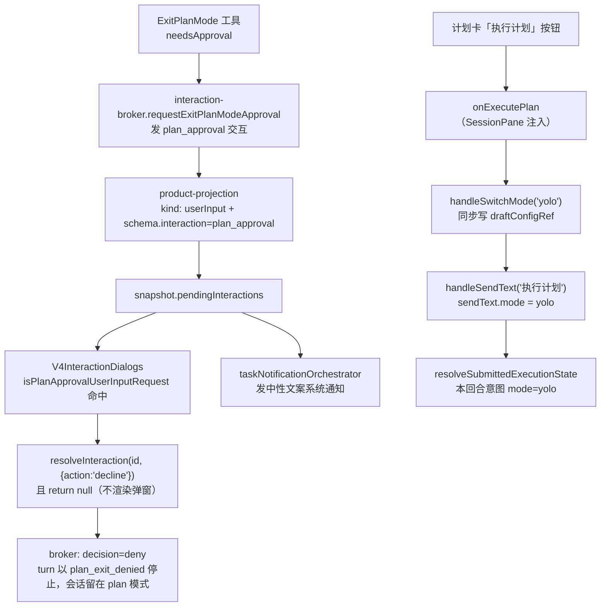

# Spec: 计划卡接管执行（批准弹窗静默拒绝 + 查看/执行计划）

## 目标

计划模式里 AI 写完计划后，**不再弹出「实施计划」批准弹窗**。批准这是运行时的一个交互（`plan_approval`），但产品上不再把它做成一个需要用户当场回答的模态：UI 收到它后直接静默回 `decline`，把「开始实施」这个动作搬到对话里的计划卡片上——用户先看计划，再决定要不要执行。

计划卡片同时承担两个入口：

- 右上角「查看」：打开右侧计划详情 tab（等价于改造前卡片底部的「查看完整计划」）。
- 底部「执行计划」：把当前会话切到**完全访问**并向 AI 发送「执行计划」。

卡片本体不再是按钮，点击正文不再跳转计划详情。

## 产品规则

- **批准弹窗从 UI 消失。** 计划批准请求（`payload.kind === "userInput"` 且为 plan approval）到达时，UI 立即回 `{ action: "decline" }` 且不渲染任何弹窗；不出现「先闪一下再消失」。回执语义与用户点「忽略」完全一致：broker 判 `deny`，本回合以 `plan_exit_denied` 停止，会话**留在计划模式**。
- **计划卡是唯一执行入口。** 用户点卡片底部「执行计划」时，客户端做两件事，且必须在同一 tick 内先切档再发送：把 composer 草稿模式置为 `yolo`，然后发一条正文为「执行计划」的普通用户消息。完全访问随这次 `sendText` 的 submission mode 上行（`resolveSubmittedExecutionState`），**不额外发 `switchCollaborationMode` 命令**；草稿模式持久化，后续提交也保持完全访问。
- **「执行计划」文案即发送正文。** 按钮 label 与发送正文取同一个 i18n key（`planTool.panel.execute`），随界面语言走；中文即「执行计划」。
- **卡片点击不再是入口。** 卡片退化为纯展示：去掉 `role="button"` / `tabIndex` / 整卡 `onClick` / `onKeyDown`，键盘与鼠标都只能通过「查看」「执行计划」两个真实按钮进入。
- **复制能力移除。** 右上角原复制按钮删除；计划正文的复制由「查看」打开的详情面板承担。
- **只读场景不给执行入口。** `readOnly`（分享只读、子代理观察等）会话不注入 `onExecutePlan`，卡片底部的「执行计划」按钮随之不渲染；「查看」仍可用。
- **系统通知保留但改中性文案。** 计划批准交互仍会生成一条系统通知（`planApprovalRequired` / `planApprovalBody`），但标题/正文从「等待确认 / 请确认计划后继续执行」改成中性描述（「计划已生成 / 可查看计划并开始执行」），因为批准动作已经不在通知对应的弹窗里了。
- **卡片折叠为「标题 + 概述」（参考 Cursor 的 Created Plan 卡）。** 计划提交时必带 `overview`（`ExitPlanMode` 必填字段，见 `session-plan-files.md`；缺失在入参校验门被打回模型重试），卡片正文不渲染计划全文，只显示：标题行（小标签 + 图标 + 文件名）→ 加粗标题（`title`，显式输入优先）→ 概述段落（`overview`，限 3 行截断）→ 底部右侧操作区（「查看」ghost +「执行计划」primary）。完整内容只能通过「查看」打开的计划详情侧栏阅读。
- **历史数据回退。** 字段加入**之前**的历史计划调用没有 `title`/`overview`，保持原渲染：全文渐隐预览 + 底部悬浮「执行计划」，老数据不劣化；新提交不再出现无 `overview` 的情况（schema 必填）。
- **卡片数据来源仍是 transcript。** 标题/概述从 `ExitPlanMode` 工具行的 input 读取（`extractPlanToolCallContent` 扩展返回 `title`/`overview`），不读落盘文件；frontmatter 只存在于文件，UI 不感知。

## 状态所有者与事件顺序

计划批准的**判定**只有一份实现：`packages/ui/src/lib/planApproval.ts` 的 `isPlanApprovalUserInputRequest`。消费方两处：交互弹窗层（决定静默拒绝）与通知编排（决定通知标题）。

事件顺序（静默拒绝）：snapshot 出现 plan approval → UI effect 触发一次 `resolveInteraction(decline)` → 用 ref Set 记已发送的 interactionId（同一 id 不重复发）→ ACK 未被接受时移出集合，允许下一次渲染重试，不做定时轮询。

事件顺序（执行计划）：按钮点击 → `handleSwitchMode("yolo")` 同步更新 `draftConfigRef.current` → 同一同步栈内 `handleSendText("执行计划")` 由该 ref 冻结本次 submission → 提交 `sendText`。

## 接口

- **UI（判定）**：`packages/ui/src/lib/planApproval.ts` — `isPlanApprovalUserInputRequest(payload: UserInputRequestPayload): boolean`（`toolName === "ExitPlanMode"`，或 `schema.interaction === "plan_approval"` / `schema.toolName === "ExitPlanMode"`）。
- **UI（拒绝）**：`V4InteractionDialogs` 内新增的静默拒绝 effect；不需要新的 props。
- **UI（执行入口）**：`ToolCallBlockRenderContext.onExecutePlan?: () => void`，与 `onOpenPlanDetail` 同构，由会话宿主（`SessionPane`）绑定会话与发送能力；缺席即不渲染按钮。
- **UI（卡片渲染）**：`packages/ui/src/ToolCallBlocks/renderers/switch-mode.tsx`（`ExitPlanMode` 行）；`extractPlanToolCallContent` 返回扩展 `title`/`overview`（`packages/ui/src/lib/planToolCall.ts`）。
- **i18n**：`planTool.panel.view`、`planTool.panel.execute`（新增）；`planTool.panel.open`（保留为「查看」的 aria-label）；`planTool.panel.copy` / `copied` / `viewFull`（删除）。折叠卡复用同一组键，不新增。
- 协议、CLI 运行时、`packages/services` 适配层**不新增接口**（`ExitPlanMode` 输入的必填 `title`/`overview` 属计划文件路径，见 `session-plan-files.md`；interaction-broker、v4 投影、elicitation 适配不动）。

## 不变量

- `isPlanApprovalUserInputRequest` 只有一份实现，弹窗层与通知层共用。
- 计划批准永远不会在 UI 上渲染成可交互弹窗；它到达即被拒绝。
- 「执行计划」不得单独发送模式切换命令：模式必须随同一次 `sendText` 的 submission 上行，避免切档与发送之间的竞态。
- 计划卡本体不得再承担跳转/执行语义；两个动作各自绑定到真实按钮。
- 只读视图不得出现写入性质的执行入口。

## 负面边界

- **不改协议与运行时。** `apps/zcode-cli` 的 `interaction-broker`、`zcode-protocol-v4` 的投影与命令、`packages/services` 的 elicitation 适配都不动；CLI / TUI 等其它前端仍按原方式批准计划。（计划文件的运行时落盘与 `ExitPlanMode` 输入的必填 `title`/`overview` 属另一条路径，见 `session-plan-files.md`；其落盘点刻意放在审批门之前，与本 spec 的「静默拒绝」语义兼容。）
- **不动计划详情侧栏。** `PlanDetailSidePane` 与状态面板的「会话计划」列表入口（`ConversationStatusPanel`）继续走 `onOpenPlanDetail`，本次只改卡片上的按钮分布与文案。
- **不删 `ElicitationDialog` 里的 plan-approval 渲染分支。** 静默拒绝后该分支不可达，但组件仍被 AskUserQuestion 复用，删除会牵动无关路径。
- **不给「执行计划」加禁用/加载态。** 提交未就绪（模型未选定等）时与点发送按钮同义：本次不发送。

## 验收场景

1. 计划模式下发一条会产出计划的请求：AI 写完计划后**不出现**「实施计划」批准弹窗、不闪现；计划卡片正常显示；通知中心出现一条标题为「计划已生成」的通知。
2. 计划卡片右上角显示「查看」文本按钮（不再是复制图标）；点击后右侧打开该计划的详情 tab。
3. 点击计划卡片正文或空白处：不打开详情、不跳转、无任何副作用。
4. 计划卡片底部显示「执行计划」；点击后 composer 权限档位变为「完全访问」，对话里出现一条用户消息「执行计划」，AI 开始实施。
5. 只读/分享视图下：卡片底部不出现「执行计划」，右上角「查看」仍可用。
6. 提交带 `overview` 的计划 → 卡片显示加粗标题与 3 行内概述（无全文预览）；「查看」打开的详情仍是完整计划。
7. 历史计划（无 `overview`）→ 卡片保持全文渐隐预览渲染，不空白。
8. `pnpm typecheck`、`pnpm lint`、`pnpm architecture:check --changed` 通过；`packages/ui/test/planApproval.test.ts` 通过。
