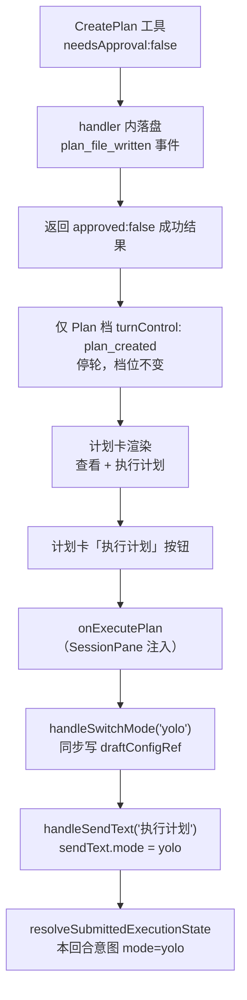

# Spec: 计划卡接管执行（CreatePlan 恒成功 + 查看/执行计划）

## 目标

模型在任何档位调用 `CreatePlan` 提交计划后，**直接成功、直接停轮，不经过任何批准询问**。用户唯一的批准与执行入口是对话里计划卡片底部的「执行计划」按钮——用户先看计划，再决定要不要执行。

`CreatePlan` 只做一件事：提交计划（落盘 + 返回成功结果）。它不切档、不询问、不还原任何档位。本 spec 的前身是「批准弹窗静默拒绝」方案（九月）：当时 `ExitPlanMode` 把提交计划、退出模式、请求批准绑在一个 `needsApproval` 工具上，而批准弹窗早已被计划卡取代，询问链空转并把必然发生的 decline 物化成 `PermissionDenied` 喂给模型。本次把整条询问链删除，根因链路不再存在。

计划卡片同时承担两个入口：

- 右上角「查看」：打开右侧计划详情 tab（等价于改造前卡片底部的「查看完整计划」）。
- 底部「执行计划」：把当前会话切到**完全访问**并向 AI 发送「执行计划」。

卡片本体不再是按钮，点击正文不再跳转计划详情。

## 产品规则

- **没有批准弹窗，也没有静默拒绝。** `CreatePlan` 设 `needsApproval:false`、`requiresUserInteraction:false`，运行时不发任何 `plan_approval` 交互，UI 侧无弹窗、无自动 decline、无重试、无 `pendingInteraction` 槽位。`usePlanApprovalAutoDecline`、`planApprovalDecline.ts`、broker 的 `requestExitPlanModeApproval` 分支、投影的 `plan_approval` 分支、sessions-index 槽位优先规则、计划批准通知与对应 i18n、`V4InteractionDialogs` 的跳过判定——全部删除，不留残桩。
- **调用即成功。** handler 内落盘（见 `session-plan-files.md`），返回 `{ approved:false, plan, mode, previousMode }` 的成功结果（`approved` 为 boolean，`false` 表示"已创建、待用户在卡片上批准"，不是失败）。仅 Plan 档调用后 `turnControl` 以 `plan_created` 停轮、等用户在计划卡上批准；Agent 档调用后继续执行（备忘语义），Ask 档调用后等用户说话。模型不再看到 `Permission denied for ExitPlanMode`。`plan_exit_denied` 理由枚举与反馈升级通道（`plan_approval_feedback` steer）同步删除。
- **任何档位都可调用。** `mode.plan.exitOnly` 硬拦已删除，plan、readonly、yolo 三档都能调 `CreatePlan`。plan 档的硬只读门禁（`checkReadOnlyScope`、`mode.plan.nonReadOnly`）不动：Write/Edit 照旧被拒；`CreatePlan` 经 `allowedInPlanMode: true` + `sideEffectScope: session` + `needsApproval: false` 走只读域的显式会话控制放行分支（与 `RespondToCoordinator`、`Compact` 同口径），不是把门禁改成只读放行。
- **计划卡是唯一执行入口。** 用户点卡片底部「执行计划」时，客户端做两件事，且必须在同一 tick 内先切档再发送：把 composer 草稿模式置为 `yolo`，然后发一条正文为「执行计划」的普通用户消息。完全访问随这次 `sendText` 的 submission mode 上行（`resolveSubmittedExecutionState`），**不额外发 `switchCollaborationMode` 命令**；草稿模式持久化，后续提交也保持完全访问。不给模型任何切档工具：`EnterPlanMode` 已删除，不做 `SwitchMode` 工具。
- **「执行计划」文案即发送正文。** 按钮 label 与发送正文取同一个 i18n key（`planTool.panel.execute`），随界面语言走；中文即「执行计划」。
- **卡片点击不再是入口。** 卡片退化为纯展示：去掉 `role="button"` / `tabIndex` / 整卡 `onClick` / `onKeyDown`，键盘与鼠标都只能通过「查看」「执行计划」两个真实按钮进入。
- **复制能力收敛为路径复制，且路径文本不再展示。** 卡片右上角原复制按钮删除，整份计划**不提供**一键复制（正文可直接框选）；复制能力收敛为详情面板头部右上角的「…」菜单里的「复制绝对路径 / 复制相对路径」两个菜单项，以及「在 {editor} 中打开」按钮。**路径只作为操作目标存在**：折叠卡头部与详情面板头部都不再渲染任何路径文本（文件名、相对路径都不显示），`planFilePath` 字段仍随行下发，仅供复制与打开操作使用。
- **只读场景不给执行入口。** `readOnly`（分享只读、子代理观察等）会话不注入 `onExecutePlan`，卡片底部的「执行计划」按钮随之不渲染；「查看」仍可用。
- **系统通知删除。** 计划批准交互已不存在，不再发 `planApprovalRequired` / `planApprovalBody` 通知。计划生成后用户在对话里直接看到计划卡，不需要通知引流。
- **卡片折叠为「标题 + 概述」（参考 Cursor 的 Created Plan 卡）。** 计划提交时必带 `overview`（`CreatePlan` 必填字段，见 `session-plan-files.md`；缺失在入参校验门被打回模型重试），卡片正文不渲染计划全文，只显示：标题行（小标签 + 图标）→ 加粗标题（`title`，显式输入优先）→ 概述段落（`overview`，限 3 行截断）→ 底部右侧操作区（「查看」ghost +「执行计划」primary）。完整内容只能通过「查看」打开的计划详情侧栏阅读。标题限 2 行截断：标题按定义是一行短标题，超过两行只可能是回退抓错了东西。任一字段未流到就少渲染那一行，**不改变卡片形态**。
- **`CreatePlan` 的入参字段顺序是产品事实：短字段在前、长正文在后。** schema 声明顺序为 `title` → `overview` → `plan`，`toToolJsonSchema` 按 shape 键序产出 provider 可见的 `properties`/`required`，模型照这个顺序流式吐 JSON，UI 再从半截 JSON 里按字段名回收。`plan` 是整个输出期最长的一段（实测可达上万字符），放在最前会让卡片在整段输出期都拿不到标题与概述，只能拿计划正文首行当标题渲染——正文不以 H1 开头时那是一整句话，会被灌进大字标题槽。schema 顺序是结构信号，`CREATE_PLAN_MODEL_INSTRUCTIONS` 的 `## Title and Overview` 段另有一句显式顺序指令，两者共同兜住不严格遵循 schema 顺序的 provider。顺序被改回时有单测钉住（`session-plan-files.test.ts`）。`allowedPrompts` 已删除，无 Cursor 等价物。
- **历史拒绝行不是失败：被拒绝的老行不携带失败标记，天然渲染计划卡。** 九月静默拒绝时期留下的 `ExitPlanMode` 拒绝行是预期的搁置终态，不是工具失败。桥接层（`toolCallRowAdapter`）对计划批准拒绝保留豁免：`legacyStatus` 不判 `denied`，`error` 为空，reason 只留在 `raw` 里可查（新行在 `raw.permissionDenial`，旧行在 `raw.error`/`rawOutput`）。于是该行自然走计划卡分支：折叠卡形态、查看与执行计划入口、无 failed 徽标、无报错 tooltip。判据只用「工具名 + 拒绝语义」，不用 reason 文案（文案易碎）；其余工具的拒绝与计划工具自身的真失败不受豁免影响。新 `CreatePlan` 行恒成功，永远走不到这条豁免。
- **旧拒绝行兼容：落盘前已拒绝的行同样视为搁置，但系统入参校验失败除外。** 落盘缺口（`completedToolPartMetadata` 未写出 `permissionDenial`）导致重启前的拒绝行恢复后退化成普通 `error` 失败：`permissionDenial` 缺席、`error/output` 里是拒绝文案，但 `input` 里计划完好。桥接层对这类旧形状（工具名命中 + `status=error` + `permissionDenial` 缺席 + `input` 里有 `title/overview/plan` 任一）同样清掉失败标记：`legacyStatus` 判 `stopped`（旧行无 wire `cancelled` 可回落，`stopped` 是唯一非失败终态），`error` 置空。`input` 为空的仍是真失败，不受兼容影响。**系统侧入参校验失败（如把正文写进 `plan_text` 导致缺 `plan`）不在兼容之列**：它的 `input` 同样非空（`title/overview` 齐备），但它从未走到权限门。桥接层按框架错误码（`tool_execution_failed`）与固定签名（`inputSchema validation` / `InputValidationError`，见 `toolCallRowAdapter.ts` 的 `isSystemToolValidationFailure`）排除，只认框架字面量、不认用户反馈文案。
- **失败且没有计划内容时，渲染为通用失败工具行，而不是裸错误块。** 计划工具成功时「计划卡就是这一行」（不套 `ToolLayout`），但这条豁免只对有计划可展示的调用有意义。当调用真失败、且入参里没有 `title`/`overview`/`plan` 可渲染时（入参校验失败、被上游降级成空对象等），这一行没有任何「计划」特有的东西可展示，此时它就是一个失败的工具调用，必须复用其它工具的失败态呈现：工具图标 + 工具名 + 「failed」徽标 + 可折叠 + 失败原因 tooltip。不得只吐一个无工具名、不可折叠的裸 `Error` 块——用户看不出是哪个工具挂了、也点不开看详情。
- **失败判据必须先于内容分支执行，且内容提取层必须对真失败短路。** 失败行的报错文本与计划正文共享 `output.text`/`raw.content` 字段：不先拦截，`extractPlanToolCallContent` 的优先级链（input 空对象 → 落到 output 分支）会把报错回收成 `markdown`，全文预览分支抢先 return，失败分支永远不可达——线上已复现为「报错渲染成带可点『执行计划』按钮的假计划卡」。所以两层都要修：渲染器里 `if (errorText)` 必须在折叠卡/全文预览两个内容分支之前；`extractPlanToolCallContent` 入口对真失败源（`status` 为 `failed/denied` 或 `error` 非空）直接返回空内容，让详情面板、assistant 复制、间距判定等其他消费方也不再把报错当计划读。历史搁置的计划拒绝行到不了这两条分支（桥接层已豁免，`errorText` 恒为空），短路误伤不到它们。

- **卡片形态由调用状态决定，不由 `overview` 有没有值决定。** 三种状态各自有明确的形态：

  | 调用状态                                        | `overview`                   | 卡片形态                            |
  | ----------------------------------------------- | ---------------------------- | ----------------------------------- |
  | 流式中（`inputStreaming`，`input` 尚未解析）    | 通常已有（先于 `plan` 流出） | 折叠卡                              |
  | 定稿，`overview` 在入参里                       | 有                           | 折叠卡                              |
  | 定稿，入参里没有 `overview`（该字段之前的版本） | 没有                         | 全文渐隐预览 + 底部悬浮「执行计划」 |

  `overview` 是 schema 必填，**定稿后必然存在**；它的缺席只有「还在流式」和「旧调用」两种含义。用「有没有 `overview`」当形态判据会把这两者混为一谈，定稿瞬间就会翻牌。**历史数据回退只针对定稿且入参无 `overview` 的旧调用**，老数据不劣化，新提交不翻牌。

- **「有内容」不只看正文。** 折叠卡的成形条件是「有正文**或**有标题/概述」：模型按 `title` → `overview` → `plan` 流出，流式早期正文还没到，但标题与概述已经能让卡片成形。若要求正文在场，那一段窗口里卡片是空白的——而旧实现恰恰是靠「整句摘要当标题」来填补它的。**「查看」按钮以正文为门禁**：正文没到之前不渲染（详情面板读的是正文，此时打开是空面板），不留点了没反应的死按钮。

- **流式期间「执行计划」置为加载态且不可点。** 计划还没写完就谈不上执行，所以按钮**保留原位、保留文案**，只把右侧箭头换成 spinner（`LoaderIcon` + `animate-spin`）并加 `disabled` + `aria-busy`（仓库既有约定，见 `DeleteAllArchivedTasksButton.tsx`）。定稿后自动恢复可点。保留文案与位置是为了让状态切换不发生位移——「执行计划」的 label 同时就是发送正文（见上），不能换成「生成中」之类的新词。
- **「查看」流式期间照常可用。** 详情面板读的是投影实时值，计划还在写的时候打开也能看，且随流更新，不需要门禁。
- **计划卡脱流（原位调用记录 + 轮末完整卡）仅在末轮生效。** Ask / Agent 档提交计划后继续输出正文时，计划行会落在最后一条正文之前、被切进历史折叠区，所以末轮里把它摘出：原位留一条紧凑调用记录，完整卡片统一渲染在该轮末尾。历史 turn 的计划行不摘出，随过程收进历史折叠区——历史中间的计划调用不是本轮产出，不适用这条优化。
- **已执行的旧轮是唯一的例外，且例外完全由 transcript 派生。** 点「执行计划」即切模式并发一条新用户消息（正文与按钮文案同源，`planTool.panel.execute`），旧轮当场失去末轮身份；若此时关闭脱流，计划行回落历史折叠区、卡片凭空消失。所以某 turn 的相邻下一 turn 首条可见用户输入即执行计划消息时，该 turn 保持脱流态。判据只读相邻下一 turn 的输入文本（中英文执行文案都认，手动输入同字样文本命中是可接受的误判），不新增任何持久状态、记忆标记与协议字段；执行后继续多轮仍保持。
- **卡片数据来源仍是 transcript。** 标题/概述从计划工具行的 input 读取（`extractPlanToolCallContent` 扩展返回 `title`/`overview`）；`planFilePath` 也随行下发——运行时在落盘后经 `plan_file_written` 事件补到这个字段（见 `session-plan-files.md`），不是 UI 算出来的——但卡片**不渲染**它，只透传给详情面板作复制与打开的操作目标。两侧都不读落盘文件，frontmatter 也不进 UI。
- **计划目录不是计划卡的展开态。** 状态面板、侧边栏启动器和 `ListPlans` 工具摘要打开的是会话级 `plan-directory` side-pane tab，目录数据来自 `state.sessionPlans`，详情行再按 `toolCallId` 打开现有 `PlanDetailSidePane`。`ListPlans` 的模型输出不注入目录；目录页不提供"执行计划"。
- **计划详情与目录按会话和 remote scope 隔离。** `plan-detail` 与 `plan-directory` tab 的身份包含 `workspaceKey`、`parentSessionId` 和 `remoteSessionId`；远端重连产生的新 scope 不会复用旧详情或目录 tab，详情正文仍只来自对应计划工具 transcript 行。

## 计划详情面板

「查看」与状态面板「会话计划」列表打开的是同一个 `PlanDetailSidePane`。它由**固定不滚的头部**与**独立滚动的正文区**两段组成，两段同套一列宽度对齐。用 flex 分栏而不是 `sticky`：根节点自己就是滚动容器，`sticky` 会和 markdown 的 margin 折叠打架。

头部自上而下两行，每行**独立降级**——字段缺席就不渲染那一行，不留空行：

1. 标题行：左侧小标签「计划」+ 图标（与折叠卡同款，复用 `planTool.panel.planTab`），右侧是操作区——「…」菜单里的「复制绝对路径 / 复制相对路径」，以及「在 {editor} 中打开」（`platform.openInEditor`，交给系统编辑器，不是应用内代码查看器）。
2. 加粗标题，与折叠卡、运行时 frontmatter 同一条优先级链：显式 `title` 优先，回退正文首个 H1/首个非空行（`getPlanDirectoryTitle`）。

**头部不渲染概述。** 概述只出现在折叠卡上（3 行截断）；详情面板是完整正文的阅读处，正文自己会讲到概述说的那件事，再顶一行只会把头部撑高。因此 `PlanDetailSidePaneTab` 与打开请求**不再携带 `overview`**——这个字段只剩卡片一个消费方。

两条配套规则：

- **正文 H1 去重。** 头部标题的来源常常就是正文首个 H1（优先级链的第 2 档），此时正文不再重复渲染该 H1；仅当正文首个非空块与标题**完全相同**时才删，其余正文逐字保留。
- **数据源仍是 transcript，路径是行级字段但不展示。** 标题取工具行 input（`extractPlanToolCallContent`）；路径取工具行的 `planFilePath`，仅供「…」复制与「在编辑器中打开」使用，不再渲染任何路径文本（运行时落盘后由 `plan_file_written` 事件补齐，优先级链最后一位：入参/输出里没有它，也不覆盖既有值）。投影窗口里找不到那条工具行时回退到打开时冻结的 tab 字段——所以 `PlanDetailSidePaneTab` 与打开请求都必须带 `title`/`planFilePath`，否则窗口滚动后头部会当场空掉。**UI 不读计划文件**：不解析 frontmatter，正文也只从工具行来。

路径复制复用 `useFileContextActions`（全应用同一份复制实现与日志，复制相对路径用行级字段按 workspace 算出的相对路径），「在外部打开」复用代码预览面板那套 `useWorkspaceOpenInEditorTarget` + `resolveWorkspaceEditorSelection`：远程工作区解不出可用编辑器时按钮禁用，不退化成用本机编辑器打开远端路径。两者都只在有 `planFilePath` 时渲染，行级相对路径在复制时按 workspace 现算，不需要新管道。

## 状态所有者与事件顺序

计划工具的**判定**只有一份实现：`packages/shared/src/zcode-protocol-v4/plan-approval.ts` 的 `isPlanApprovalToolName`（同时接受 `CreatePlan` 与历史 `ExitPlanMode`，大小写不敏感）。它必须在 shared 而不是 UI：fork 继承、计划目录、行过滤等多处都要判断"这一行是不是计划工具"，两边各写一份字面量迟早漂移。历史 `isPlanApprovalUserInputRequest` / `isPlanApprovalPendingSummary` 随交互链删除。消费方：桥接层拒绝豁免（仅历史行）、`plan-file-continuity` 的 fork 复制、`toolIdentity` 的 legacy 映射、`resolveRenderer` 的计划工具兜底、两处 `EnterPlanMode` 行过滤器（判据改走共享常量）。

**渲染分发走同一判定，但分发器必须双认新旧工具名。** 聊天区的行分发是三段：`resolveToolCallIdentity`（`packages/ui/src/lib/toolIdentity.ts`）解析工具身份 → `resolveRenderer`（`packages/ui/src/ToolCallBlocks/resolveRenderer.ts`）按 family 选 renderer → `renderers/switch-mode.tsx` 渲染计划卡。`switch-mode` 是 UI 的**展示 family**（`ToolCallPresentationFamily`），不属于跨端 `ZCodeToolFamily`，所以 shared 工具注册表登记 `CreatePlan` 时**只登记名字、不指定 family**——family 判空后由 UI 侧兜底接住。判定仍只有 `isPlanApprovalToolName` 一份实现，注册表与 legacy 分支都只是接入点，两者都不得写字面量：任一接入点漏认新名，family 就落到 `unknown`，行会被分发进 `FallbackToolCallBlock`（通用扳手行），卡片代码本身再正确也渲染不到。

```mermaid
flowchart TD
  A["CreatePlan 工具<br/>needsApproval:false"] --> B["handler 内落盘<br/>plan_file_written 事件"]
  B --> C["返回 approved:false 成功结果"]
  C --> D["仅 Plan 档 turnControl: plan_created<br/>停轮，档位不变"]
  D --> E["计划卡渲染<br/>查看 + 执行计划"]
  E --> L["计划卡「执行计划」按钮"]
  L --> M["onExecutePlan（SessionPane 注入）"]
  M --> N["handleSwitchMode('yolo')<br/>同步写 draftConfigRef"]
  N --> O["handleSendText('执行计划')<br/>sendText.mode = yolo"]
  O --> P["resolveSubmittedExecutionState<br/>本回合意图 mode=yolo"]
```

事件顺序（提交计划）：handler 落盘 → `call-runner` 统一发布 `plan_file_written`（唯一发布点）→ v4 投影按 `toolCallId` 把路径补到工具行 `planFilePath` 上 → 仅 Plan 档工具成功结果经 `plan_created` 停轮 → 用户点「执行计划」→ 同一同步栈内先切档后发送。

事件顺序（执行计划）：按钮点击 → `handleSwitchMode("yolo")` 同步更新 `draftConfigRef.current` → 同一同步栈内 `handleSendText("执行计划")` 由该 ref 冻结本次 submission → 提交 `sendText`。

## 接口

- **判定（跨端唯一实现）**：`packages/shared/src/zcode-protocol-v4/plan-approval.ts` — `isPlanApprovalToolName(value)`（`CreatePlan` 或 `ExitPlanMode`，大小写不敏感）。`isPlanApprovalUserInputRequest` 与 `isPlanApprovalPendingSummary` 已随交互链删除。`packages/ui/src/lib/planApproval.ts` 如仍存在，只做 re-export，不再持有实现。
- **UI（执行入口）**：`ToolCallBlockRenderContext.onExecutePlan?: () => void`，与 `onOpenPlanDetail` 同构，由会话宿主（`SessionPane`）绑定会话与发送能力；缺席即不渲染按钮。
- **UI（卡片渲染）**：`packages/ui/src/ToolCallBlocks/renderers/switch-mode.tsx`（计划工具行，新老工具名都走同一渲染分支）；`extractPlanToolCallContent` 返回扩展 `title`/`overview`（正文缺席时仍返回这两个字段），形态判定抽成纯函数 `isPlanToolCallInputStreaming` / `shouldRenderCollapsedPlanCard`（`packages/ui/src/lib/planToolCall.ts`），规则由单测锁定。正文提取读 `plan`/`text`/`content` 三选一，`title`/`overview` 可选读——V1 无 `title`/`overview` 的旧行零额外成本。
- **UI（流式预览字段）**：`packages/shared/src/streaming-tool-input-preview.ts` 的半截 JSON 字段白名单已纳入 `title`/`overview`/`plan`，让折叠卡的三个字段都能在 `input_end` 之前随流补进卡片。该白名单的消费方是 UI 适配层与 services 的工具名推断（只看文件路径/Edit/Write 字段），加这两个字段对后者无影响。字段**回收时机**由上一条的入参顺序决定，不由白名单决定。
- **UI（详情面板）**：`packages/ui/src/app-shell/PlanDetailSidePane.tsx`（固定头部：标题行左标签右操作 + 加粗标题；纯函数 `stripLeadingPlanTitleHeading`）；`planFilePath` 仍随行下发，仅作为「…」复制与「在编辑器中打开」的操作目标，不再渲染任何路径文本。
- **UI（tab 字段）**：`PlanDetailSidePaneTab` 与 `OpenPlanDetailSideTabRequest` 加可选 `title`/`overview`（`packages/ui/src/lib/workspaceSidePane.ts`）；状态面板的 `ConversationStatusPanelSessionPlanItem` 同步补 `overview`。
- **i18n**：`planTool.panel.view`、`planTool.panel.execute`；`planTool.panel.open`（保留为「查看」的 aria-label）；`planTool.panel.copy` / `copied` / `viewFull`（删除）。折叠卡复用同一组键，不新增。详情面板头部另加 `planTool.panel.copyPath` / `pathCopied` / `openFile`。计划批准通知的 `planApprovalRequired` / `planApprovalBody` 已删除。
- **UI（行级路径）**：`ToolCallRow.planFilePath`（`packages/shared/src/zcode-protocol-v4/rows.ts`，可选）经 `packages/ui/src/v4/toolCallRowAdapter.ts` 带进 `extractPlanToolCallContent`（`packages/ui/src/lib/planToolCall.ts`）。字段的**生产者**在运行时与 v4 投影：`plan_file_written` 事件、`AgentRuntime.listSessionPlanFileWrittenFacts` 与冷恢复合成（`bootstrap/src/zcode-protocol-v4/plan-file-hydration.ts`），全部记在 `session-plan-files.md`。
- **interaction-broker、v4 的命令与 elicitation 适配已删询问分支**；`product-projection` 的 `plan_approval` 投影分支已删除；`ElicitationDialog` 的 plan-approval 渲染分支随交互删除（组件仍被 AskUserQuestion 复用）。

## 不变量

- 计划工具判定与新旧工具名兼容的实现只有一份，放在 shared；桥接层的工具名判定复用 `isPlanApprovalToolName`，消费方不得再出现 `ExitPlanMode` / `plan_approval` 字面量（历史行过滤器的 `EnterPlanMode` 判据改走共享常量，见下）。
- **不再有任何批准询问链。** 不得把 decline、重试、pendingInteraction 槽位、通知以任何形式加回来。`CreatePlan` 恒成功，失败只可能来自入参校验。
- 计划批准永远不会在 UI 上渲染成可交互弹窗；该交互类型已不存在。
- 「执行计划」不得单独发送模式切换命令：模式必须随同一次 `sendText` 的 submission 上行，避免切档与发送之间的竞态。
- 计划卡本体不得再承担跳转/执行语义；两个动作各自绑定到真实按钮。
- 计划卡形态由调用状态决定：流式与「定稿且有 `overview`」都渲染折叠卡，只有「定稿且入参无 `overview`」才退回全文预览；不得用 `overview` 有没有值代替状态判断。
- 失败且无计划内容的计划工具行必须带工具身份（工具名 + failed 徽标 + 可折叠 + 原因），不得退化成无标题的裸错误块。**历史搁置的拒绝行不在此列**：它有完整计划内容，且桥接层已豁免失败标记（含旧形状兼容），天然渲染计划卡。
- 旧拒绝行兼容不得吞掉系统入参校验失败行：该行必须同样带工具名 + failed 徽标 + 原因，且 `input` 是否为空一律不影响判定（`plan_text` 现场形状的 `input` 非空，照样是失败行）。
- 不得以 `errorText` 有无决定计划卡形态：历史搁置行在桥接层之后恒无 `errorText`；不得用 reason 文案区分拒绝来源（旧 reason 可能是默认文案也可能是用户反馈）。
- 卡片形态在一次调用内不得跳变：不得出现「流式期间全文预览 → 定稿后折叠」这种翻牌。
- `CreatePlan` 入参的 provider 可见字段顺序必须是 `title` → `overview` → `plan`：短字段在前，长正文在后。顺序回退会让流式期卡片退化成「正文首行当标题」，有单测钉住。
- 流式期间「执行计划」必须不可点（加载态），不得让用户对还没写完的计划发起执行。
- 只读视图不得出现写入性质的执行入口。
- 详情面板头部各行独立降级：字段缺席不渲染空行，不出现「undefined」或空白占位。
- 详情面板与卡片不得读计划文件：标题只来自工具行 input 与 tab 冻结值，路径只来自工具行 `planFilePath` 字段（前端不解析 frontmatter，不从文件正文取任何东西）。
- **路径与卡片同源，且只作操作目标**：卡片与详情面板取的都必须是工具行的 `planFilePath`，不得一处用投影值、另一处另算；两侧头部都不渲染路径文本。`getPlanFileLabel` 随「卡片显示文件名」一并删除（渲染层已无引用）；`getPlanPathLabel` 仍在用——「复制相对路径」的目标就是它算出的 workspace 相对路径。
- 显示层不改名，但分发必须双认：折叠卡不渲染工具名，老行显示旧名无用户可见影响，不做显示映射。工具名只在分发层做新旧双认（shared 注册表登记名字 + UI legacy 分支调共享判定 + renderer 的计划工具兜底），三处判定都走 `isPlanApprovalToolName`；不得因为卡片不显示工具名就跳过分发认领。

## 负面边界

- **历史数据一个字不改。** 兼容靠运行时判定（`isPlanApprovalToolName` 双认），不做一次性迁移。`plan_approval` 协议枚举值不删，老会话水合要解析。`plan_approval_feedback` 枚举保留（历史轨迹可读），但不再有生产者。
- **plan 档硬只读门禁不动。** 不改 `mode.plan.nonReadOnly` 只读规则。
- **不加 todos、name、old_str、new_str。** 执行期步骤由 TodoWrite 独立维护；每次提交写新文件、从不覆盖。
- **「执行计划」不进详情面板。** 它仍只挂在折叠卡底部；把会话发送能力与只读门禁穿到 `AnimatedSidePanePanel` 属另一条改动。
- **状态面板「会话计划」列表的渲染不动**，不喂面板任何卡片专属字段。
- **不为「提交未就绪」给「执行计划」加门禁。** 模型未选定之类的提交条件不满足时，点击与点发送按钮同义：本次不发送，不在卡片上再加禁用/加载态。（流式期间禁用是另一条规则，为的是「计划还没写完」，见产品规则。）
- CLI / TUI 的计划批准入口本次不补，这是已知缺口，单独排期。

## 验收场景

1. 任意档位发一条会产出计划的请求：AI 写完计划后**不出现**批准弹窗；计划卡片正常显示；工具结果成功，无 `Permission denied`，无 failed 徽标。
2. 计划卡片右上角显示「查看」文本按钮；点击后右侧打开该计划的详情 tab。
3. 点击计划卡片正文或空白处：不打开详情、不跳转、无任何副作用。
4. 计划卡片底部显示「执行计划」；点击后 composer 权限档位变为「完全访问」，对话里出现一条用户消息「执行计划」，AI 开始实施。
5. 只读/分享视图下：卡片底部不出现「执行计划」，右上角「查看」仍可用。
6. 提交带 `overview` 的计划 → 卡片显示加粗标题与 3 行内概述（无全文预览）；「查看」打开的详情仍是完整计划。
7. 历史计划（**定稿**且入参无 `overview`）→ 卡片保持全文渐隐预览渲染，不空白。
8. `pnpm typecheck`、`pnpm lint`、`pnpm architecture:check --changed` 通过；`packages/ui/test/planToolCall.test.ts`、`planDetailSidePaneTab.test.ts` 通过（`planApproval*.test.ts` 随交互链删除）。
9. 点「查看」打开详情面板：头部显示小标签「计划」与加粗标题（标题行右侧是「…」与「在 {editor} 中打开」两个按钮），**不出现概述行、不出现任何路径文本**。点「…」→「复制绝对路径」拿到完整绝对路径并提示「已复制路径」（「复制相对路径」拿到 workspace 相对路径）；点「在 {editor} 中打开」在系统编辑器里打开该计划文件（不是应用内代码查看器）。正文若以与标题相同的 H1 开头，不再重复渲染该 H1。
10. 历史计划（无 `planFilePath`）：头部只有标签、标题，复制/打开按钮不渲染，不留空位；正文照常渲染。
11. 滚动会话使该工具行离开投影窗口后仍停在面板里：头部标题与右上操作区不消失（来自 tab 冻结的 `title`/`planFilePath`）。
12. 模型还在写计划（工具调用处于 `inputStreaming`）时，卡片**在第一帧就已经是折叠形态**：标题先逐字长出（`title` 先于 `plan` 流出），随后补上灰色概述行；正文到达前后卡片外观不再变化，定稿时不发生形态跳变。**任何时候都不出现「把计划正文首行当大标题」的样子。**「执行计划」此时为加载态（spinner + 不可点），定稿后自动恢复可点，文案与位置不变。
13. 流式期间点「查看」：详情面板正常打开并随流更新计划正文。**正文尚未流出时「查看」按钮不渲染**（不是点了没反应）。
14. 计划落盘后详情面板右上操作区可用（复制/打开走行级 `planFilePath`）；卡片头部与面板头部都不显示文件名或路径。**重启应用并重开该会话**后照旧（路径来自运行时按计划目录重推导的事件），历史旧计划的操作按钮缺席且不留空位。
15. 折叠卡与旧全文预览卡的头部都不再渲染文件名：只有「计划」小标签 + 图标；详情面板头部也不渲染任何路径文本。
16. **历史拒绝行（`status=cancelled + permissionDenial`，input 完整）**：渲染正常折叠计划卡（标题+概述），有「查看」与「执行计划」按钮，**无「failed」徽标、无报错 tooltip**。
17. **旧拒绝行（`status=error`、无 `permissionDenial`、input 有计划内容）**：同样渲染正常折叠计划卡（`legacyStatus=stopped`、`error` 为空）。判据不认文案：默认拒绝文案与用户反馈文案都兼容；只有标题无正文的行也兼容。系统校验失败的排除判据生效后，真旧拒绝行仍走计划卡。
18. **入参校验失败的计划工具行**（无 `permissionDenial`、报错文本落在 `output.text` 或 `error.message`）：显示计划图标 + 工具名 + 「failed」徽标，可展开查看 `Tool input failed inputSchema validation`；**无「查看」按钮、无「执行计划」按钮、无计划卡边框形态**。夹具有两种：入参被降级成 `{}`，以及 `input:{title,overview,plan_text}` 的现场形状（`title/overview` 齐备、`plan` 缺失）——后者同样是失败行。
19. 成功态回归：折叠卡、全文渐隐预览卡、失败时的通用工具行，三者互不串形——搁置行（含旧形状）走计划卡分支（桥接层已无失败标记），真失败拦截发生在任何内容分支之前。
20. 写端回归：新计划行重启后仍是计划卡（`completedToolPartMetadata` 已写出 `permissionDenial` 的历史行走拒绝重放；新 `CreatePlan` 行恒成功，不依赖该标记）。
21. 分发回归：新会话里 `CreatePlan` 的工具行走 `resolveToolCallIdentity` 得到 `switch-mode` 展示 family、`resolveRenderer` 返回 `SwitchModeToolCallBlock`（不是 `FallbackToolCallBlock`），因此渲染出的是计划卡而不是通用工具行；九月老会话的 `ExitPlanMode` 行仍走同一条卡片分支。
