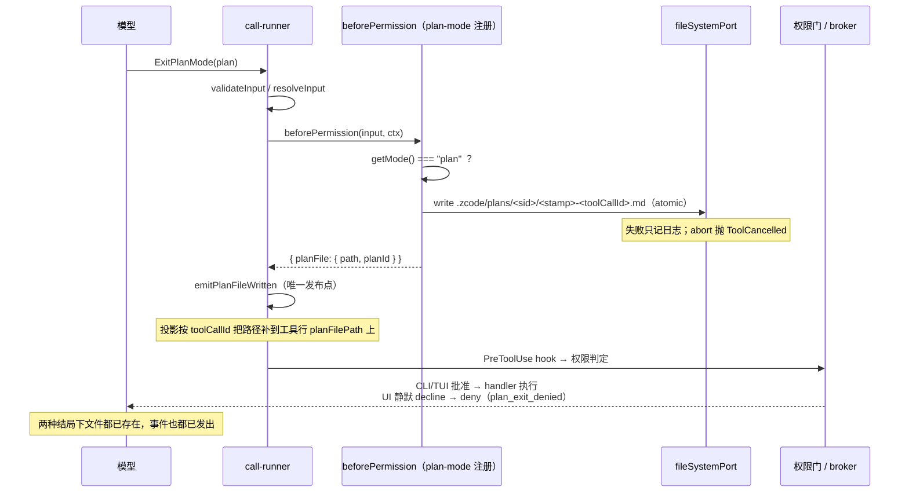

# Spec: 会话计划文件（运行时落盘 + 多计划 + 压缩回注）

## 目标

计划模式里模型每次通过 `ExitPlanMode` 提交计划时，**运行时**把计划原文落盘为工作区文件，且一个会话可以有任意多个计划（互不覆盖）。上下文压缩后，最新一份计划原文会被重新注入上下文；模型也可以通过只读工具 `ListPlans` 列举本会话全部计划并取回最新一份的全文。

在此之前，落盘发生在 `ExitPlanMode` 的 handler 里，而 v4 UI 路径上计划批准被静默拒绝（见 `plan-card-execute.md`），deny 在权限门就提前返回，handler 从不执行——计划文件从不落盘，压缩回注永远读不到文件。旧文件名 `plan-<sessionId>.md` 还是每会话一个固定名、覆盖写，「一会话多计划」在运行时侧不成立。

## 产品规则

- **运行时是唯一的落盘者。** 模型不写计划文件（计划模式下普通写入仍被权限拒绝）；计划文件由运行时在 `ExitPlanMode` 工具调用进入执行流程时写入，**无论该次调用最终被批准还是拒绝**。
- **路径规则**：`<workspaceRoot>/.zcode/plans/<sanitize(sessionId)>/<planId>.md`。
  - `sanitize(sessionId)`：非 `[A-Za-z0-9._-]` 字符替换为 `-`，去首尾 `-`。
  - `planId` = `<UTC时间戳 YYYYMMDD-HHmmssSSS>-<toolCallId>`。时间戳前缀使**字典序 = 时间序**，「最新一条」= 目录内文件名排序最后一条，无需解析文件内容。
  - `toolCallId` 同时是 UI 计划目录的键（`conversationStatusPanelModel` 按 `toolCallId` 打开详情），两侧由此对齐。
- **文件 = YAML frontmatter + 计划正文。** frontmatter 由**运行时**落盘时生成；模型提交的 `plan` 正文保持纯净（不含元数据），UI 计划卡片从 transcript 取正文，两侧都不受影响。
  - `title`：取 `ExitPlanMode` 输入的 `title`（必填）。「首个 H1，回退首个非空行（去前缀装饰）」的提取规则仅作为**历史数据兜底**，与 UI `getPlanDirectoryTitle` 同一条规则；新提交必有显式 `title`，不靠回退硬造标题（正文不以 H1 开头时回退会把整段话封成标题）。
  - `overview`：`ExitPlanMode` 输入的 `overview`（必填，1-3 句概括）；它无法从正文推导。历史文件无该键。
  - 键序固定 `title → overview`，YAML 由运行时用 `yaml` 包序列化，转义交给序列化器。
- **给模型的正文剥 frontmatter**：压缩回注与 `ListPlans` 的 `latest.content` 只含 `---` 围栏之后的计划正文；元数据走结构化字段（`title`、`overview`）。
- **多计划**：每次 `ExitPlanMode` 写一个新文件，从不覆盖旧文件。
- **压缩回注**：压缩时读会话计划目录中最新一份，把剥掉 frontmatter 的正文作为 `plan_file_reference` 系统提醒注入（source 与生命周期不变，只换读取逻辑）。
- **`ListPlans` 工具**：只读、免审批、always-on；一次调用返回本会话全部计划（标题、概述、文件路径、时间、是否最新）与**最新一份的正文**；非最新计划只给路径，模型自行用 Read 读取。任何模式下可用（压缩、换回合后都靠它找计划）。
- **失败语义**：落盘失败只记日志、不失败工具调用、不影响回合；用户取消（abort）时抛 `ToolCancelled`。回注读取失败同样不阻塞压缩。
- **非计划模式的 `ExitPlanMode` 调用不落盘**：与 handler 现有的模式校验对齐（`mode !== "plan"` 时 handler 抛错），落盘钩子同样先判当前模式。

## 状态所有者与事件顺序

- **所有者**：运行时（`@zcode/core`）拥有计划文件的写入与读取；UI 的会话计划目录继续从 transcript（`ExitPlanMode` tool call 行）派生，文件只是运行时的连续性事实，UI 不读文件——路径本身由运行时经事件补到工具行的 `planFilePath` 字段上（见下）。
- **落盘点**：`ToolEntry.beforePermission` 可选钩子，在 `call-runner` 的 `resolveInput` 之后、`runPreToolUseHooks` 与权限判定之前调用，不看权限结果。这是执行流程里唯一「审批前异步副作用」插入点；不塞进 `resolveInput`（其契约是入参归一化，明确不得成为第二个执行入口）。
- **单一写入路径**：`exitPlanModeToolEntry` 通过 `beforePermission` 落盘；handler 内不再写（删除 `persistApprovedPlanFileBeforeExitPlanMode`）。
- **落盘事实的唯一发布点**：`beforePermission` 只**回报**事实（`{ planFile: { path, planId } }`），事件由 `call-runner` 统一发布（`emitPlanFileWritten`，与 `emitToolCallStarted` 同形）。事件信封里的 session / turn / trace / sequence 只有执行器知道，钩子不自造事件；钩子抛错的调用没有既成事实，也就不发布。
- **路径到 UI 的通道是事件，不是工具输出。** `plan_file_written` 由 v4 投影打到那条 `ExitPlanMode` 工具行的可选字段 `planFilePath` 上（键是**原始** `toolCallId`，与文件名的 sanitize 形态解耦）。走工具输出不行：v4 UI 静默拒绝计划批准，拒绝路径上的工具结果是一条没有 output 的权限错误。
  - 投影**按 toolCallId 找已有行**、找不到即丢弃（路径只补事实，不凭空造行）；同值重复投影按值去重（冷恢复会同时拿到 live 事件与目录重推导的事件）。
  - 这条事件只改已存在行上的一个不可变字段，因此投影**不设 phase 门禁**（对照 `onPermissionRequested`）：冷恢复重推导的事件排在整段 transcript 之后，历史末轮的 phase 已是终态，被 phase 挡掉反而让重启后的卡片丢掉路径。
- **冷恢复的第二来源**：内存事件在进程重启后消失，transcript 不记落盘路径，所以冷订阅时由运行时读会话计划目录（`AgentRuntime.listSessionPlanFileWrittenFacts` → `readSessionPlanFileWrittenFacts`）重推导同一份事实，再映射成同型事件交给 merge。读目录是运行时的知识（`workspaceRoot` 与计划子目录位置），协议层不碰文件系统；读失败只丢这一条展示事实，不让整次冷恢复失败。

- **压缩回注时机**：`compactActiveConversation` 生成摘要后、构造 post-compact entries 时，读最新计划文件；`not_found`/读取失败 → 不注入，压缩照常完成。

## 接口

- `ToolEntry.beforePermission?: (input, context) => Promise<ToolBeforePermissionOutcome | void>`，返回 `{ planFile?: { path, planId } }`；context 含 `sessionId`、`workspaceRoot`、`fileSystemPort`、`toolCallId`、`mode`、`traceContext`、`abortSignal`、`logger`，窄上下文风格同 `ToolInputResolutionContext`。钩子只回报**事实**，不自己发事件（事件信封只有执行器能填）。
- `plan_file_written` 事件：契约在 `apps/zcode-cli/packages/contracts/src/events/session.events.ts`，payload 为 `{ planId, planFilePath, toolCallId }`；发布点是 `core/src/tool/executor/events.ts` 的 `emitPlanFileWritten`。v4 投影把它落到工具行的可选字段 `planFilePath`（`packages/shared/src/zcode-protocol-v4/rows.ts` 的 `toolCallRowSchema`），UI 适配层（`toolCallRowAdapter`）再带进 `extractPlanToolCallContent`。冷恢复的合成事件在 `bootstrap/src/zcode-protocol-v4/plan-file-hydration.ts`。
- `ExitPlanMode` 输入新增**必填** `title`（≤200 字符）与 `overview`（≤2000 字符），均非空 trim 校验。必填由入参校验闭环强制：缺失即在入参校验门报错并回给模型补齐重试，不依赖模型自觉（可选 + 描述指引实测会被模型无视，折叠卡随之落空）。二者只被运行时落盘与 UI 卡片消费，不进 `ExitPlanModeOutput`。
- `ListPlans`：契约在 `@zcode/contracts`（`tools/session-plans.ts`），handler 在 `core/src/tool/handlers/list-plans.ts`，注册进 `builtInTools`。输出含 `plans[]`（`planId`、`path`、`title`、`overview`、`createdAt`、`isLatest`）与 `latest`（含 `content`——剥 frontmatter 的正文——与 `overview`），列表按时间升序、最新在末尾。`title`/`overview` 优先读文件 frontmatter，缺省回退正文提取 / `null`。
- **`ExitPlanModeOutput` 仍然不改。** 路径给**模型**的通道是 `ListPlans`（批准路径上正文已在 output 里，拒绝路径上模型拿不到 output 也不必知道）；给 **UI** 的通道是上面那条事件，两者都不需要改工具输出 schema。

## 不变量

- 计划文件只有一条写入路径（`beforePermission`）；handler、UI、broker 都不写。
- 落盘事实只有一条发布路径（`call-runner` 的 `emitPlanFileWritten`）；钩子、handler、投影都不发这条事件。
- 「最新」的判定只依赖文件名字典序，不依赖文件内容或外部索引。
- 落盘/回注的失败都不改变回合与压缩的结果语义；冷恢复读目录失败同样只丢这条展示事实。
- 计划模式下模型的普通文件写入仍被 `mode.plan.nonReadOnly` 拒绝；运行时写计划文件不经过该策略（它不是模型写入）。

## 负面边界

- 不新增「模型自己写计划文件」的专用工具（不同于 Cursor 的 `create_plan`）。
- frontmatter **不写 `created` 之类的冗余字段**：创建时间的唯一所有者是文件名（`planId` 的 UTC 时间戳前缀），frontmatter 不重复这份事实。
- **UI 仍不读计划文件。** 会话计划目录、计划卡片、详情侧栏的数据源依旧只有 transcript（`ExitPlanMode` 工具行）；这次新增的只是工具行上的一个可选字段 `planFilePath`（由事件补齐），frontmatter 不进 UI，正文也不从文件读。
- **投影只补已有行**：`plan_file_written` 不建行、不改输入、不参与"哪条工具行存在"的判定；没有对应行（例如该轮不在投影窗口内）就丢弃。
- 不做会话删除时的计划目录清理（`deleteSession` 是 close-only；`.zcode` 已 gitignore，属本地残留）。
- 不改 CLI/TUI 的计划批准语义；不触碰用户级 plan-store MCP 的去留。
- 不改 `plan_file_reference` 的 source 注册与生命周期，只换它读的文件。

## 验收场景

1. UI 计划模式提交计划（批准被静默拒绝）→ `.zcode/plans/<sessionId>/` 下出现该计划的 md 文件。
2. 同一会话再走一轮计划模式 → 目录里出现第二个文件，第一个不被覆盖；`ListPlans` 返回两条，最新一条带全文，旧一条带路径。
3. 触发上下文压缩 → 压缩后的上下文包含最新计划的全文（`plan_file_reference`）。
4. 无计划会话调 `ListPlans` → 返回空列表，不报错。
5. 落盘失败（如目录不可写）→ 工具调用与回合照常结束，仅日志记录。
6. 模型提交带 `title`/`overview` 的计划 → 文件 frontmatter 含 `title`/`overview`，`ListPlans` 返回它们，压缩回注与 `latest.content` 只含正文。
7. 提交缺 `title` 或 `overview` 的计划 → 工具调用在入参校验门失败并把字段缺失错误回给模型，不落盘。
8. 历史（无 frontmatter）计划文件 → 标题走正文提取回退，`latest.content` = 原文，`overview` 为 `null`；不做迁移。
9. **路径可见（拒绝路径）**：计划提交被静默拒绝后，工具行带上 `planFilePath`，卡片显示文件名、详情面板显示路径行。
10. **路径可见（冷恢复）**：重启应用后重新打开该会话（计划目录仍在）→ 卡片与详情面板的路径照旧显示（来源是目录重推导的合成事件）；计划目录不可读时只是路径缺席，会话其余内容照常恢复。
11. 同一路径重复到达（live 事件 + 目录重推导）→ 工具行只被改一次，不出现重复行或路径闪变。
12. `pnpm typecheck`、`pnpm lint`、`pnpm architecture:check --changed` 通过；`core` 包测试与 bootstrap 的 `planFileWrittenProjection.test.ts` 通过。
