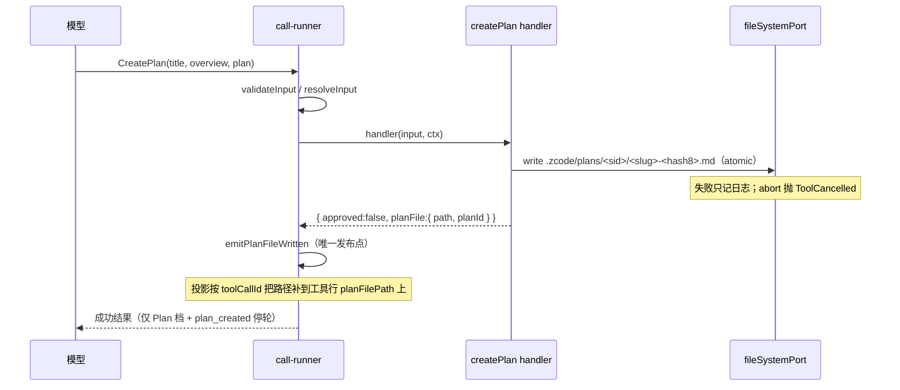

# Spec: 会话计划文件（运行时落盘 + 多计划 + 压缩路径提示）

## 目标

模型每次通过 `CreatePlan` 提交计划时，**运行时**把计划原文落盘为工作区文件，且一个会话可以有任意多个计划（互不覆盖）。上下文压缩后，模型会收到最新计划文件的工作区相对路径；模型需要时可以通过只读工具 `ListPlans` 列举本会话全部计划并取回最新一份的全文。

历史背景：`CreatePlan` 的前身 `ExitPlanMode` 曾把提交计划、退出模式、请求批准绑在一个 `needsApproval` 工具上，落盘钩子站在审批门之前（`beforePermission`），因为 UI 路径上计划批准被静默拒绝、deny 在权限门提前返回、handler 从不执行——不提前落盘文件就永远写不出来。本次 `CreatePlan` 设 `needsApproval:false`、`requiresUserInteraction:false`，调用即成功执行 handler，落盘直接搬进 handler，不再需要审批前钩子。旧文件名 `plan-<sessionId>.md` 还是每会话一个固定名、覆盖写，「一会话多计划」在运行时侧不成立——现已改为每次提交写新文件。

## 产品规则

- **运行时是唯一的落盘者。** 模型不写计划文件（计划模式下普通写入仍被权限拒绝）；计划文件由运行时在 `CreatePlan` 的 handler 内写入。调用恒成功，所以落盘与成功返回是同一条路径，不存在"批准/拒绝两种结局"。
- **任何档位调用都落盘。** `mode.plan.exitOnly` 硬拦已删除，plan、readonly、yolo 三档都能调 `CreatePlan`，handler 内无模式校验，落盘不判当前模式。历史 `ExitPlanMode` 行仍按旧规则理解（当时非 plan 档不落盘），见「兼容面」。
- **路径规则**：`<workspaceRoot>/.zcode/plans/<sanitize(sessionId)>/<planId>.md`。
  - `sanitize(sessionId)`：非 `[A-Za-z0-9._-]` 字符替换为 `-`，去首尾 `-`。
  - `planId` = `<slug>-<短hash8>`。`slug` 由运行时从计划 `title` 机械推导（Cursor 同款规则：小写化，只把 Windows 非法字符 `[<>:"/\|?*]`、控制字符 `[\x00-\x1f\x7f]` 与空白替换为 `_`，合并多余 `_`、去首尾、截断 100 字符，中文原样保留；推导结果为空时回退 `plan`）。控制字符必须清：NUL（`\x00`）会让文件系统写入直接失败，ESC（`\x1b`）等不可见字节会静默进磁盘、在终端里显示成乱码。短 hash 是 `toolCallId + created` 的确定性 32 位哈希（8 位 hex），只负责同名去重，不承载任何可逆信息。
  - `toolCallId` 与创建时间不再进文件名：二者随 frontmatter 落盘（见下）。UI 计划目录按 `toolCallId` 打开详情，冷恢复时从文件头读回 `toolCallId` 与 `created` 再对齐。
- **文件 = YAML frontmatter + 计划正文。** frontmatter 由**运行时**落盘时生成；模型提交的 `plan` 正文保持纯净（不含元数据），UI 计划卡片从 transcript 取正文，两侧都不受影响。
  - `title`：取 `CreatePlan` 输入的 `title`（必填）。「首个 H1，回退首个非空行（去前缀装饰）」的提取规则仅作为**历史数据兜底**，与 UI `getPlanDirectoryTitle` 同一条规则；新提交必有显式 `title`，不靠回退硬造标题（正文不以 H1 开头时回退会把整段话封成标题）。
  - `title` 在 `CreatePlan` 入参里排在 `plan` **之前**（schema 声明顺序 `title` → `overview` → `plan`，见 `plan-card-execute.md`）。这条顺序决定的是流式体验而非落盘内容：短字段先流出，折叠计划卡才能在计划正文还在写的时候就用显式标题与概述成形，不必拿正文首行当标题。落盘发生在 handler 内，那时三个字段都已到齐，顺序不影响 frontmatter。
  - `overview`：`CreatePlan` 输入的 `overview`（必填，1-3 句概括）；它无法从正文推导。历史文件无该键。
  - `created`：落盘时刻的 ISO 8601 字符串（`now.toISOString()`，UTC，毫秒精度）。它是「最新是哪份」的唯一排序依据，写入即固定，不随文件编辑改变（区别于文件 mtime）。
  - `toolCallId`：触发本次落盘的 `CreatePlan` 工具调用 id（原始形态，未 sanitize）。冷恢复从文件头读回它，重建「哪个调用落了哪份计划」的映射。
  - 键序固定 `title → overview → created → toolCallId`，YAML 由运行时用 `yaml` 包序列化，转义交给序列化器。
- **给模型的正文剥 frontmatter**：`ListPlans` 的 `latest.content` 只含 `---` 围栏之后的计划正文；元数据走结构化字段（`title`、`overview`）。
- **多计划**：每次 `CreatePlan` 写一个新文件，从不覆盖旧文件。
- **Fork 继承**：Fork 只复制 Fork 边界之前、且实际出现在复制 transcript 中的计划工具调用（`CreatePlan` 与历史 `ExitPlanMode` 都认，判据走共享 `isPlanApprovalToolName`）；复制到 child 自己的 `.zcode/plans/<childSessionId>/` 目录，父目录保留不变。复制时 frontmatter 的 `toolCallId` 重映射为 child-local tool call ID，`planId`、标题、概述、创建时间和正文保持不变。`ListPlans` 仍只查当前 session，不沿父会话回溯。
- **Fork 失败边界**：计划复制是运行时拥有的、幂等的 Fork 前置步骤；复制失败不创建 child session。数据库提交失败时清理本次 child 计划副本，清理失败只记录告警，不删除父计划；同一 child/sourceCommand 重试时，若既有副本除 child-local `toolCallId` 外的元数据与正文一致，则只刷新该调用映射，其他差异仍拒绝覆盖。
- **压缩路径提示**：压缩后只向模型提供最新计划文件的工作区相对路径，不把计划正文重新注入上下文；模型需要时通过 `ListPlans` 或 `Read` 取回。
- **`ListPlans` 工具**：只读、免审批、always-on；一次调用返回本会话全部计划（标题、概述、文件路径、时间、是否最新）与**最新一份的正文**；非最新计划只给路径，模型自行用 Read 读取。任何模式下可用（压缩、换回合后都靠它找计划）。
- **失败语义**：落盘失败只记日志、不失败工具调用、不影响回合；用户取消（abort）时抛 `ToolCancelled`。压缩后的路径提示生成失败不阻塞压缩。
- **`ListPlans` 逐份降级**：单份计划文件读不出来时，不失败整个工具调用。该份的 `title` 留空、`overview` 写入可读的错误原因（模型据此知道这份为什么读不了），其余计划与最新一份正文照常返回；列举排序所需的 `created` 读失败时，该份按历史文件处理（排最旧），同样不阻塞列举。用户取消仍抛 `ToolCancelled`。
- **计划文件不设读取预算**：`CreatePlan` 的 schema 已把正文限死在 `PLAN_MODE_MAX_PLAN_CHARS`（20000 **字符**），文件天然有界，读取侧不再按字节切前缀。曾经按 8192 字节切摘要，中文三字节一字、截断点只有三分之一落在字符边界上，其余会被读成乱码。

## 状态所有者与事件顺序

- **所有者**：运行时（`@zcode/core`）拥有计划文件的写入与读取。UI 的会话计划目录**从计划文件派生**（一条文件一条目录项），因此目录读的就是 `ListPlans` 读的那批文件，条数天然一致；读目录与解析 frontmatter 都在运行时，协议层只透传条目。计划**卡片与详情面板**的数据源依旧是 transcript（计划工具 tool call 行），文件对它们只是运行时的连续性事实——路径由运行时经事件补到工具行的 `planFilePath` 字段上（见下）。
- **落盘点**：`CreatePlan` 的 handler 内，在 `writeSessionPlanFile` 成功后、返回成功结果之前。`beforePermission` 钩子不再承担落盘（`CreatePlan` 无审批门，不需要审批前副作用插入点）；`ToolEntry.beforePermission` 接口本身保留（其他工具有 `planFile` 回报的通用通道，`call-runner` 的 `emitPlanFileWritten` 统一发布点不动），只是计划工具不再使用它。
- **单一写入路径**：`createPlanToolEntry` 的 handler 内落盘；`beforePermission` 不再写。落盘失败只记日志、不失败工具调用（计划文件是压缩连续性的事实，不是执行前提），abort 时抛 `ToolCancelled`。
- **落盘事实的唯一发布点**：handler 只**回报**事实（`{ planFile: { path, planId } }` 随 handler 结果带出，或由 handler 直接调 `emitPlanFileWritten`——实现选其一，不允许两条并存），事件由 `call-runner` 统一发布（`emitPlanFileWritten`，与 `emitToolCallStarted` 同形）。事件信封里的 session / turn / trace / sequence 只有执行器知道，handler 不自造事件。
- **路径到 UI 的通道是事件，不是工具输出。** `plan_file_written` 由 v4 投影打到那条计划工具行的可选字段 `planFilePath` 上（键是**原始** `toolCallId`，与文件名的 sanitize 形态解耦）。
  - 投影**按 toolCallId 找已有行**、找不到即丢弃（路径只补事实，不凭空造行）；同值重复投影按值去重（冷恢复会同时拿到 live 事件与目录重推导的事件）。
  - 这条事件只改已存在行上的一个不可变字段，因此投影**不设 phase 门禁**（对照 `onPermissionRequested`）：冷恢复重推导的事件排在整段 transcript 之后，历史末轮的 phase 已是终态，被 phase 挡掉反而让重启后的卡片丢掉路径。
- **冷恢复的第二来源**：内存事件在进程重启后消失，transcript 不记落盘路径，所以冷订阅时由运行时读会话计划目录（`AgentRuntime.listSessionPlanFileWrittenFacts` → `readSessionPlanFileWrittenFacts`）重推导同一份事实，再映射成同型事件交给 merge。读目录是运行时的知识（`workspaceRoot` 与计划子目录位置），协议层不碰文件系统；读失败只丢这一条展示事实，不让整次冷恢复失败。重推导需要每个文件的文件头（frontmatter 的 `toolCallId`/`created`），历史无 frontmatter 文件无法反查调用、会被跳过。

```mermaid
sequenceDiagram
  participant M as 模型
  participant CR as call-runner
  participant H as createPlan handler
  participant FS as fileSystemPort
  M->>CR: CreatePlan(title, overview, plan)
  CR->>CR: validateInput / resolveInput
  CR->>H: handler(input, ctx)
  H->>FS: write .zcode/plans/<sid>/<slug>-<hash8>.md（atomic）
  Note over FS: 失败只记日志；abort 抛 ToolCancelled
  H-->>CR: { approved:false, planFile:{ path, planId } }
  CR->>CR: emitPlanFileWritten（唯一发布点）
  Note over CR: 投影按 toolCallId 把路径补到工具行 planFilePath 上
  CR-->>M: 成功结果（仅 Plan 档 + plan_created 停轮）
```

- **压缩路径提示时机**：`compactActiveConversation` 生成摘要后、构造 post-compact entries 时，解析最新计划文件的工作区相对路径；没有计划、目录不可读或元数据解析失败时不注入路径，压缩照常完成。路径只作为提醒，正文不进入压缩上下文。

## 接口

- `CreatePlan` 输入**必填** `title`（≤200 字符）与 `overview`（≤2000 字符），均非空 trim 校验；`plan` 正文限 `PLAN_MODE_MAX_PLAN_CHARS`（20000 字符）。必填由入参校验闭环强制：缺失即在入参校验门报错并回给模型补齐重试，不依赖模型自觉（可选 + 描述指引实测会被模型无视，折叠卡随之落空）。三者只被运行时落盘与 UI 卡片消费。`allowedPrompts` 已删除，无 Cursor 等价物。**该门失败的那一行在 UI 必须呈失败态**：入参校验失败是唯一的失败形态（不再有"被用户拒绝"终态），即使 `input` 里 `title/overview` 非空（如 `plan_text` 现场形状），UI 判据也必须能区分，不得被旧拒绝行兼容误判成计划卡（见 `plan-card-execute.md`）。
- `plan_file_written` 事件：契约在 `apps/zcode-cli/packages/contracts/src/events/session.events.ts`，payload 为 `{ planId, planFilePath, toolCallId }`；发布点是 `core/src/tool/executor/events.ts` 的 `emitPlanFileWritten`。v4 投影把它落到工具行的可选字段 `planFilePath`（`packages/shared/src/zcode-protocol-v4/rows.ts` 的 `toolCallRowSchema`），UI 适配层（`toolCallRowAdapter`）再带进 `extractPlanToolCallContent`。冷恢复的合成事件在 `bootstrap/src/zcode-protocol-v4/plan-file-hydration.ts`。
- `ListPlans`：契约在 `@zcode/contracts`（`tools/session-plans.ts`），handler 在 `core/src/tool/handlers/list-plans.ts`，注册进 `builtInTools`。输出含 `plans[]`（`planId`、`path`、`title`、`overview`、`createdAt`、`isLatest`）与 `latest`（含 `content`——剥 frontmatter 的正文——与 `overview`），列表按 `created` 升序、最新在末尾。`title`/`overview`/`createdAt` 优先读文件 frontmatter，缺省回退正文提取 / `null`（无 `created` 的历史文件视为最旧）。压缩后生成的路径提醒使用相对于 workspace root 的路径，模型需要正文时调用本工具或按路径调用 `Read`。
- **`ListPlans` 的用户侧摘要 display**：契约在 `@zcode/contracts` 的 `toolResultDisplayPayloadSchema` 与 shared V4 `toolResultDisplaySchema`，仅携带 `{ kind: "list_plans", planCount }`；core 的 `createToolResultDisplay` 从已经通过 `ListPlansOutputSchema` 校验的业务输出投影计数。模型侧完整 `plans[]`/`latest.content` 仍只走 `ListPlansOutput` 与模型 formatter，UI 不解析 `output.text`。
- **计划目录侧边栏**：用户点击 `ListPlans` 摘要或状态面板的"会话计划"入口后打开会话级 `plan-directory` side-pane tab；目录数据来自 `v4/conversation/plans → state.sessionPlans`，一条计划文件一条目录项。目录 tab 只存 `(workspaceKey, parentSessionId)` 身份，不冻结计划列表；点击行打开现有 `plan-detail` tab。`ListPlans.display` 不参与目录 owner。
- **`CreatePlanOutput` 含 `approved: boolean`**（`false` = 已创建、待用户在卡片上批准），另带 `plan` 正文回显与 `mode` / `previousMode` 记录字段（仅记录，不切档）。路径给**模型**的通道是 `ListPlans`；给 **UI** 的通道是上面那条事件和 `state.sessionPlans` 目录查询。

## 不变量

- 计划文件只有一条写入路径（`createPlanToolEntry` 的 handler 内）；UI、broker 都不写。
- 落盘事实只有一条发布路径（`call-runner` 的 `emitPlanFileWritten`）；handler、投影都不发这条事件。
- 「最新」的判定依赖各文件 frontmatter 的 `created`（不可变、写入即固定），不再依赖文件名字典序；需要读文件头，一个会话的计划数量是个位数，开销可接受。
- 压缩只读取最新计划文件的元数据来生成相对路径，不读取计划正文；路径提示失败不改变压缩结果。
- 落盘/路径提示的失败都不改变回合与压缩的结果语义；冷恢复读目录失败同样只丢这条展示事实。
- Fork 计划复制只处理复制 transcript 中可达的计划工具调用（新老工具名都认）；child 目录、frontmatter 的 `toolCallId` 和冷恢复事实必须保持 child-local，父目录不删除。

## 兼容面

- 历史 `ExitPlanMode` 落盘文件与新文件同格式，`ListPlans`、目录、冷恢复不区分生产者。
- 历史 transcript 里 `part.tool === "ExitPlanMode"` 的行，fork 复制与行判定走共享 `isPlanApprovalToolName` 双认，不写字面量。

- 计划模式下模型的普通文件写入仍被 `mode.plan.nonReadOnly` 拒绝；运行时写计划文件不经过该策略（它不是模型写入）。
- 用户侧计划目录只从 `state.sessionPlans` 派生，`state.sessionPlans` 只从计划文件派生；`ListPlans` 成功/失败/重复调用都不能创建、覆盖或清空目录状态。目录详情在 `toolCallId` 存在时由它定位。
- 计划目录 tab 按 `(workspaceIdentity?.trim() || workspacePath, parentSessionId)` 隔离；同一会话重复打开只聚焦同一个目录，跨 workspace、跨会话和 remote session 不互见。

## 负面边界

- **`CreatePlan` 不新增参数**：不加 todos、name、old_str/new_str（Cursor 的 `create_plan` 有这些，我们的不跟随：todos 由 TodoWrite 独立维护；slug 已从 title 机械派生；每次提交写新文件、从不覆盖）。slug 由运行时从 `title` 纯派生。
- frontmatter 的 `created`/`toolCallId` 不是冗余：它们是排序与冷恢复反查的唯一所有者，文件名不再承担这两份职责。
- **UI 仍不自己读计划文件。** 读目录与解析 frontmatter 是运行时的活，协议层只透传条目，renderer 不碰文件系统。计划卡片与详情侧栏的数据源依旧只有 transcript（计划工具行），正文不从文件读。
- **不把 `ListPlans` 输出变成目录状态。** 模型恢复工具的计数 display 只用于工具摘要和入口提示；目录行、排序与详情由 `state.sessionPlans` 负责，卡片与详情正文由计划工具 transcript 负责。
- **投影只补已有行**：`plan_file_written` 不建行、不改输入、不参与"哪条工具行存在"的判定；没有对应行（例如该轮不在投影窗口内）就丢弃。
- 不做会话删除时的计划目录清理（`deleteSession` 是 close-only；`.zcode` 已 gitignore，属本地残留）。
- 不改 `plan_file_reference` 的 source 注册与生命周期；压缩不再注入该 source 的计划正文。
- Fork 继承接入 V4 stable/compact-edit conversation fork；既有 legacy workspace fork 不扩展计划复制，避免改变其独立的 checkpoint 恢复语义。

## 验收场景

1. 任意档位提交计划 → `.zcode/plans/<sessionId>/` 下出现该计划的 md 文件，工具结果成功，无 `Permission denied`；仅 Plan 档回合以 `plan_created` 停止。
2. 同一会话再提交一次 → 目录里出现第二个文件，第一个不被覆盖；`ListPlans` 返回两条，最新一条带全文，旧一条带路径。
3. 触发上下文压缩 → 压缩后的上下文只包含最新计划的工作区相对路径，不包含计划全文；模型随后调用 `ListPlans` 或按路径调用 `Read` 可取回正文。
4. 无计划会话调 `ListPlans` → 返回空列表，不报错。
5. 落盘失败（如目录不可写）→ 工具调用与回合照常结束，仅日志记录。
6. 模型提交带 `title`/`overview` 的计划 → 文件 frontmatter 含 `title`/`overview`/`created`/`toolCallId`，文件名形如 `<slug>-<8位hash>.md`（中文标题保留中文；含控制字符的标题里控制字符变 `_`，纯控制字符标题清洗为空回退 `plan`，均不写入不可见字节、不抛错），`ListPlans` 返回它们，压缩后的路径提醒只含相对路径，`latest.content` 只含正文。
7. 提交缺 `title` 或 `overview` 的计划 → 工具调用在入参校验门失败并把字段缺失错误回给模型，不落盘；UI 侧该工具行呈失败态（工具名 + failed 徽标 + 原因），不渲染计划卡——即使 `input` 里 `title/overview` 非空（如把正文写进 `plan_text` 的现场形状）。
8. 历史（无 frontmatter）计划文件 → 标题走正文提取回退，`latest.content` = 原文，`overview` 为 `null`；不做迁移。
9. **路径可见**：计划提交成功后，工具行带上 `planFilePath`，详情面板复制/打开操作可用。
10. **路径可见（冷恢复）**：重启应用后重新打开该会话（计划目录仍在）→ 卡片与详情面板的路径照旧显示（来源是目录重推导的合成事件）；计划目录不可读时只是路径缺席，会话其余内容照常恢复。
11. 同一路径重复到达（live 事件 + 目录重推导）→ 工具行只被改一次，不出现重复行或路径闪变。
12. `pnpm typecheck`、`pnpm lint`、`pnpm architecture:check --changed` 通过；`core` 包测试与 bootstrap 的 `planFileWrittenProjection.test.ts` 通过。
13. 模型成功调用 `ListPlans` → 工具卡只显示"找到 N 份计划"和"查看计划目录"，不展示 `PARAMETERS`、`RESULT`、计划正文或原始 JSON；N 为 0 时只显示"暂无计划"，不提供跳转。
14. 用户点击工具摘要或状态面板入口 → 当前会话的计划目录侧栏打开，目录最新在前；点击某行进入对应 `PlanDetailSidePane` 详情。切换会话或 remote scope 后目录不泄漏到其他会话。
15. `ListPlans` 运行中、失败、拒绝或停止 → 只显示状态，不读取旧 display；`ListPlans` display 缺失的历史成功行继续回退原文本。
